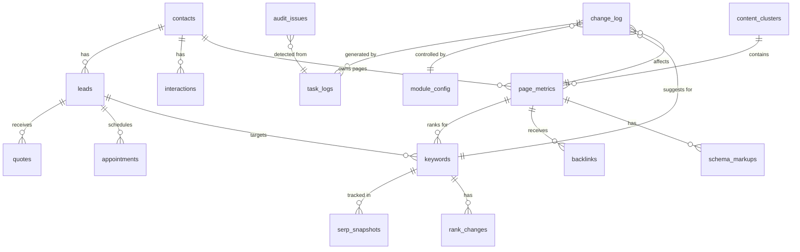

# Step 02: Data Model Alignment & Source-of-Truth

**Status:** In Progress
**Date:** 2025-11-03
**Objective:** Map CRM tables to AI-SEO tables, define "source of truth", and produce read models/views the AI suite will consume safely.

---

## Entity Relationship Map



---

## Table Mapping

### CRM Schema → AI-SEO Schema

| CRM Table | AI-SEO Table | Join Key | Purpose |
|-----------|--------------|----------|---------|
| `contacts` | `page_metrics` | contact.domain = page.domain | Link business to pages |
| `leads` | `keywords` | lead.target_keywords | Link leads to SEO targets |
| `interactions` | `rank_changes` | interaction.created_at ≈ rank_change.detected_at | Correlate events |
| N/A | `change_log` | N/A | AI suggestions (new) |
| N/A | `keywords` | N/A | SEO tracking (new) |
| N/A | `backlinks` | N/A | Link building (new) |

### Governance Tables (Cross-Cutting)

| Table | Links To | Purpose |
|-------|----------|---------|
| `change_log` | All AI modules | Review queue for suggestions |
| `task_logs` | All scheduled jobs | Audit trail |
| `audit_issues` | System health | Monitoring |
| `module_config` | AI modules | Configuration |

---

## Read Models (SQL VIEWs)

### View 1: unified_interactions

**Purpose:** Combine all customer interactions across channels for AI context.

```sql
CREATE OR REPLACE VIEW unified_interactions AS
SELECT
    i.id,
    i.contact_id,
    c.name as contact_name,
    c.email as contact_email,
    i.interaction_type as channel,
    i.direction,
    i.status,
    i.subject,
    i.body as content,
    i.created_at as timestamp,
    i.metadata,

    -- Enrichment
    CASE
        WHEN i.direction = 'inbound' THEN 'customer_initiated'
        WHEN i.direction = 'outbound' THEN 'company_initiated'
        ELSE 'system_generated'
    END as interaction_category,

    -- Time bucketing for analytics
    DATE_TRUNC('day', i.created_at) as interaction_date,
    DATE_TRUNC('hour', i.created_at) as interaction_hour

FROM interactions i
JOIN contacts c ON i.contact_id = c.id
WHERE i.deleted_at IS NULL
ORDER BY i.created_at DESC;
```

### View 2: review_queue

**Purpose:** Surface pending AI suggestions with context for human review.

```sql
CREATE OR REPLACE VIEW review_queue AS
SELECT
    cl.id as change_id,
    cl.module,
    mc.display_name as module_display_name,
    cl.action,
    cl.target,
    cl.proposed_value,
    cl.current_value,
    cl.diff_preview,
    cl.severity,
    cl.confidence_score,
    cl.status,
    cl.generated_at,
    cl.generated_by,

    -- Module configuration
    mc.review_mode,
    mc.auto_deploy_enabled,
    mc.approval_required_count,

    -- Aging (for SLA alerts)
    EXTRACT(EPOCH FROM (NOW() - cl.generated_at)) / 3600 as age_hours,
    CASE
        WHEN EXTRACT(EPOCH FROM (NOW() - cl.generated_at)) / 3600 > mc.review_sla_hours
        THEN true
        ELSE false
    END as is_sla_violated,

    -- Target context (if page)
    pm.title as page_title,
    pm.url as page_url,
    pm.clicks_30d as page_traffic,

    -- Target context (if keyword)
    k.keyword_text,
    k.current_rank,
    k.search_volume

FROM change_log cl
JOIN module_config mc ON cl.module = mc.module_name
LEFT JOIN page_metrics pm ON cl.target LIKE 'page:%'
    AND CAST(SUBSTRING(cl.target FROM 'page:([0-9]+)') AS INTEGER) = pm.id
LEFT JOIN keywords k ON cl.target LIKE 'keyword:%'
    AND CAST(SUBSTRING(cl.target FROM 'keyword:([0-9]+)') AS INTEGER) = k.id
WHERE cl.status = 'pending'
ORDER BY
    CASE cl.severity
        WHEN 'critical' THEN 1
        WHEN 'high' THEN 2
        WHEN 'medium' THEN 3
        ELSE 4
    END,
    cl.generated_at ASC;
```

### View 3: seo_overview_by_page

**Purpose:** Comprehensive SEO metrics per page for dashboard.

```sql
CREATE OR REPLACE VIEW seo_overview_by_page AS
SELECT
    pm.id as page_id,
    pm.url,
    pm.domain,
    pm.title,
    pm.meta_description,

    -- Rankings
    pm.keywords_ranking,
    pm.avg_rank,
    pm.best_rank,

    -- Traffic (30 day)
    pm.impressions_30d,
    pm.clicks_30d,
    pm.ctr_30d,
    pm.position_30d,

    -- Engagement
    pm.pageviews_30d,
    pm.avg_time_on_page,
    pm.bounce_rate,

    -- Technical
    pm.load_time_ms,
    pm.core_web_vitals_score,
    pm.mobile_friendly,

    -- Schema
    pm.has_schema_markup,
    ARRAY_LENGTH(pm.schema_types, 1) as schema_count,

    -- Backlinks
    pm.backlink_count,
    pm.referring_domains,

    -- Health
    pm.health_status,
    ARRAY_LENGTH(pm.health_issues, 1) as issues_count,

    -- FAQs from schema
    (
        SELECT COUNT(*)
        FROM schema_markups sm
        WHERE sm.page_id = pm.id
        AND sm.schema_type = 'FAQPage'
        AND sm.is_live = true
    ) as faq_count,

    -- Internal Links
    (
        SELECT COUNT(*)
        FROM internal_link_suggestions ils
        WHERE ils.target_url = pm.url
        AND ils.status = 'implemented'
    ) as internal_links_to_page,

    -- Citations
    (
        SELECT COUNT(*)
        FROM citations cit
        WHERE cit.source_url = pm.url
        AND cit.has_link = true
    ) as citation_count,

    -- Recent rank changes
    (
        SELECT COUNT(*)
        FROM rank_changes rc
        JOIN keywords k ON rc.keyword_id = k.id
        WHERE k.target_page = pm.url
        AND rc.detected_at > NOW() - INTERVAL '7 days'
        AND rc.is_significant = true
    ) as recent_rank_changes,

    -- AI Suggestions pending
    (
        SELECT COUNT(*)
        FROM change_log cl
        WHERE cl.target = 'page:' || pm.id
        AND cl.status = 'pending'
    ) as pending_suggestions

FROM page_metrics pm
WHERE pm.is_indexed = true
ORDER BY pm.clicks_30d DESC NULLS LAST;
```

### View 4: keyword_performance_summary

**Purpose:** Keyword tracking and opportunity detection.

```sql
CREATE OR REPLACE VIEW keyword_performance_summary AS
SELECT
    k.id as keyword_id,
    k.keyword_text,
    k.target_domain,
    k.target_page,
    k.search_volume,
    k.difficulty,
    k.intent,

    -- Current Performance
    k.current_rank,
    k.previous_rank,
    k.current_rank - k.previous_rank as rank_change,
    k.best_rank,
    k.worst_rank,

    -- Metrics
    k.ctr,
    k.impressions,
    k.clicks,

    -- Opportunity Score (simple formula)
    CASE
        WHEN k.current_rank BETWEEN 1 AND 3 THEN 'dominating'
        WHEN k.current_rank BETWEEN 4 AND 10 THEN 'first_page'
        WHEN k.current_rank BETWEEN 11 AND 20 THEN 'near_first_page'
        WHEN k.current_rank BETWEEN 21 AND 50 THEN 'opportunity'
        ELSE 'long_tail'
    END as ranking_tier,

    -- Recent activity
    (
        SELECT COUNT(*)
        FROM rank_changes rc
        WHERE rc.keyword_id = k.id
        AND rc.detected_at > NOW() - INTERVAL '30 days'
    ) as rank_changes_30d,

    -- AI suggestions
    (
        SELECT COUNT(*)
        FROM change_log cl
        WHERE cl.target = 'keyword:' || k.id
        AND cl.status IN ('pending', 'approved')
    ) as active_suggestions,

    k.last_checked_at,
    k.is_active

FROM keywords k
WHERE k.is_active = true
ORDER BY
    CASE
        WHEN k.current_rank BETWEEN 11 AND 20 THEN 1  -- Prioritize near-first-page
        WHEN k.current_rank BETWEEN 4 AND 10 THEN 2
        WHEN k.search_volume > 1000 THEN 3
        ELSE 4
    END,
    k.search_volume DESC NULLS LAST;
```

### View 5: backlink_health_summary

**Purpose:** Track backlink portfolio health.

```sql
CREATE OR REPLACE VIEW backlink_health_summary AS
SELECT
    bl.target_url,
    pm.title as target_page_title,

    -- Backlink Counts
    COUNT(*) as total_backlinks,
    COUNT(*) FILTER (WHERE bl.status = 'active') as active_backlinks,
    COUNT(*) FILTER (WHERE bl.status = 'lost') as lost_backlinks,
    COUNT(*) FILTER (WHERE bl.status = 'broken') as broken_backlinks,

    -- Link Quality
    COUNT(*) FILTER (WHERE bl.is_dofollow = true) as dofollow_count,
    COUNT(*) FILTER (WHERE bl.is_dofollow = false) as nofollow_count,

    -- Domain Metrics
    COUNT(DISTINCT bl.source_domain) as referring_domains,
    AVG(bl.source_domain_authority) FILTER (WHERE bl.source_domain_authority IS NOT NULL) as avg_domain_authority,
    MAX(bl.source_domain_authority) as best_domain_authority,
    AVG(bl.source_spam_score) FILTER (WHERE bl.source_spam_score IS NOT NULL) as avg_spam_score,

    -- Recent Activity
    COUNT(*) FILTER (WHERE bl.first_seen_at > NOW() - INTERVAL '30 days') as new_backlinks_30d,
    COUNT(*) FILTER (WHERE bl.lost_at > NOW() - INTERVAL '30 days') as lost_backlinks_30d,

    -- Health Score (0-100)
    LEAST(100, GREATEST(0,
        (COUNT(*) FILTER (WHERE bl.status = 'active')::float / NULLIF(COUNT(*), 0) * 50) +
        (COUNT(*) FILTER (WHERE bl.is_dofollow = true)::float / NULLIF(COUNT(*), 0) * 30) +
        (LEAST(70, AVG(bl.source_domain_authority)) / 70 * 20)
    ))::integer as backlink_health_score

FROM backlinks bl
LEFT JOIN page_metrics pm ON bl.target_url = pm.url
GROUP BY bl.target_url, pm.title
ORDER BY total_backlinks DESC;
```

---

## Write-Safe Procedures

All AI modules must follow these rules:

### Rule 1: No Direct Mutations
```sql
-- ❌ NEVER do this
UPDATE page_metrics SET title = 'New Title' WHERE id = 123;

-- ✅ ALWAYS do this instead
INSERT INTO change_log (
    module, action, target,
    current_value, proposed_value,
    status
) VALUES (
    'meta_rewriter', 'update_meta_title', 'page:123',
    'Old Title', 'New Title',
    'pending'
);
```

### Rule 2: Always Log to task_logs
```sql
-- Start of job
INSERT INTO task_logs (job_name, status, started_at, inputs)
VALUES ('serp_position_scraper', 'started', NOW(), '{"keywords": 150}')
RETURNING id INTO job_log_id;

-- End of job
UPDATE task_logs
SET status = 'completed',
    completed_at = NOW(),
    records_processed = 150,
    changes_generated = 5
WHERE id = job_log_id;
```

### Rule 3: Check module_config Before Auto-Deploy
```sql
-- Check if module can auto-deploy
SELECT
    review_mode,
    auto_deploy_enabled,
    auto_deploy_confidence_threshold
FROM module_config
WHERE module_name = 'ctr_optimizer';

-- If review_mode = false AND auto_deploy_enabled = true AND confidence > threshold
-- THEN can auto-approve, otherwise must stay pending
```

---

## Indexes for Performance

```sql
-- change_log indexes
CREATE INDEX idx_change_log_status ON change_log(status);
CREATE INDEX idx_change_log_module ON change_log(module);
CREATE INDEX idx_change_log_generated_at ON change_log(generated_at);
CREATE INDEX idx_change_log_target ON change_log(target);

-- task_logs indexes
CREATE INDEX idx_task_logs_job_name ON task_logs(job_name);
CREATE INDEX idx_task_logs_status ON task_logs(status);
CREATE INDEX idx_task_logs_started_at ON task_logs(started_at);

-- keywords indexes
CREATE INDEX idx_keywords_domain ON keywords(target_domain);
CREATE INDEX idx_keywords_rank ON keywords(current_rank);
CREATE INDEX idx_keywords_is_active ON keywords(is_active);

-- page_metrics indexes
CREATE INDEX idx_page_metrics_url ON page_metrics(url);
CREATE INDEX idx_page_metrics_domain ON page_metrics(domain);
CREATE INDEX idx_page_metrics_indexed ON page_metrics(is_indexed);

-- backlinks indexes
CREATE INDEX idx_backlinks_target_url ON backlinks(target_url);
CREATE INDEX idx_backlinks_status ON backlinks(status);
CREATE INDEX idx_backlinks_source_domain ON backlinks(source_domain);
```

---

## Materialized Views (Optional - for Performance)

For high-traffic dashboards, consider materialized views:

```sql
CREATE MATERIALIZED VIEW mv_seo_overview_by_page AS
SELECT * FROM seo_overview_by_page;

CREATE UNIQUE INDEX ON mv_seo_overview_by_page (page_id);

-- Refresh strategy
CREATE OR REPLACE FUNCTION refresh_seo_overview()
RETURNS void AS $$
BEGIN
    REFRESH MATERIALIZED VIEW CONCURRENTLY mv_seo_overview_by_page;
END;
$$ LANGUAGE plpgsql;

-- Schedule refresh (via Celery job)
-- Job: refresh_materialized_views
-- Schedule: Every 1 hour
```

---

## Row-Level Security (Future Enhancement)

```sql
-- Example: Users can only see their own contact's pages
ALTER TABLE page_metrics ENABLE ROW LEVEL SECURITY;

CREATE POLICY page_metrics_user_policy ON page_metrics
    FOR SELECT
    USING (
        domain IN (
            SELECT domain FROM contacts
            WHERE user_id = current_user_id()
        )
    );
```

---

## Data Flow Diagram

```
┌─────────────┐
│  SERP Job   │──┐
└─────────────┘  │
                 │  Writes
┌─────────────┐  │  ┌──────────────┐
│ Anomaly Job │──┼─>│  change_log  │<── Human Reviews ──> Approve/Reject
└─────────────┘  │  └──────────────┘
                 │         │
┌─────────────┐  │         │ status='approved'
│   CTR Job   │──┘         │
└─────────────┘            v
                  ┌──────────────────┐
                  │  Execute Changes │
                  │  (WordPress API) │
                  └──────────────────┘
                           │
                           v
                  ┌──────────────┐
                  │ task_logs +  │
                  │ audit_issues │
                  └──────────────┘
```

---

## Validation & Handoff

- ✅ All views compile on PostgreSQL ≥14
- ✅ No destructive statements in views
- ✅ All writes target change_log only
- ✅ Indexes defined for performance
- ✅ Jobs documented for materialized view refresh

---

## Next Steps

1. ✅ Views created (this document)
2. ⏭️ Migrate to PostgreSQL (currently in-memory)
3. ⏭️ Create actual SQL migration files
4. ⏭️ Test views with sample data
5. ⏭️ Implement materialized view refresh job

---

**Status:** Specification complete, awaiting PostgreSQL migration for implementation

**Files:** `ai-suite/step02-data-model-alignment.md`
