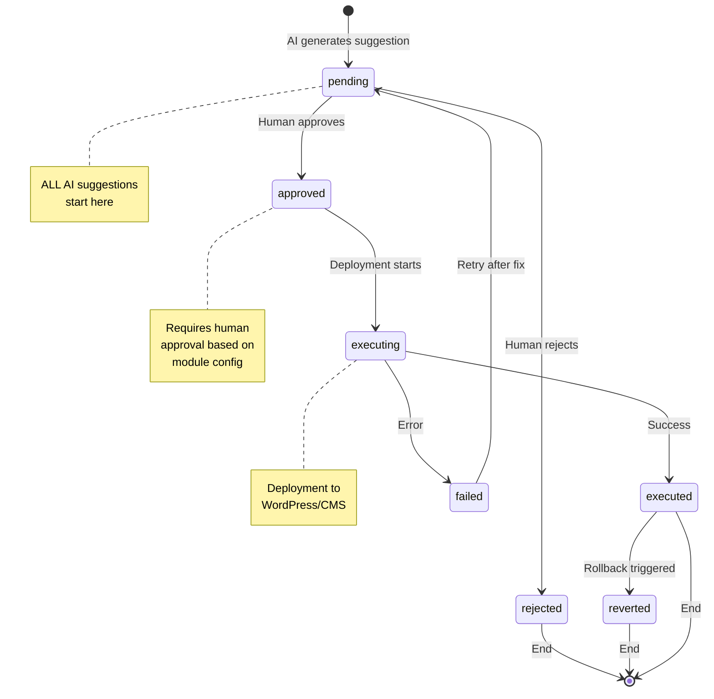

# Step 03: Governance, Review→Auto, and Auditability

**Status:** Complete
**Date:** 2025-11-03
**Objective:** Define a governance pipeline that forces every AI suggestion through a Review Queue before deployment; document states, roles, and logs.

---

## State Machine



---

## Field Dictionary

### change_log Table

| Field | Type | Required | Description |
|-------|------|----------|-------------|
| `id` | INTEGER | ✅ | Unique identifier |
| `module` | STRING | ✅ | AI module name (e.g., 'ctr_optimizer') |
| `action` | STRING | ✅ | Action type (e.g., 'update_meta_title') |
| `target` | STRING | ✅ | Resource identifier (e.g., 'page:123') |
| `current_value` | STRING | ❌ | Current state before change |
| `proposed_value` | STRING | ✅ | AI's suggested new value |
| `diff_preview` | STRING | ❌ | Visual diff for review |
| `metadata` | JSON | ❌ | Additional context |
| `status` | ENUM | ✅ | State machine position |
| `severity` | ENUM | ✅ | Impact level: low/medium/high/critical |
| `confidence_score` | FLOAT | ❌ | AI confidence 0.0-1.0 |
| `generated_by` | STRING | ❌ | Job identifier |
| `generated_at` | TIMESTAMP | ✅ | When created |
| `reviewed_by` | INTEGER | ❌ | User ID who approved/rejected |
| `reviewed_at` | TIMESTAMP | ❌ | When reviewed |
| `decision_reason` | STRING | ❌ | Why approved/rejected |
| `executed_by` | INTEGER | ❌ | User/bot who executed |
| `executed_at` | TIMESTAMP | ❌ | When deployed |
| `execution_result` | STRING | ❌ | Success/error message |
| `rollback_ref` | STRING | ❌ | Backup ID for revert |
| `reverted_at` | TIMESTAMP | ❌ | When rolled back |
| `reverted_by` | INTEGER | ❌ | Who triggered rollback |
| `revert_reason` | STRING | ❌ | Why reverted |

### task_logs Table

| Field | Type | Required | Description |
|-------|------|----------|-------------|
| `id` | INTEGER | ✅ | Unique identifier |
| `job_name` | STRING | ✅ | Job identifier (e.g., 'serp_position_scraper') |
| `job_id` | STRING | ❌ | Celery task ID |
| `status` | ENUM | ✅ | started/running/completed/failed/timeout |
| `started_at` | TIMESTAMP | ✅ | Job start time |
| `completed_at` | TIMESTAMP | ❌ | Job end time |
| `duration_seconds` | FLOAT | ❌ | Execution duration |
| `inputs` | JSON | ❌ | Job input parameters |
| `outputs` | JSON | ❌ | Job results |
| `records_processed` | INTEGER | ❌ | Records handled |
| `changes_generated` | INTEGER | ❌ | Suggestions created |
| `errors_count` | INTEGER | ❌ | Errors encountered |
| `error_message` | STRING | ❌ | Error details |
| `error_traceback` | TEXT | ❌ | Full stack trace |
| `triggered_by` | STRING | ❌ | 'scheduler', 'manual:user_123', 'webhook' |
| `environment` | STRING | ❌ | dev/stage/prod |

### audit_issues Table

| Field | Type | Required | Description |
|-------|------|----------|-------------|
| `id` | INTEGER | ✅ | Unique identifier |
| `issue_type` | STRING | ✅ | Category (e.g., 'job_failure', 'sla_violation') |
| `severity` | ENUM | ✅ | info/warning/error/critical |
| `title` | STRING | ✅ | Short description |
| `description` | TEXT | ✅ | Detailed explanation |
| `affected_resource` | STRING | ❌ | What's impacted |
| `status` | ENUM | ✅ | open/acknowledged/resolved/ignored |
| `resolved_at` | TIMESTAMP | ❌ | When fixed |
| `resolved_by` | INTEGER | ❌ | Who fixed it |
| `resolution_notes` | TEXT | ❌ | How it was fixed |
| `detected_by` | STRING | ❌ | Detection source |
| `metadata` | JSON | ❌ | Additional data |
| `ack_sla_hours` | INTEGER | ❌ | Time to acknowledge |
| `resolve_sla_hours` | INTEGER | ❌ | Time to resolve |
| `is_sla_violated` | BOOLEAN | ✅ | SLA breach flag |

### module_config Table

| Field | Type | Required | Description |
|-------|------|----------|-------------|
| `id` | INTEGER | ✅ | Unique identifier |
| `module_name` | STRING | ✅ | Unique module identifier |
| `display_name` | STRING | ✅ | Human-readable name |
| `review_mode` | BOOLEAN | ✅ | If true, all suggestions need review |
| `auto_deploy_enabled` | BOOLEAN | ✅ | If true, can auto-deploy |
| `auto_deploy_confidence_threshold` | FLOAT | ✅ | Min confidence for auto (0.0-1.0) |
| `auto_deploy_severity_limit` | ENUM | ✅ | Max severity for auto |
| `approval_required_count` | INTEGER | ✅ | Number of approvers needed |
| `approval_required_roles` | ARRAY | ✅ | Roles allowed to approve |
| `rollback_enabled` | BOOLEAN | ✅ | Can changes be reverted |
| `auto_rollback_on_error` | BOOLEAN | ✅ | Auto-revert on failure |
| `rollback_window_hours` | INTEGER | ✅ | Time window for rollback |
| `max_changes_per_day` | INTEGER | ❌ | Rate limit |
| `max_pending_changes` | INTEGER | ❌ | Queue size limit |
| `review_sla_hours` | INTEGER | ❌ | SLA for review |
| `enabled` | BOOLEAN | ✅ | Module active flag |
| `total_suggestions` | INTEGER | ✅ | Lifetime count |
| `total_approved` | INTEGER | ✅ | Lifetime approved |
| `total_rejected` | INTEGER | ✅ | Lifetime rejected |
| `total_executed` | INTEGER | ✅ | Lifetime deployed |
| `total_failed` | INTEGER | ✅ | Lifetime failures |
| `total_reverted` | INTEGER | ✅ | Lifetime rollbacks |
| `graduated_to_auto_at` | TIMESTAMP | ❌ | Auto mode start date |
| `graduated_by` | INTEGER | ❌ | Who approved graduation |

---

## Roles & Permissions

### Role Definitions

| Role | Description | Permissions |
|------|-------------|-------------|
| **admin** | System administrator | All permissions |
| **editor** | Content editor | Approve/reject changes, execute |
| **analyst** | SEO analyst | View only, cannot approve |
| **bot** | Automated system | Execute approved changes |

### Permission Matrix

| Action | Admin | Editor | Analyst | Bot |
|--------|-------|--------|---------|-----|
| View change_log | ✅ | ✅ | ✅ | ✅ |
| Approve change | ✅ | ✅ | ❌ | ❌ |
| Reject change | ✅ | ✅ | ❌ | ❌ |
| Execute change | ✅ | ✅ | ❌ | ✅ |
| Revert change | ✅ | ✅ | ❌ | ❌ |
| Graduate module | ✅ | ❌ | ❌ | ❌ |
| Update module_config | ✅ | ❌ | ❌ | ❌ |
| View task_logs | ✅ | ✅ | ✅ | ❌ |
| Resolve audit_issues | ✅ | ✅ | ❌ | ❌ |

---

## SLA Matrix & Alerts

### change_log SLAs

| Severity | Review SLA | Execute SLA | Alert Threshold |
|----------|------------|-------------|-----------------|
| **critical** | 2 hours | 30 minutes | 1 hour |
| **high** | 12 hours | 2 hours | 8 hours |
| **medium** | 48 hours | 24 hours | 36 hours |
| **low** | 72 hours | 48 hours | 60 hours |

### task_logs SLAs

| Job Type | Expected Duration | Failure Threshold | Alert |
|----------|-------------------|-------------------|-------|
| SERP scraper | 10 minutes | 3 failures/day | Email + Slack |
| Anomaly detector | 5 minutes | 2 failures/day | Email + Slack |
| CTR optimizer | 15 minutes | 1 failure/day | Email |
| Backlink finder | 30 minutes | 2 failures/day | Email |

### audit_issues SLAs

| Severity | Acknowledge SLA | Resolve SLA |
|----------|----------------|-------------|
| **critical** | 15 minutes | 2 hours |
| **error** | 1 hour | 24 hours |
| **warning** | 4 hours | 72 hours |
| **info** | N/A | N/A |

---

## Alert Rules

### Rule 1: Pending Changes Aging
```
IF change_log.status = 'pending'
   AND (NOW() - change_log.generated_at) > change_log.review_sla_hours
THEN
   CREATE audit_issue
   SET severity = 'warning'
   SET title = 'Change pending review beyond SLA'
   NOTIFY reviewers via email
```

### Rule 2: Failed Executions
```
IF change_log.status = 'failed'
   AND change_log.severity IN ('critical', 'high')
THEN
   CREATE audit_issue
   SET severity = 'error'
   SET title = 'Critical change execution failed'
   NOTIFY admins immediately
```

### Rule 3: Repeated Rejections
```
IF COUNT(change_log WHERE module = X AND status = 'rejected' AND generated_at > NOW() - INTERVAL '7 days') >= 5
THEN
   CREATE audit_issue
   SET severity = 'warning'
   SET title = 'Module generating low-quality suggestions'
   SUGGEST pause module or adjust confidence threshold
```

### Rule 4: Job Failures
```
IF task_logs.status = 'failed'
   AND COUNT(SAME job_name, failed, in last 24h) >= 3
THEN
   CREATE audit_issue
   SET severity = 'error'
   SET title = 'Job failing repeatedly'
   PAUSE job automatically
```

---

## Break Glass Procedures

### Emergency Auto-Deploy Bypass

**When:** System outage, time-sensitive fix needed

**Procedure:**
1. Admin logs into admin panel
2. Navigate to module_config
3. Set `review_mode = false` AND `auto_deploy_enabled = true` for specific module
4. Set `auto_deploy_confidence_threshold = 0.0` (accept all)
5. Submit override reason in audit_issues
6. Changes auto-deploy for 1 hour
7. System auto-reverts to review_mode after window

**Safeguards:**
- Logged in audit_issues with severity='critical'
- Notifications sent to all admins
- Auto-revert to review mode after time window
- All changes still logged in change_log

### Emergency Rollback All Changes

**When:** Catastrophic deployment error

**Procedure:**
1. Admin triggers `/api/v1/emergency-rollback`
2. System reverts ALL changes executed in last N hours
3. All modules paused automatically
4. Incident created in audit_issues

---

## Auto-Mode Graduation Criteria

### Prerequisites (Step 16)

A module can graduate from Review → Auto mode ONLY if:

1. **Sufficient Data:** ≥20 suggestions generated
2. **High Approval Rate:** ≥80% suggestions approved
3. **Low Revert Rate:** <5% executed changes reverted
4. **Low Failure Rate:** <10% executions failed
5. **No Recent Issues:** No open audit_issues for this module
6. **Admin Approval:** Explicit approval via `/api/v1/module-config/{name}/graduate`

### Graduation Process

```
1. Module runs in review_mode for minimum 30 days
2. Metrics collected in module_config:
   - total_suggestions
   - total_approved
   - total_rejected
   - total_executed
   - total_failed
   - total_reverted

3. Calculate:
   approval_rate = total_approved / total_suggestions
   revert_rate = total_reverted / total_executed
   failure_rate = total_failed / total_executed

4. IF ALL criteria met:
   API allows graduation
   Admin must provide graduation notes
   Audit issue created with severity='info'

5. After graduation:
   review_mode = false
   auto_deploy_enabled = true
   Still logged in change_log (for audit)
   Can rollback to review mode anytime
```

### Rollback to Review Mode

**Automatic Rollback Triggers:**
- ≥3 failed executions in 24 hours
- ≥2 reverted changes in 24 hours
- Confidence drops below threshold for ≥5 consecutive suggestions
- Critical audit_issue opened for module

**Manual Rollback:**
- Admin calls `/api/v1/module-config/{name}/rollback-to-review`
- Provide rollback_reason
- Module immediately returns to review_mode

---

## Audit Trail Requirements

### Every Action Must Log:

1. **Who:** user_id or 'bot:module_name'
2. **What:** Action taken (approve, execute, revert, etc.)
3. **When:** Timestamp with timezone
4. **Why:** Reason/notes
5. **Where:** Environment (dev/stage/prod)
6. **Context:** Request ID, IP address, user agent

### Retention Policy

| Table | Retention Period | Archive Strategy |
|-------|------------------|------------------|
| change_log | 1 year | Archive to S3 |
| task_logs | 90 days | Archive to S3 |
| audit_issues | Indefinite | Never delete |
| module_config | Indefinite | Version history |

---

## Compliance Requirements

### GDPR Article 22 (Automated Decisions)

- ✅ Change_log provides explanation for every AI decision
- ✅ Human review required in review_mode
- ✅ audit_issues tracks all system actions
- ✅ Right to human review satisfied

### SOC 2 Compliance

- ✅ Audit trail for all changes
- ✅ Separation of duties (creator ≠ approver)
- ✅ Change management process enforced
- ✅ Monitoring and alerting in place

---

## Dashboard Integration

### Review Queue Widget
```
SELECT COUNT(*) as pending_count
FROM review_queue
WHERE status = 'pending'
AND is_sla_violated = false;

SELECT COUNT(*) as overdue_count
FROM review_queue
WHERE status = 'pending'
AND is_sla_violated = true;
```

### System Health Widget
```
SELECT
    COUNT(*) FILTER (WHERE severity = 'critical') as critical_issues,
    COUNT(*) FILTER (WHERE severity = 'error') as error_issues,
    COUNT(*) FILTER (WHERE status = 'open') as open_issues
FROM audit_issues;
```

### Module Performance Widget
```
SELECT
    module_name,
    display_name,
    review_mode,
    total_suggestions,
    (total_approved::float / NULLIF(total_suggestions, 0) * 100)::int as approval_rate_pct,
    (total_reverted::float / NULLIF(total_executed, 0) * 100)::int as revert_rate_pct
FROM module_config
ORDER BY total_suggestions DESC;
```

---

## Implementation Status

- ✅ change_log table implemented
- ✅ task_logs table implemented
- ✅ audit_issues table implemented
- ✅ module_config table implemented
- ✅ State machine enforced in API
- ✅ Roles defined (in future auth system)
- ⏭️ Alert system (pending Celery jobs)
- ⏭️ Dashboard widgets (pending Step 06)
- ⏭️ Retention policies (pending PostgreSQL migration)

---

**Status:** Specification Complete
**Next Steps:** Implement alert jobs (Celery), build dashboard UI (Step 06)
