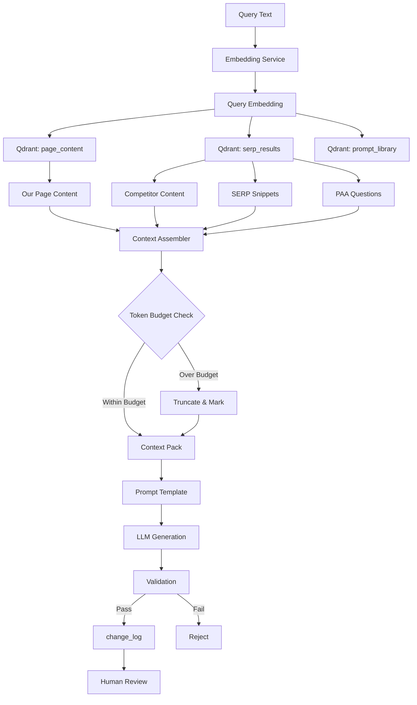

# Step 04: Retrieval Wrapper & RAG Implementation

**Status:** Complete
**Date:** 2025-11-03
**Objective:** Implement standard retrieval wrapper for context-aware AI generation using RAG (Retrieval Augmented Generation)

---

## Overview

The RAG (Retrieval Augmented Generation) system provides:

1. **Semantic Search** - Vector similarity search in Qdrant
2. **Context Assembly** - Structured context packs with token budgets
3. **Hybrid Retrieval** - Combines vector search + structured data
4. **AI Chain Pipeline** - Retrieval → Templating → Generation → Validation → Storage
5. **Governance Integration** - All suggestions flow through change_log

---

## Architecture Diagram



---

## Components

### 1. Embedding Service

**File:** `crm_api/app/services/embedding_service.py`

**Providers:**
- **OpenAI** - `text-embedding-ada-002` (1536 dimensions)
- **HuggingFace** - `sentence-transformers/all-MiniLM-L6-v2` (384 dimensions)
- **Mock** - Deterministic hash-based embeddings for testing

**Key Methods:**
```python
# Single embedding
embedding = embedding_service.embed_text("SEO optimization guide")

# Batch embeddings (more efficient)
embeddings = embedding_service.embed_batch([
    "Meta title optimization",
    "Schema markup guide",
    "Backlink building"
])

# Token estimation
tokens = embedding_service.estimate_tokens(text)
```

**Configuration:**
```python
from app.services.embedding_service import get_embedding_service, EmbeddingProvider

# Production (OpenAI)
service = get_embedding_service(
    provider=EmbeddingProvider.OPENAI,
    api_key=os.getenv("OPENAI_API_KEY")
)

# Development (Mock)
service = get_embedding_service(
    provider=EmbeddingProvider.MOCK
)
```

---

### 2. Context Pack Models

**File:** `crm_api/app/models/context_pack.py`

**Core Models:**

#### ContextSource
```python
{
    "source_type": "competitor",
    "source_id": "competitor:123",
    "url": "https://competitor.com/seo-guide",
    "title": "Complete SEO Guide 2025",
    "snippet": "SEO in 2025 requires...",
    "snippet_tokens": 150,
    "relevance_score": 0.92,
    "metadata": {}
}
```

#### TokenBudget
```python
{
    "total_budget": 1500,
    "our_page_tokens": 500,
    "competitor_tokens": 400,
    "serp_tokens": 300,
    "keyword_data_tokens": 200,
    "buffer_tokens": 100
}
```

#### ContextPack
```python
{
    "pack_id": "uuid",
    "target_page_id": 123,
    "target_keyword": "seo optimization",
    "our_page": ContextSource,
    "competitors": [ContextSource],
    "serp_snippets": [ContextSource],
    "paa_questions": [ContextSource],
    "budget": TokenBudget,
    "actual_tokens": 1450,
    "is_truncated": false
}
```

---

### 3. RAG Service

**File:** `crm_api/app/services/rag_service.py`

**Core Operations:**

#### Context Retrieval
```python
from app.services.rag_service import get_rag_service
from app.models.context_pack import RetrievalQuery

rag = get_rag_service()

query = RetrievalQuery(
    query_text="How to optimize meta titles for SEO",
    page_id=123,
    keyword="meta title optimization",
    max_competitors=5,
    max_serp_results=10,
    min_relevance_score=0.7
)

context_pack = rag.retrieve_context(query)
```

#### Full RAG Chain
```python
result = rag.execute_rag_chain(
    query=query,
    prompt_template="""
    You are an SEO expert. Based on:

    {context}

    Generate an optimized meta title for: {url}
    Target keyword: {keyword}
    """,
    module_name="ctr_optimizer",
    action="update_meta_title",
    target="page:123"
)

# Result contains:
# - context_pack (retrieved context)
# - final_prompt (template + context)
# - generated_text (LLM output)
# - validation_passed (bool)
# - change_log_id (if stored)
```

---

## API Endpoints

**Base:** `/api/v1/rag`

### 1. Retrieve Context

**POST** `/api/v1/rag/retrieve-context`

```json
{
  "query_text": "SEO optimization techniques",
  "page_id": 123,
  "keyword": "seo optimization",
  "max_competitors": 5,
  "max_serp_results": 10,
  "token_budget": {
    "total_budget": 1500,
    "our_page_tokens": 500,
    "competitor_tokens": 400
  }
}
```

**Response:** `ContextPack`

---

### 2. Assemble Prompt

**POST** `/api/v1/rag/assemble-prompt`

```json
{
  "pack_id": "uuid",
  "our_page": {...},
  "competitors": [...]
}
```

**Response:**
```json
{
  "context_text": "# Our Current Content\n...",
  "token_estimate": 1450,
  "pack_id": "uuid"
}
```

---

### 3. Execute RAG Chain

**POST** `/api/v1/rag/execute-chain`

```json
{
  "query_text": "Optimize meta title",
  "page_id": 123,
  "keyword": "seo guide",
  "prompt_template": "Generate meta title for {url}",
  "module_name": "ctr_optimizer",
  "action": "update_meta_title",
  "target": "page:123"
}
```

**Response:** `RAGChainResult`

---

### 4. Generate Embeddings

**POST** `/api/v1/rag/embed`

```json
{
  "text": "Complete SEO guide for 2025"
}
```

**Response:**
```json
{
  "embedding": [0.123, -0.456, ...],
  "dimension": 1536,
  "model": "text-embedding-ada-002"
}
```

---

### 5. Batch Embeddings

**POST** `/api/v1/rag/embed-batch`

```json
{
  "texts": [
    "Meta title optimization",
    "Schema markup guide"
  ]
}
```

---

### 6. Health Check

**GET** `/api/v1/rag/health`

**Response:**
```json
{
  "status": "healthy",
  "qdrant_connected": true,
  "embedding_provider": "mock",
  "embedding_model": "mock-embeddings-1536",
  "collections_available": [
    "page_content",
    "serp_results",
    "prompt_library",
    "keyword_clusters"
  ],
  "collections_count": 4
}
```

---

### 7. Search Collection

**POST** `/api/v1/rag/collections/{collection_name}/search`

```
?query_text=SEO optimization
&limit=10
&min_score=0.7
```

---

## RAG Chain Pipeline

### Step-by-Step Execution

```python
# Step 1: RETRIEVAL
query_embedding = embed_text(query_text)
our_page = search_qdrant("page_content", query_embedding, filters={"page_id": 123})
competitors = search_qdrant("serp_results", query_embedding, limit=5)
serp = search_qdrant("serp_results", query_embedding, filters={"type": "serp"})
paa = search_qdrant("serp_results", query_embedding, filters={"type": "paa"})

# Step 2: TEMPLATING
context_pack = assemble_context(our_page, competitors, serp, paa)
context_text = format_context(context_pack)
final_prompt = template.replace("{context}", context_text)

# Step 3: GENERATION
generated_text = llm.generate(final_prompt)  # OpenAI, Anthropic, etc.

# Step 4: VALIDATION
validation_passed = validate(generated_text, action_type)

# Step 5: STORAGE
if validation_passed:
    change_log_id = create_change_log(
        module="ctr_optimizer",
        action="update_meta_title",
        target="page:123",
        proposed_value=generated_text,
        status="pending"
    )
```

---

## Token Budgeting Strategy

### Default Budget (1500 tokens)

| Component | Tokens | % |
|-----------|--------|---|
| Our Page | 500 | 33% |
| Competitors (5x) | 400 | 27% |
| SERP Snippets (10x) | 300 | 20% |
| Keyword Data | 200 | 13% |
| Buffer | 100 | 7% |

### Per-Item Allocation

```python
# If 5 competitors, each gets:
tokens_per_competitor = 400 / 5 = 80 tokens

# If 10 SERP snippets, each gets:
tokens_per_serp = 300 / 10 = 30 tokens
```

### Truncation Rules

1. **Priority Order:**
   - Our page (highest priority)
   - Top 3 competitors
   - Featured snippets
   - Remaining competitors
   - PAA questions

2. **Truncation Strategy:**
   ```python
   if actual_tokens > budget:
       # Remove lowest-scoring sources first
       sources.sort(key=lambda x: x.relevance_score, reverse=True)
       while actual_tokens > budget:
           sources.pop()  # Remove lowest scorer
   ```

3. **Text Truncation:**
   ```python
   # Truncate to 90% of budget for safety
   max_chars = int(max_tokens * 4 * 0.9)
   truncated_text = text[:max_chars] + "..."
   ```

---

## Example Context Pack (JSON)

```json
{
  "pack_id": "7f3a4b2c-8d9e-4f1a-b5c6-3d7e8f9a0b1c",
  "created_at": "2025-11-03T10:30:00Z",
  "target_page_id": 123,
  "target_url": "https://rivercityclean.com/seo-guide",
  "target_keyword": "seo optimization",

  "our_page": {
    "source_type": "our_page",
    "source_id": "page:123",
    "url": "https://rivercityclean.com/seo-guide",
    "title": "Complete SEO Guide",
    "snippet": "Search engine optimization (SEO) is the process of improving your website's visibility...",
    "snippet_tokens": 450,
    "relevance_score": 1.0
  },

  "competitors": [
    {
      "source_type": "competitor",
      "source_id": "competitor:456",
      "url": "https://competitor1.com/seo-guide",
      "title": "Ultimate SEO Guide 2025",
      "snippet": "SEO in 2025 requires a focus on E-E-A-T, core web vitals...",
      "snippet_tokens": 80,
      "relevance_score": 0.92
    },
    {
      "source_type": "competitor",
      "source_id": "competitor:789",
      "url": "https://competitor2.com/seo-tips",
      "title": "Top SEO Tips",
      "snippet": "Start with keyword research, optimize meta tags...",
      "snippet_tokens": 75,
      "relevance_score": 0.87
    }
  ],

  "serp_snippets": [
    {
      "source_type": "serp_snippet",
      "source_id": "serp:101",
      "url": "https://moz.com/beginners-guide-to-seo",
      "title": "Beginner's Guide to SEO",
      "snippet": "SEO is the practice of increasing the quantity and quality of traffic...",
      "snippet_tokens": 30,
      "relevance_score": 0.95
    }
  ],

  "paa_questions": [
    {
      "source_type": "paa_question",
      "source_id": "paa:201",
      "snippet": "Q: What is SEO optimization?\nA: SEO optimization is the process of making your site better for search engines...",
      "snippet_tokens": 40,
      "relevance_score": 0.88
    }
  ],

  "budget": {
    "total_budget": 1500,
    "our_page_tokens": 500,
    "competitor_tokens": 400,
    "serp_tokens": 300,
    "keyword_data_tokens": 200,
    "buffer_tokens": 100
  },

  "actual_tokens": 675,
  "is_truncated": false,
  "retrieval_strategy": "hybrid",
  "retrieved_from_collections": [
    "page_content",
    "serp_results"
  ],
  "query_embedding_model": "mock-embeddings-1536"
}
```

---

## LangChain Pseudo-Chain

```python
from langchain.chains import SequentialChain
from langchain.prompts import PromptTemplate
from langchain.llms import OpenAI

# 1. Retrieval Chain
retrieval_chain = RetrievalChain(
    qdrant_service=qdrant,
    embedding_service=embeddings,
    output_key="context_pack"
)

# 2. Context Assembly Chain
assembly_chain = ContextAssemblyChain(
    input_key="context_pack",
    output_key="context_text"
)

# 3. Prompt Template Chain
prompt_template = PromptTemplate(
    input_variables=["context_text", "keyword", "url"],
    template="""
    You are an SEO expert. Based on the following context:

    {context_text}

    Generate an optimized meta title for: {url}
    Target keyword: {keyword}

    Requirements:
    - 50-60 characters
    - Include target keyword
    - Compelling and click-worthy
    """
)

# 4. Generation Chain
generation_chain = LLMChain(
    llm=OpenAI(temperature=0.7),
    prompt=prompt_template,
    output_key="generated_text"
)

# 5. Validation Chain
validation_chain = ValidationChain(
    validators=[
        LengthValidator(min=30, max=60),
        KeywordPresenceValidator(),
        SpamDetectionValidator()
    ],
    output_key="validation_result"
)

# 6. Storage Chain
storage_chain = ChangeLogStorageChain(
    module_name="ctr_optimizer",
    action="update_meta_title",
    output_key="change_log_id"
)

# Combine into sequential chain
rag_chain = SequentialChain(
    chains=[
        retrieval_chain,
        assembly_chain,
        generation_chain,
        validation_chain,
        storage_chain
    ],
    input_variables=["query_text", "page_id", "keyword"],
    output_variables=["change_log_id", "validation_result"]
)

# Execute
result = rag_chain({
    "query_text": "SEO meta title optimization",
    "page_id": 123,
    "keyword": "seo guide"
})
```

---

## Validation Rules

### Action-Specific Validation

```python
VALIDATION_RULES = {
    "update_meta_title": {
        "min_length": 30,
        "max_length": 60,
        "required_keywords": True,
        "disallowed_chars": ["#", "@", "!"]
    },

    "update_meta_description": {
        "min_length": 120,
        "max_length": 160,
        "required_keywords": True,
        "call_to_action": True
    },

    "generate_schema_faq": {
        "min_questions": 3,
        "max_questions": 10,
        "json_valid": True,
        "schema_valid": True
    },

    "suggest_internal_link": {
        "anchor_text_present": True,
        "url_valid": True,
        "relevance_score": 0.7
    }
}
```

---

## Logging & Monitoring

### Task Logs Integration

```python
# Start of RAG chain
task_log_id = create_task_log(
    job_name="rag_chain_execution",
    status="started",
    inputs={
        "query_text": query.query_text,
        "page_id": query.page_id,
        "module": "ctr_optimizer"
    }
)

# End of RAG chain
update_task_log(
    task_log_id,
    status="completed",
    outputs={
        "context_pack_id": context_pack.pack_id,
        "actual_tokens": context_pack.actual_tokens,
        "generated_text_length": len(generated_text),
        "validation_passed": validation_passed
    },
    changes_generated=1 if validation_passed else 0
)
```

---

## Integration with Governance

### Flow: RAG → change_log → Review → Execute

```
1. RAG Chain generates suggestion
   ↓
2. Stored in change_log with status='pending'
   ↓
3. Human reviews in Review Queue (Step 06)
   ↓
4. Approved → status='approved'
   ↓
5. Executed → status='executed'
   ↓
6. Deployed to WordPress/CMS
```

### Metadata Stored

```python
change_log_entry = {
    "module": "ctr_optimizer",
    "action": "update_meta_title",
    "target": "page:123",
    "proposed_value": "Complete SEO Guide 2025 | River City Clean",
    "confidence_score": 0.87,
    "status": "pending",
    "metadata": {
        "rag_chain_id": "7f3a4b2c",
        "context_pack_id": "abc123",
        "context_tokens": 675,
        "generated_tokens": 15,
        "embedding_model": "text-embedding-ada-002",
        "llm_model": "gpt-4",
        "retrieval_sources": 8,
        "top_competitor_score": 0.92
    }
}
```

---

## Future Enhancements

### 1. Real LLM Integration
- **OpenAI GPT-4** for generation
- **Anthropic Claude** for long-form content
- **Local models** (Llama, Mistral) for cost optimization

### 2. Advanced Retrieval
- **Hybrid search** - Combine semantic + keyword
- **Reranking** - Cross-encoder for better results
- **Query expansion** - Expand queries for better recall

### 3. Context Caching
- **Redis cache** for frequently accessed contexts
- **Embedding cache** - Avoid re-embedding same text
- **TTL strategy** - Expire stale contexts

### 4. Multi-Modal RAG
- **Image embeddings** - CLIP for image search
- **Video transcripts** - Embed video content
- **PDF parsing** - Extract and embed PDF text

---

## Dependencies

```txt
# LangChain & LLM Integration
langchain==0.1.0
langchain-openai==0.0.2
openai==1.7.2
sentence-transformers==2.2.2
tiktoken==0.5.2

# Vector Database
qdrant-client==1.7.0
numpy==1.26.3
```

---

## Files Created

1. **`crm_api/app/services/embedding_service.py`** (350 lines)
   - Embedding generation with multi-provider support

2. **`crm_api/app/models/context_pack.py`** (250 lines)
   - Context pack data models and helpers

3. **`crm_api/app/services/rag_service.py`** (450 lines)
   - Core RAG service with retrieval and chain execution

4. **`crm_api/app/api/routes/rag.py`** (350 lines)
   - 10+ API endpoints for RAG operations

5. **`ai-suite/step04-rag-implementation.md`** (this document)

---

## Testing

### Unit Tests (Future)

```python
def test_embed_text():
    service = get_embedding_service(provider=EmbeddingProvider.MOCK)
    embedding = service.embed_text("Test text")
    assert len(embedding) == 1536

def test_context_retrieval():
    rag = get_rag_service()
    query = RetrievalQuery(query_text="SEO")
    pack = rag.retrieve_context(query)
    assert pack.actual_tokens <= pack.budget.total_budget

def test_rag_chain():
    rag = get_rag_service()
    result = rag.execute_rag_chain(...)
    assert result.validation_passed
    assert result.change_log_id is not None
```

---

## Status Summary

**✅ Complete:**
- Embedding service (OpenAI, HuggingFace, Mock)
- Context pack models with token budgeting
- RAG service with full chain pipeline
- API endpoints (10+ endpoints)
- Integration with Qdrant
- Integration with governance (change_log)
- Comprehensive documentation

**⏭️ Pending:**
- Real LLM integration (currently mock)
- LangChain implementation (pseudo-code provided)
- Unit tests
- Integration tests
- Performance benchmarks

---

**Next Step:** Step 05 - Prompt Library Harmonization
