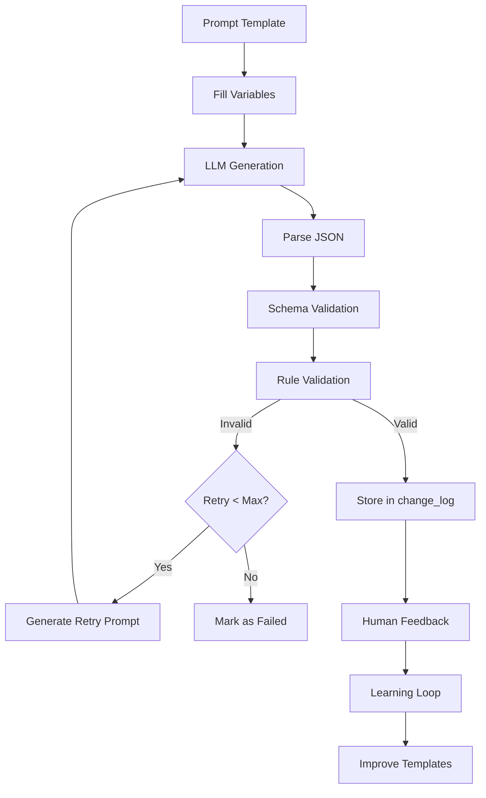

# Step 05: Prompt Library Harmonization & Self-Healing

**Status:** Complete
**Date:** 2025-11-03
**Objective:** Standardize prompt templates with JSON schemas, validation, and auto-retry for self-healing

---

## Overview

The Prompt Library system provides:

1. **Versioned Templates** - Semantic versioning with deprecation support
2. **JSON Schema Validation** - Strict output validation per type
3. **Auto-Retry Logic** - Self-healing on validation failures
4. **Learning Loop** - Feedback collection for prompt improvement
5. **Semantic Search** - Find templates via Qdrant

---

## Architecture



---

## Components

### 1. Output Types

```python
class OutputType(str, Enum):
    META_VARIANTS = "meta_variants"              # Meta title/description
    FAQ_ARRAY = "faq_array"                      # FAQ schema
    JSONLD_SCHEMA = "jsonld_schema"              # JSON-LD schema
    INTERNAL_LINK_SUGGESTIONS = "internal_link_suggestions"  # Links
    CONTENT_OUTLINE = "content_outline"          # Content structure
    SNIPPET_OPTIMIZATION = "snippet_optimization"  # SERP snippets
    BACKLINK_PITCH = "backlink_pitch"            # Outreach emails
```

---

## JSON Schemas

### META_VARIANTS Schema

```json
{
  "$schema": "http://json-schema.org/draft-07/schema#",
  "type": "object",
  "required": ["meta_title", "meta_description"],
  "properties": {
    "meta_title": {
      "type": "string",
      "minLength": 30,
      "maxLength": 60
    },
    "meta_description": {
      "type": "string",
      "minLength": 120,
      "maxLength": 160
    },
    "variants": {
      "type": "array",
      "items": {
        "type": "object",
        "required": ["title", "description"],
        "properties": {
          "title": {"type": "string", "maxLength": 60},
          "description": {"type": "string", "maxLength": 160}
        }
      },
      "minItems": 0,
      "maxItems": 3
    },
    "target_keyword": {
      "type": "string"
    }
  }
}
```

**Validation Rules:**
1. Title length: 30-60 characters
2. Description length: 120-160 characters
3. Keyword must appear in title
4. Max 3 variants

---

### FAQ_ARRAY Schema

```json
{
  "$schema": "http://json-schema.org/draft-07/schema#",
  "type": "object",
  "required": ["faqs"],
  "properties": {
    "faqs": {
      "type": "array",
      "items": {
        "type": "object",
        "required": ["question", "answer"],
        "properties": {
          "question": {
            "type": "string",
            "minLength": 10,
            "maxLength": 200
          },
          "answer": {
            "type": "string",
            "minLength": 50,
            "maxLength": 500
          },
          "keywords": {
            "type": "array",
            "items": {"type": "string"}
          }
        }
      },
      "minItems": 3,
      "maxItems": 10
    }
  }
}
```

**Validation Rules:**
1. Minimum 3 FAQs, maximum 10
2. Question length: 10-200 characters
3. Answer length: 50-500 characters
4. Valid FAQPage schema structure

---

### INTERNAL_LINK_SUGGESTIONS Schema

```json
{
  "$schema": "http://json-schema.org/draft-07/schema#",
  "type": "object",
  "required": ["suggestions"],
  "properties": {
    "suggestions": {
      "type": "array",
      "items": {
        "type": "object",
        "required": ["source_page", "target_page", "anchor_text", "relevance_score"],
        "properties": {
          "source_page": {"type": "string", "format": "uri"},
          "target_page": {"type": "string", "format": "uri"},
          "anchor_text": {
            "type": "string",
            "minLength": 2,
            "maxLength": 100
          },
          "context_sentence": {"type": "string"},
          "relevance_score": {
            "type": "number",
            "minimum": 0.0,
            "maximum": 1.0
          },
          "reasoning": {"type": "string"}
        }
      },
      "minItems": 1,
      "maxItems": 10
    }
  }
}
```

**Validation Rules:**
1. Valid URLs for source and target
2. Relevance score between 0.0-1.0
3. Anchor text 2-100 characters
4. At least 1 suggestion, max 10

---

## Self-Healing Retry Logic

### Retry Flow

```python
attempts = 0
max_retries = 3

while attempts < max_retries:
    attempts += 1

    # Generate output
    raw_output = llm.generate(prompt)

    # Validate
    is_valid, parsed, errors = validate(raw_output)

    if is_valid:
        return SUCCESS

    # Generate retry prompt with error feedback
    prompt = generate_retry_prompt(
        original_prompt,
        raw_output,
        errors,
        attempt_number=attempts + 1
    )

return FAILURE
```

### Retry Prompt Example

```
[Original Prompt]

---

⚠️ RETRY ATTEMPT #2

Your previous output had the following validation errors:
- Meta title too long: 65 characters (max 60)
- Target keyword "seo guide" not found in meta title
- Invalid JSON format: missing closing brace

Previous output:
{"meta_title": "Complete SEO Guide for Beginners - Learn Everything About SEO",...

Please fix these errors and regenerate the output. Ensure:
1. Valid JSON format
2. All required fields present
3. Values within specified constraints
4. Proper data types

Generate corrected output:
```

---

## Default Templates

### 1. Meta Title Optimizer

```python
{
  "template_name": "meta_title_optimizer",
  "display_name": "Meta Title Optimizer",
  "description": "Generate optimized meta titles for SEO",

  "system_message": "You are an SEO expert specializing in meta title optimization.",

  "user_prompt_template": """
Based on the following context:

{context}

Generate an optimized meta title for the page: {url}

Requirements:
- Target keyword: {keyword}
- 50-60 characters
- Include keyword naturally
- Compelling and click-worthy
- Unique from competitors

Return JSON format:
{
  "meta_title": "Your optimized title here",
  "meta_description": "Your optimized description here",
  "target_keyword": "{keyword}"
}
""",

  "output_type": "meta_variants",
  "module_name": "ctr_optimizer",
  "action": "update_meta_title",
  "max_retries": 3
}
```

### 2. FAQ Generator

```python
{
  "template_name": "faq_generator",
  "display_name": "FAQ Schema Generator",
  "description": "Generate FAQ schema markup from page content",

  "system_message": "You are an expert in structured data and FAQ schema generation.",

  "user_prompt_template": """
Based on this page content:

{context}

Generate 5-7 frequently asked questions related to: {keyword}

Requirements:
- Questions should be natural and conversational
- Answers should be 50-150 words
- Based on page content and SERP PAA
- Valid for FAQPage schema

Return JSON format:
{
  "faqs": [
    {"question": "...", "answer": "..."},
    ...
  ]
}
""",

  "output_type": "faq_array",
  "module_name": "schema_generator",
  "action": "generate_faq_schema"
}
```

### 3. Internal Link Suggester

```python
{
  "template_name": "internal_link_suggester",
  "display_name": "Internal Link Suggester",
  "description": "Suggest relevant internal links for a page",

  "system_message": "You are an internal linking expert. Suggest contextually relevant internal links.",

  "user_prompt_template": """
Source page: {url}
Target keyword: {keyword}

Available pages to link to:
{context}

Suggest 3-5 internal links that would be most relevant.

Return JSON format:
{
  "suggestions": [
    {
      "source_page": "{url}",
      "target_page": "URL",
      "anchor_text": "Natural anchor text",
      "context_sentence": "Sentence where link should be placed",
      "relevance_score": 0.95,
      "reasoning": "Why this link is relevant"
    }
  ]
}
"""
}
```

---

## API Endpoints

### Create Template

**POST** `/api/v1/prompts/templates`

```json
{
  "template_name": "custom_optimizer",
  "display_name": "Custom SEO Optimizer",
  "description": "Custom template for...",
  "system_message": "You are...",
  "user_prompt_template": "...",
  "output_type": "meta_variants",
  "required_placeholders": ["context", "keyword"],
  "module_name": "ctr_optimizer",
  "action": "custom_action",
  "max_retries": 3
}
```

### Execute Template

**POST** `/api/v1/prompts/execute`

```json
{
  "template_id": "uuid",
  "variables": {
    "context": "Page content here...",
    "keyword": "seo optimization",
    "url": "https://example.com/page"
  },
  "mock_output": "{\"meta_title\": \"Test\", \"meta_description\": \"Test description for testing\"}"
}
```

**Response:**
```json
{
  "execution_id": "uuid",
  "template_id": "uuid",
  "template_version": "1.0.0",
  "validation_passed": true,
  "attempt_number": 1,
  "status": "success",
  "parsed_output": {
    "meta_title": "Test",
    "meta_description": "Test description for testing"
  },
  "validation_errors": []
}
```

### Validate Output

**POST** `/api/v1/prompts/validate`

```json
{
  "raw_output": "{\"meta_title\": \"Test Title Here\", \"meta_description\": \"Test description\"}",
  "output_type": "meta_variants"
}
```

**Response:**
```json
{
  "is_valid": false,
  "parsed_output": {...},
  "errors": [
    "Meta title too short: 15 characters (min 30)",
    "Meta description too short: 16 characters (min 120)"
  ]
}
```

### Add Feedback

**POST** `/api/v1/prompts/feedback`

```json
{
  "execution_id": "uuid",
  "feedback_reason": "Generated title was too generic, lacked compelling hook",
  "human_rating": 3
}
```

### Get Learning Data

**GET** `/api/v1/prompts/learning-data?min_rating=4`

Returns executions with feedback for nightly learning loop.

---

## Learning Loop (Nightly Job)

### Process

```python
# 1. Collect feedback
learning_data = get_learning_data(min_rating=4)

# 2. Analyze patterns
high_performing = [d for d in learning_data if d['rating'] >= 4]
low_performing = [d for d in learning_data if d['rating'] <= 2]

# 3. Identify common issues
common_errors = analyze_validation_errors(low_performing)

# 4. Update templates
for template_id, issues in common_errors.items():
    if issues['count'] > 10:
        # Adjust prompt template
        update_template(template_id, optimizations)

# 5. Adjust validation thresholds
for output_type, metrics in performance_metrics.items():
    if metrics['avg_retry_count'] > 2.0:
        # Relax some validation rules
        adjust_validation_rules(output_type)
```

### Metrics Tracked

- **Success Rate**: % of generations that pass validation
- **Avg Retry Count**: Average retries before success
- **Common Errors**: Most frequent validation failures
- **Human Ratings**: 1-5 star feedback
- **Time to Success**: Duration from start to valid output

---

## Validation Rules System

### Rule Types

1. **length**: String length validation
   ```python
   {"min": 30, "max": 60}
   ```

2. **range**: Numeric range validation
   ```python
   {"min": 0.0, "max": 1.0}
   ```

3. **format**: Format validation (URI, email)
   ```python
   {"format": "uri"}
   ```

4. **required_field**: Field presence and content
   ```python
   {"must_appear_in": "meta_title"}
   ```

5. **array_length**: Array size validation
   ```python
   {"min": 3, "max": 10}
   ```

6. **json_schema**: Full JSON schema validation
   ```python
   {"schema": META_VARIANTS_SCHEMA}
   ```

---

## Migration Notes

### Existing Suggestions

For suggestions created before prompt versioning:

```sql
-- Add prompt_version field to change_log
ALTER TABLE change_log ADD COLUMN prompt_version VARCHAR(20) DEFAULT '0.0.0';

-- Backfill with default version
UPDATE change_log
SET prompt_version = '0.0.0'
WHERE prompt_version IS NULL;

-- Add feedback fields
ALTER TABLE change_log ADD COLUMN human_feedback TEXT;
ALTER TABLE change_log ADD COLUMN human_rating INTEGER CHECK (human_rating BETWEEN 1 AND 5);
```

### Template Versioning Strategy

```
1.0.0 -> Initial template
1.1.0 -> Minor prompt improvements (backward compatible)
2.0.0 -> Major changes (breaking, new schema)
```

When updating:
1. Create new version
2. Mark old version as deprecated
3. Set `superseded_by` field
4. New executions use latest version
5. Old templates remain for audit trail

---

## Usage Examples

### Example 1: Execute Template with Retry

```python
from app.services.prompt_library import get_prompt_library

library = get_prompt_library()

def mock_llm(prompt: str) -> str:
    # Simulate LLM call
    return '{"meta_title": "Complete SEO Guide", "meta_description": "Learn everything about SEO optimization techniques..."}'

execution = library.execute_template(
    template_id="meta_title_optimizer",
    variables={
        "context": "Page content...",
        "keyword": "seo guide",
        "url": "https://example.com/seo"
    },
    generate_func=mock_llm,
    max_retries=3
)

if execution.validation_passed:
    print(f"Success! Generated: {execution.parsed_output}")
else:
    print(f"Failed after {execution.attempt_number} attempts")
    print(f"Errors: {execution.validation_errors}")
```

### Example 2: Custom Validation

```python
from app.services.validation_service import get_validation_service

validator = get_validation_service()

raw_output = '{"meta_title": "Too long title that exceeds the maximum allowed length of 60 characters", "meta_description": "Short"}'

is_valid, parsed, errors = validator.validate_output(
    raw_output=raw_output,
    output_type=OutputType.META_VARIANTS
)

print(f"Valid: {is_valid}")
print(f"Errors: {errors}")
# Output:
# Valid: False
# Errors: ['Meta title too long: 78 chars (max 60)', 'Meta description too short: 5 chars (min 120)']
```

---

## Files Created

1. **`app/models/prompt_template.py`** (350 lines)
   - PromptTemplate, PromptExecution models
   - JSON schemas for all output types
   - Validation rules definitions

2. **`app/services/validation_service.py`** (350 lines)
   - Schema validation
   - Rule-based validation
   - Auto-retry logic with error feedback

3. **`app/services/prompt_library.py`** (400 lines)
   - Template management (CRUD)
   - Semantic search via Qdrant
   - Template execution with retry
   - Learning data collection

4. **`app/api/routes/prompts.py`** (400 lines)
   - 15+ API endpoints
   - Template management
   - Execution and validation
   - Feedback and statistics

5. **`ai-suite/step05-prompt-library.md`** (this document)

---

## Statistics & Monitoring

### Dashboard Metrics

```python
GET /api/v1/prompts/stats/summary

{
  "total_templates": 12,
  "total_executions": 1543,
  "successful_executions": 1421,
  "failed_executions": 122,
  "success_rate_pct": 92.09,
  "avg_retry_count": 1.23,
  "templates_by_module": {
    "ctr_optimizer": 4,
    "schema_generator": 3,
    "internal_linking": 2
  }
}
```

### Per-Template Stats

```python
GET /api/v1/prompts/stats/template/{template_id}

{
  "template_id": "uuid",
  "template_name": "meta_title_optimizer",
  "version": "1.2.0",
  "total_uses": 523,
  "successful": 487,
  "failed": 36,
  "success_rate_pct": 93.11,
  "avg_retry_count": 1.15,
  "feedback_count": 89,
  "common_errors": [
    {"error": "Title too long", "count": 18},
    {"error": "Keyword missing", "count": 12}
  ]
}
```

---

## Dependencies

```txt
# Validation
jsonschema==4.20.0
```

---

## Future Enhancements

### 1. A/B Testing
- Multiple template versions active simultaneously
- Compare performance metrics
- Auto-graduate winning templates

### 2. Prompt Optimization
- Use GPT-4 to improve prompts based on feedback
- Automated prompt engineering
- Self-improving templates

### 3. Multi-Language Support
- Templates per language
- Locale-specific validation rules
- Character count adjustments (Chinese, Japanese)

### 4. Advanced Retry Strategies
- Exponential backoff
- Temperature adjustment on retry
- Model fallback (GPT-4 → GPT-3.5)

---

## Status Summary

**✅ Complete:**
- Versioned prompt templates
- JSON schema validation (5 output types)
- Rule-based validation (6 rule types)
- Auto-retry with error feedback
- Default templates (3 templates)
- Semantic search via Qdrant
- Feedback collection
- Learning data API
- Statistics and monitoring
- API endpoints (15+ endpoints)
- Comprehensive documentation

**⏭️ Pending:**
- Real LLM integration (currently mock)
- Nightly learning loop job (Celery)
- A/B testing system
- Auto-optimization from feedback

---

**Next Step:** Step 06 - Main Dashboard UI
