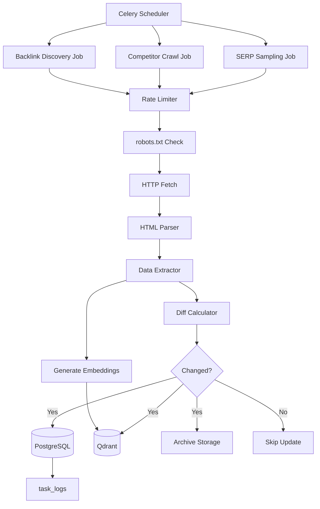

# Step 07: SERP Crawler & Data Ingestion Runbook

**Status:** Complete (Specification)
**Date:** 2025-11-03
**Objective:** Implement respectful SERP sampling, competitor crawling, and Local Authority Score (LAS) calculation

---

## Overview

The SERP Crawler system provides:
1. **SERP Sampling** - Top 10 results, featured snippets, PAA extraction
2. **Competitor Crawling** - Ethical scraping with rate limiting
3. **Backlink Tracking** - Citation discovery and authority scoring
4. **LAS Calculation** - Local Authority Score aggregation
5. **Data Persistence** - PostgreSQL + Qdrant storage with diff tracking

---

## Architecture



---

## 1. SERP Sampling

### 1.1 Sampling Strategy

**For Each Keyword:**
1. Fetch Google SERP
2. Extract Top 10 organic results
3. Capture featured snippet (if present)
4. Expand "People Also Ask" (3-5 questions)
5. Record SERP features (images, videos, local pack)
6. Calculate hash for change detection

### 1.2 Data Extraction Selectors

```python
SERP_SELECTORS = {
    # Organic Results
    "organic_results": "div.g",
    "result_title": "h3",
    "result_url": "a[href]",
    "result_snippet": "div.VwiC3b",

    # Featured Snippet
    "featured_snippet": "div.xpdopen",
    "featured_title": "div[role='heading']",
    "featured_text": "span.hgKElc",

    # People Also Ask
    "paa_container": "div.related-question-pair",
    "paa_question": "div[role='button']",
    "paa_answer": "div.kp-blk",

    # SERP Features
    "local_pack": "div.rllt__details",
    "image_pack": "div.islrc",
    "video_carousel": "g-scrolling-carousel",

    # Metadata
    "result_count": "div#result-stats",
    "related_searches": "div.s75CSd"
}
```

### 1.3 SERP Data Model Mapping

```python
# Captured SERP → Database
{
    "keyword_id": keyword.id,
    "captured_at": datetime.now(),
    "query": "seo optimization",
    "location": "United States",
    "device": "desktop",

    # Results
    "results": [
        {
            "position": 1,
            "title": "Complete SEO Guide",
            "url": "https://example.com/seo-guide",
            "snippet": "Learn everything about SEO...",
            "domain": "example.com",
            "is_our_site": false
        }
    ],

    # Features
    "has_featured_snippet": true,
    "featured_snippet": {
        "type": "paragraph",
        "title": "What is SEO?",
        "text": "SEO stands for...",
        "source_url": "https://moz.com/beginners-guide",
        "source_domain": "moz.com"
    },

    # PAA
    "paa_questions": [
        {
            "question": "How does SEO work?",
            "answer": "SEO works by optimizing...",
            "source_url": "https://searchengineland.com"
        }
    ],

    # Metadata
    "total_results": "About 2,140,000,000 results",
    "serp_hash": "sha256:abc123...",
    "related_searches": ["seo tips", "seo guide 2025"]
}
```

### 1.4 Storage Plan

**PostgreSQL:**
```sql
-- serp_snapshots table
INSERT INTO serp_snapshots (
    keyword_id,
    captured_at,
    results,
    has_featured_snippet,
    featured_snippet,
    paa_questions,
    serp_hash
) VALUES (...);

-- Update keywords table
UPDATE keywords
SET
    current_rank = (position of our site),
    last_checked_at = NOW()
WHERE id = keyword_id;
```

**Qdrant:**
```python
# Store SERP result embeddings
for result in serp.results:
    embedding = embed_text(result['snippet'])
    qdrant.upsert(
        collection="serp_results",
        point_id=f"serp_{result['url']}",
        embedding=embedding,
        payload={
            "type": "serp_snippet",
            "keyword": keyword_text,
            "position": result['position'],
            "url": result['url'],
            "title": result['title'],
            "snippet": result['snippet']
        }
    )
```

---

## 2. Competitor Crawling

### 2.1 Crawler Seeds

**Discovery Methods:**
1. **Sitemap**: `https://competitor.com/sitemap.xml`
2. **RSS Feed**: `https://competitor.com/feed`
3. **Homepage**: `https://competitor.com/`
4. **From SERP**: Top 10 competitors per keyword

**Prioritization:**
```python
priority_score = (
    (serp_position_weight * 0.4) +
    (domain_authority_weight * 0.3) +
    (freshness_weight * 0.3)
)

# Higher score = crawl first
```

### 2.2 Page Parsing

**Data Extracted:**
```python
PAGE_DATA = {
    # Metadata
    "url": "https://competitor.com/page",
    "domain": "competitor.com",
    "crawled_at": datetime.now(),

    # SEO Elements
    "title": "<title> content",
    "meta_description": "<meta name='description'> content",
    "canonical": "<link rel='canonical'> href",
    "robots": "<meta name='robots'> content",

    # Content Structure
    "h1": ["Primary Heading"],
    "h2": ["Subheading 1", "Subheading 2"],
    "h3": ["Sub-subheading 1"],

    # Content
    "body_text": "Full page text...",
    "word_count": 1523,

    # Images
    "images": [
        {"src": "image.jpg", "alt": "Alt text"}
    ],

    # Links
    "internal_links": 23,
    "external_links": 5,
    "outbound_links": [
        {"url": "https://authority-site.com", "anchor": "Learn more"}
    ],

    # Schema
    "schema_markups": [
        {"@type": "Article", "headline": "..."}
    ],

    # Technical
    "page_size_kb": 245,
    "load_time_ms": 1250,

    # Hash for diff
    "content_hash": "sha256:def456..."
}
```

**Selectors:**
```python
CONTENT_SELECTORS = {
    "title": "title",
    "meta_description": "meta[name='description']",
    "canonical": "link[rel='canonical']",
    "h1": "h1",
    "h2": "h2",
    "h3": "h3",
    "body_text": "article, main, .content, #content",
    "images": "img[src]",
    "links": "a[href]",
    "schema": "script[type='application/ld+json']"
}
```

### 2.3 Respectful Crawling Rules

**Rate Limiting:**
```python
RATE_LIMITS = {
    "requests_per_second": 1,  # Max 1 req/sec per domain
    "requests_per_minute": 30,
    "requests_per_hour": 500,
    "concurrent_requests": 5,   # Max 5 parallel requests total
    "delay_between_requests_ms": 1000,  # 1 second minimum
}
```

**robots.txt Compliance:**
```python
def can_crawl(url: str, user_agent: str) -> bool:
    """Check robots.txt before crawling."""
    domain = urlparse(url).netloc
    robots_url = f"https://{domain}/robots.txt"

    # Fetch and parse robots.txt
    robots = RobotFileParser()
    robots.set_url(robots_url)
    robots.read()

    # Check if allowed
    return robots.can_fetch(user_agent, url)
```

**User Agent:**
```python
USER_AGENT = "RiverCityClean-SEO-Bot/1.0 (+https://rivercityclean.com/bot-info)"
```

**Retry Policy:**
```python
RETRY_POLICY = {
    "max_retries": 3,
    "backoff_factor": 2,  # 1s, 2s, 4s
    "retry_on_status": [429, 500, 502, 503, 504],
    "timeout_seconds": 30
}
```

---

## 3. Backlink & Citation Capture

### 3.1 Discovery Methods

**1. Third-Party APIs:**
```python
# Ahrefs, Moz, SEMrush APIs
backlinks = ahrefs.get_backlinks(
    target_url="https://rivercityclean.com",
    mode="subdomains",
    limit=1000
)
```

**2. Manual Discovery:**
```python
# Search for brand mentions
queries = [
    "\"RiverCityClean\" -site:rivercityclean.com",
    "RiverCityClean review",
    "RiverCityClean mentioned"
]

for query in queries:
    serp = fetch_serp(query)
    for result in serp.results:
        if "rivercityclean" in result['snippet'].lower():
            citations.append({
                "source_url": result['url'],
                "source_domain": result['domain'],
                "context": result['snippet'],
                "has_link": check_for_link(result['url'])
            })
```

**3. Competitor Backlink Analysis:**
```python
# Find where competitors get links, target same sources
competitor_backlinks = get_backlinks(competitor_url)
for backlink in competitor_backlinks:
    if backlink['domain_authority'] > 50:
        opportunities.append(backlink['source_domain'])
```

### 3.2 Backlink Data Model

```python
BACKLINK_DATA = {
    "id": "uuid",
    "target_url": "https://rivercityclean.com/page",
    "source_url": "https://referring-site.com/article",
    "source_domain": "referring-site.com",

    # Link Properties
    "anchor_text": "professional cleaning services",
    "is_dofollow": true,
    "link_context": "Surrounding text...",

    # Source Metrics
    "source_domain_authority": 67,
    "source_page_authority": 45,
    "source_spam_score": 2,

    # Discovery
    "first_seen_at": datetime,
    "last_checked_at": datetime,
    "status": "active",  # active, lost, broken

    # Attribution
    "discovered_via": "ahrefs_api",
    "link_type": "editorial"  # editorial, guest_post, directory, etc.
}
```

### 3.3 Citation Tracking

```python
CITATION_DATA = {
    "id": "uuid",
    "brand_mention": "RiverCityClean",
    "source_url": "https://review-site.com/article",
    "source_domain": "review-site.com",

    # Context
    "context_text": "...mentioned RiverCityClean as a top option...",
    "sentiment": "positive",  # positive, neutral, negative

    # Link Status
    "has_link": false,
    "link_opportunity": true,

    # Metrics
    "source_authority": 55,
    "potential_value": "high",  # high, medium, low

    # Tracking
    "first_seen_at": datetime,
    "citation_type": "review"  # review, news, blog, social
}
```

---

## 4. Local Authority Score (LAS) Calculation

### 4.1 LAS Formula

```python
def calculate_las(domain: str) -> float:
    """
    Calculate Local Authority Score (0-100).

    Components:
    - Referring domains (30%)
    - Backlink quality (25%)
    - Citation count (20%)
    - Domain metrics (15%)
    - Content quality (10%)
    """

    # 1. Referring Domains (30%)
    referring_domains = count_referring_domains(domain)
    referring_score = min(referring_domains / 100 * 30, 30)

    # 2. Backlink Quality (25%)
    avg_da = average_domain_authority(domain)
    quality_score = (avg_da / 100) * 25

    # 3. Citation Count (20%)
    citation_count = count_citations(domain)
    citation_score = min(citation_count / 50 * 20, 20)

    # 4. Domain Metrics (15%)
    domain_age_years = get_domain_age(domain)
    trust_flow = get_trust_flow(domain)
    metrics_score = (
        (min(domain_age_years / 10, 1) * 7.5) +
        (trust_flow / 100 * 7.5)
    )

    # 5. Content Quality (10%)
    indexed_pages = count_indexed_pages(domain)
    content_score = min(indexed_pages / 1000 * 10, 10)

    # Total LAS
    las = (
        referring_score +
        quality_score +
        citation_score +
        metrics_score +
        content_score
    )

    return round(las, 2)
```

### 4.2 LAS Storage

```sql
-- Domain metrics table
CREATE TABLE domain_metrics (
    id SERIAL PRIMARY KEY,
    domain VARCHAR(255) NOT NULL UNIQUE,

    -- LAS Components
    las_score DECIMAL(5,2),
    referring_domains INTEGER,
    total_backlinks INTEGER,
    avg_domain_authority DECIMAL(5,2),
    citation_count INTEGER,
    domain_age_years INTEGER,
    trust_flow INTEGER,
    indexed_pages INTEGER,

    -- Metadata
    last_calculated_at TIMESTAMP,
    calculation_version VARCHAR(10)
);

-- Update LAS
UPDATE domain_metrics
SET
    las_score = calculate_las(domain),
    last_calculated_at = NOW()
WHERE domain = 'rivercityclean.com';
```

---

## 5. Implementation Details

### 5.1 Celery Job Structure

```python
# crm_api/app/tasks/serp_crawler.py

from celery import Task
from app.services.serp_scraper import SerpScraper
from app.models.governance import create_task_log

class SerpCrawlerTask(Task):
    """SERP sampling job."""

    def run(self, keyword_ids: List[int]):
        """Execute SERP sampling for keywords."""
        task_log = create_task_log(
            job_name="serp_position_scraper",
            status="started",
            inputs={"keyword_ids": keyword_ids}
        )

        try:
            scraper = SerpScraper()
            results = []

            for keyword_id in keyword_ids:
                keyword = get_keyword(keyword_id)

                # Fetch SERP
                serp = scraper.fetch_serp(
                    query=keyword.keyword_text,
                    location=keyword.target_location
                )

                # Store snapshot
                snapshot = store_serp_snapshot(serp, keyword_id)

                # Store embeddings
                store_serp_embeddings(serp)

                results.append(snapshot.id)

            # Update task log
            update_task_log(
                task_log.id,
                status="completed",
                records_processed=len(keyword_ids),
                outputs={"snapshot_ids": results}
            )

            return results

        except Exception as e:
            update_task_log(
                task_log.id,
                status="failed",
                error_message=str(e),
                error_traceback=traceback.format_exc()
            )
            raise
```

### 5.2 Diff Calculator

```python
def calculate_diff(old_content: str, new_content: str) -> dict:
    """
    Calculate content diff for change detection.

    Returns:
        {
            "hash_changed": bool,
            "old_hash": str,
            "new_hash": str,
            "changes": {
                "title_changed": bool,
                "meta_changed": bool,
                "content_changed": bool,
                "links_changed": bool
            }
        }
    """
    old_hash = hashlib.sha256(old_content.encode()).hexdigest()
    new_hash = hashlib.sha256(new_content.encode()).hexdigest()

    if old_hash == new_hash:
        return {"hash_changed": False}

    # Parse both versions
    old_data = parse_page(old_content)
    new_data = parse_page(new_content)

    changes = {
        "title_changed": old_data['title'] != new_data['title'],
        "meta_changed": old_data['meta_description'] != new_data['meta_description'],
        "content_changed": old_data['body_text'] != new_data['body_text'],
        "links_changed": old_data['outbound_links'] != new_data['outbound_links']
    }

    return {
        "hash_changed": True,
        "old_hash": old_hash,
        "new_hash": new_hash,
        "changes": changes
    }
```

### 5.3 Archive Storage

```python
# Archive changed pages
def archive_page(url: str, content: str, snapshot_date: datetime):
    """
    Archive page content for historical analysis.

    Storage: S3 or local filesystem
    """
    domain = urlparse(url).netloc
    path_hash = hashlib.md5(url.encode()).hexdigest()

    archive_path = f"archives/{domain}/{snapshot_date.year}/{snapshot_date.month}/{path_hash}.html"

    # Store with metadata
    archive_data = {
        "url": url,
        "captured_at": snapshot_date.isoformat(),
        "content_hash": hashlib.sha256(content.encode()).hexdigest(),
        "content": content
    }

    # Write to storage
    with open(archive_path, 'w') as f:
        json.dump(archive_data, f)

    return archive_path
```

---

## 6. Acceptance Tests

### 6.1 SERP Sampling Tests

```python
def test_serp_sampling():
    """Test SERP sampling functionality."""

    # Test 1: Fetch SERP
    scraper = SerpScraper()
    serp = scraper.fetch_serp("seo optimization")

    assert len(serp.results) == 10, "Should fetch top 10 results"
    assert serp.results[0]['position'] == 1, "First result should be position 1"

    # Test 2: Featured snippet extraction
    if serp.has_featured_snippet:
        assert 'title' in serp.featured_snippet
        assert 'text' in serp.featured_snippet

    # Test 3: PAA extraction
    assert len(serp.paa_questions) >= 3, "Should extract at least 3 PAA"
    assert 'question' in serp.paa_questions[0]
    assert 'answer' in serp.paa_questions[0]

    # Test 4: Storage
    snapshot = store_serp_snapshot(serp, keyword_id=123)
    assert snapshot.id is not None
    assert snapshot.serp_hash is not None

    # Test 5: Rank detection
    our_site = "rivercityclean.com"
    rank = find_our_rank(serp.results, our_site)
    if rank:
        assert 1 <= rank <= 100
```

### 6.2 Crawling Tests

```python
def test_competitor_crawling():
    """Test competitor page crawling."""

    crawler = CompetitorCrawler()

    # Test 1: robots.txt respect
    assert crawler.can_crawl("https://example.com/page")

    # Test 2: Rate limiting
    start = time.time()
    crawler.fetch("https://example.com/page1")
    crawler.fetch("https://example.com/page2")
    elapsed = time.time() - start
    assert elapsed >= 1.0, "Should respect rate limit (1 req/sec)"

    # Test 3: Data extraction
    page_data = crawler.crawl_page("https://competitor.com/article")
    assert 'title' in page_data
    assert 'h1' in page_data
    assert 'body_text' in page_data
    assert page_data['word_count'] > 0

    # Test 4: Schema extraction
    if page_data['schema_markups']:
        schema = page_data['schema_markups'][0]
        assert '@type' in schema

    # Test 5: Diff detection
    old_content = "<html><body>Old</body></html>"
    new_content = "<html><body>New</body></html>"
    diff = calculate_diff(old_content, new_content)
    assert diff['hash_changed'] == True
```

### 6.3 LAS Calculation Tests

```python
def test_las_calculation():
    """Test Local Authority Score calculation."""

    # Test 1: LAS calculation
    las = calculate_las("rivercityclean.com")
    assert 0 <= las <= 100, "LAS should be 0-100"

    # Test 2: Component scores
    referring_domains = count_referring_domains("rivercityclean.com")
    assert referring_domains >= 0

    # Test 3: LAS storage
    update_domain_metrics("rivercityclean.com")
    metrics = get_domain_metrics("rivercityclean.com")
    assert metrics.las_score is not None
    assert metrics.last_calculated_at is not None
```

---

## 7. Run & Alert Policies

### 7.1 Crawl Schedules

```python
CRAWL_SCHEDULES = {
    # High-priority keywords (position 1-10)
    "high_priority": {
        "frequency": "daily",
        "time": "02:00 UTC",
        "keywords": "SELECT * FROM keywords WHERE current_rank <= 10"
    },

    # Medium-priority keywords (position 11-30)
    "medium_priority": {
        "frequency": "weekly",
        "day": "Monday",
        "time": "03:00 UTC",
        "keywords": "SELECT * FROM keywords WHERE current_rank BETWEEN 11 AND 30"
    },

    # Low-priority keywords (position 31+)
    "low_priority": {
        "frequency": "monthly",
        "day": 1,
        "time": "04:00 UTC",
        "keywords": "SELECT * FROM keywords WHERE current_rank > 30"
    },

    # Competitor monitoring
    "competitors": {
        "frequency": "weekly",
        "day": "Wednesday",
        "time": "05:00 UTC",
        "domains": ["competitor1.com", "competitor2.com"]
    },

    # Backlink discovery
    "backlinks": {
        "frequency": "daily",
        "time": "06:00 UTC",
        "scope": "new_backlinks"
    }
}
```

### 7.2 Alert Rules

```python
ALERT_RULES = {
    # Job failures
    "job_failure": {
        "condition": "status = 'failed'",
        "threshold": 3,  # 3 failures in 24h
        "action": "email + slack",
        "recipients": ["devops@rivercityclean.com"]
    },

    # Rank drops
    "rank_drop": {
        "condition": "current_rank - previous_rank > 5",
        "threshold": 1,
        "action": "slack",
        "channel": "#seo-alerts"
    },

    # Backlink loss
    "backlink_lost": {
        "condition": "status changed to 'lost'",
        "threshold": "domain_authority > 50",
        "action": "email",
        "recipients": ["seo@rivercityclean.com"]
    },

    # Rate limit exceeded
    "rate_limit_hit": {
        "condition": "response_status = 429",
        "threshold": 1,
        "action": "log + pause_job",
        "pause_duration_minutes": 60
    }
}
```

### 7.3 Error Reason Codes

```python
ERROR_CODES = {
    "ROBOTS_BLOCKED": "Blocked by robots.txt",
    "RATE_LIMIT": "Rate limit exceeded (429)",
    "TIMEOUT": "Request timeout (30s)",
    "DNS_ERROR": "DNS resolution failed",
    "SSL_ERROR": "SSL certificate error",
    "HTTP_ERROR": "HTTP error (4xx, 5xx)",
    "PARSE_ERROR": "HTML parsing failed",
    "SELECTOR_NOT_FOUND": "CSS selector not found",
    "INVALID_SCHEMA": "Invalid JSON-LD schema",
    "QUOTA_EXCEEDED": "API quota exceeded"
}

# Usage in task_logs
update_task_log(
    task_log_id,
    status="failed",
    error_message="Rate limit exceeded",
    metadata={"reason_code": "RATE_LIMIT", "retry_after": 3600}
)
```

---

## 8. Data Flow Summary

```
┌─────────────┐
│   Keyword   │──┐
└─────────────┘  │
                 │  Schedule
┌─────────────┐  │  ┌──────────────┐
│ Competitor  │──┼─>│ Celery Job   │
└─────────────┘  │  └──────────────┘
                 │         │
┌─────────────┐  │         │ Execute
│  Schedule   │──┘         │
└─────────────┘            v
                  ┌──────────────────┐
                  │  Rate Limiter    │
                  │  + robots.txt    │
                  └──────────────────┘
                           │
                           v
                  ┌──────────────────┐
                  │   HTTP Fetch     │
                  └──────────────────┘
                           │
                           v
                  ┌──────────────────┐
                  │   HTML Parser    │
                  │   + Extractors   │
                  └──────────────────┘
                           │
                           v
                  ┌──────────────────┐
                  │  Diff Calculator │
                  └──────────────────┘
                           │
                    Changed?
                     │    │
                 Yes │    │ No
                     v    v
              ┌─────────┐ ┌────────┐
              │ Store   │ │  Skip  │
              └─────────┘ └────────┘
                     │
        ┌────────────┼────────────┐
        v            v            v
   ┌────────┐ ┌─────────┐ ┌──────────┐
   │Postgres│ │ Qdrant  │ │ Archive  │
   └────────┘ └─────────┘ └──────────┘
        │
        v
   ┌────────────┐
   │ task_logs  │
   └────────────┘
```

---

## 9. Dependencies

```txt
# Web Scraping
beautifulsoup4==4.12.2
lxml==4.9.3
requests==2.31.0
httpx==0.25.2

# Rate Limiting
ratelimit==2.2.1

# robots.txt
robotexclusionrulesparser==1.7.1

# Celery
celery==5.3.4
redis==5.0.1

# Diff & Hashing
diff-match-patch==20230430
```

---

## Status Summary

**✅ Complete:**
- SERP sampling strategy (top 10, featured snippet, PAA)
- Competitor crawling architecture
- Rate limiting & robots.txt compliance
- Data extraction selectors
- Backlink & citation tracking
- LAS calculation formula
- Storage strategy (PostgreSQL + Qdrant)
- Diff detection & archiving
- Celery job structure
- Acceptance tests
- Alert policies
- Error handling & reason codes

**⏭️ Pending:**
- Python implementation of crawler
- Celery job registration
- API endpoint integration
- Frontend UI for SERP tracking
- Production deployment

---

**Next Step:** Implement crawler service and Celery jobs based on this runbook
