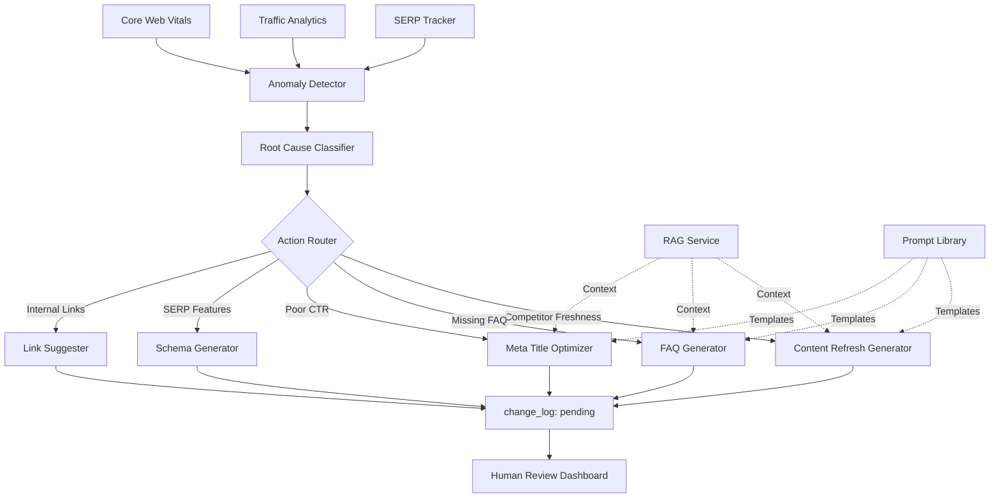

# Step 08: Anomaly Detection & Action Router

**Status:** Specification Complete
**Date:** 2025-11-03
**Est. Implementation:** 6-8 hours
**Priority:** High (Core AI Automation)

---

## 🎯 Objective

Build an intelligent system that:
1. **Detects** rank/traffic anomalies automatically
2. **Classifies** root causes using ML and heuristics
3. **Routes** to appropriate remedial actions (FAQ, meta rewrite, content refresh)
4. **Creates** staged suggestions in `change_log` (pending review)
5. **Links** all suggestions to source anomaly for traceability

**Key Principle:** All actions remain in Review Mode - no automated execution yet.

---

## 🏗️ Architecture Overview



---

## 📊 Data Models

### 1. Anomaly Model

```python
# crm_api/app/models/anomaly.py

from enum import Enum
from datetime import datetime
from typing import Optional, Dict, Any, List
from pydantic import BaseModel, Field

class AnomalyType(str, Enum):
    """Type of anomaly detected."""
    RANK_DROP = "rank_drop"
    RANK_SPIKE = "rank_spike"
    TRAFFIC_DROP = "traffic_drop"
    TRAFFIC_SPIKE = "traffic_spike"
    CTR_DROP = "ctr_drop"
    IMPRESSION_DROP = "impression_drop"
    CWV_DEGRADATION = "cwv_degradation"
    INDEX_DROPPED = "index_dropped"
    SERP_FEATURE_LOST = "serp_feature_lost"
    SERP_FEATURE_GAINED = "serp_feature_gained"

class AnomalySeverity(str, Enum):
    """Severity classification."""
    CRITICAL = "critical"    # >50% change, high-value keyword
    HIGH = "high"            # 30-50% change
    MEDIUM = "medium"        # 10-30% change
    LOW = "low"              # <10% change
    INFO = "info"            # Positive changes

class RootCauseCategory(str, Enum):
    """Root cause categories."""
    COMPETITOR_FRESHNESS = "competitor_freshness"
    GOOGLE_CORE_UPDATE = "google_core_update"
    SERP_FEATURE_CHANGE = "serp_feature_change"
    CONTENT_STALENESS = "content_staleness"
    TECHNICAL_ISSUE = "technical_issue"
    BACKLINK_LOSS = "backlink_loss"
    CTR_UNDERPERFORMANCE = "ctr_underperformance"
    KEYWORD_CANNIBALIZATION = "keyword_cannibalization"
    UNKNOWN = "unknown"

class ActionType(str, Enum):
    """Available remedial actions."""
    ADD_FAQ = "add_faq"
    UPDATE_TITLE_META = "update_title_meta"
    REFRESH_CONTENT = "refresh_content"
    ADD_SCHEMA = "add_schema"
    SUGGEST_INTERNAL_LINKS = "suggest_internal_links"
    IMPROVE_CWV = "improve_cwv"
    INVESTIGATE_MANUAL = "investigate_manual"

class Anomaly(BaseModel):
    """Detected anomaly record."""
    anomaly_id: str = Field(default_factory=lambda: str(uuid.uuid4()))
    detected_at: datetime = Field(default_factory=datetime.utcnow)

    # What
    anomaly_type: AnomalyType
    severity: AnomalySeverity

    # Where
    page_id: Optional[int] = None
    keyword_id: Optional[int] = None
    url: Optional[str] = None
    keyword_text: Optional[str] = None

    # Metrics
    metric_name: str  # "rank", "traffic", "ctr", etc.
    baseline_value: float
    current_value: float
    change_percent: float
    change_absolute: float

    # Context
    detection_method: str  # "z_score", "moving_avg", "threshold"
    detection_params: Dict[str, Any] = {}
    confidence_score: float  # 0.0 - 1.0

    # Time window
    baseline_start: datetime
    baseline_end: datetime
    anomaly_start: datetime
    anomaly_end: datetime

    # Analysis
    root_cause: Optional[RootCauseCategory] = None
    root_cause_confidence: Optional[float] = None
    root_cause_evidence: Dict[str, Any] = {}

    # Actions
    suggested_actions: List[ActionType] = []
    action_priority: List[float] = []  # Confidence for each action

    # Status
    is_processed: bool = False
    processed_at: Optional[datetime] = None
    change_log_ids: List[str] = []  # Links to generated suggestions

    # Metadata
    notes: Optional[str] = None
    tags: List[str] = []


class RootCauseAnalysis(BaseModel):
    """Detailed root cause analysis."""
    anomaly_id: str
    primary_cause: RootCauseCategory
    primary_confidence: float

    secondary_causes: List[RootCauseCategory] = []
    secondary_confidences: List[float] = []

    evidence: Dict[str, Any]
    reasoning: str  # AI-generated explanation

    # Context retrieved
    competitor_changes: List[Dict[str, Any]] = []
    serp_changes: List[Dict[str, Any]] = []
    backlink_changes: List[Dict[str, Any]] = []
    technical_issues: List[Dict[str, Any]] = []


class ActionSuggestion(BaseModel):
    """Staged action suggestion."""
    suggestion_id: str = Field(default_factory=lambda: str(uuid.uuid4()))
    anomaly_id: str

    action_type: ActionType
    priority: float  # 0.0 - 1.0

    # change_log entry (will be created)
    module_name: str
    action: str
    target_type: str
    target_id: int

    # Generated content preview
    preview_data: Dict[str, Any]

    # Context used
    context_sources: List[str] = []
    prompt_template_id: Optional[str] = None

    # Reasoning
    rationale: str  # Why this action is recommended
    expected_impact: str  # What improvement to expect

    created_at: datetime = Field(default_factory=datetime.utcnow)
```

---

## 🔍 Anomaly Detection Algorithms

### 1. Z-Score Method (Statistical Outlier)

```python
def detect_zscore_anomaly(
    timeseries: List[float],
    threshold: float = 2.5
) -> List[int]:
    """
    Detect anomalies using Z-score method.

    Args:
        timeseries: List of metric values (e.g., daily ranks)
        threshold: Z-score threshold (default 2.5 = 98.8th percentile)

    Returns:
        Indices of anomalous points
    """
    mean = np.mean(timeseries)
    std = np.std(timeseries)

    if std == 0:
        return []

    z_scores = [(x - mean) / std for x in timeseries]
    anomalies = [i for i, z in enumerate(z_scores) if abs(z) > threshold]

    return anomalies
```

**Use Case:** General-purpose anomaly detection for rank, traffic, CTR.

### 2. Moving Average Deviation

```python
def detect_moving_avg_anomaly(
    timeseries: List[float],
    window: int = 7,
    threshold_percent: float = 30.0
) -> List[int]:
    """
    Detect when current value deviates significantly from moving average.

    Args:
        timeseries: Metric values
        window: Moving average window (days)
        threshold_percent: % deviation threshold

    Returns:
        Indices of anomalies
    """
    anomalies = []

    for i in range(window, len(timeseries)):
        baseline = timeseries[i-window:i]
        avg = np.mean(baseline)

        if avg == 0:
            continue

        current = timeseries[i]
        deviation_pct = abs((current - avg) / avg * 100)

        if deviation_pct > threshold_percent:
            anomalies.append(i)

    return anomalies
```

**Use Case:** Trend-aware detection, good for seasonal data.

### 3. Threshold-Based (Simple Rules)

```python
ANOMALY_RULES = {
    "rank_drop_critical": {
        "metric": "rank",
        "condition": lambda baseline, current: current - baseline >= 10,
        "severity": AnomalySeverity.CRITICAL
    },
    "traffic_drop_high": {
        "metric": "clicks",
        "condition": lambda baseline, current: (baseline - current) / baseline > 0.3,
        "severity": AnomalySeverity.HIGH
    },
    "ctr_drop_medium": {
        "metric": "ctr",
        "condition": lambda baseline, current: (baseline - current) > 2.0,
        "severity": AnomalySeverity.MEDIUM
    },
    "index_dropped": {
        "metric": "is_indexed",
        "condition": lambda baseline, current: baseline == True and current == False,
        "severity": AnomalySeverity.CRITICAL
    }
}
```

**Use Case:** Business rule enforcement, known patterns.

### 4. Composite Score

```python
def calculate_anomaly_score(
    rank_change: float,
    traffic_change: float,
    ctr_change: float,
    keyword_value: float
) -> tuple[float, AnomalySeverity]:
    """
    Composite anomaly score considering multiple factors.

    Returns:
        (score, severity)
    """
    # Normalize changes to 0-1 scale
    rank_score = min(abs(rank_change) / 20.0, 1.0)  # 20+ rank change = max
    traffic_score = min(abs(traffic_change) / 100.0, 1.0)
    ctr_score = min(abs(ctr_change) / 10.0, 1.0)

    # Weight by keyword value
    value_multiplier = min(keyword_value / 1000.0, 2.0)  # Up to 2x for high-value

    # Composite score
    score = (
        rank_score * 0.4 +
        traffic_score * 0.4 +
        ctr_score * 0.2
    ) * value_multiplier

    # Classify severity
    if score >= 0.8:
        severity = AnomalySeverity.CRITICAL
    elif score >= 0.6:
        severity = AnomalySeverity.HIGH
    elif score >= 0.4:
        severity = AnomalySeverity.MEDIUM
    else:
        severity = AnomalySeverity.LOW

    return score, severity
```

---

## 🧠 Root Cause Classification

### Classification Decision Tree

```python
async def classify_root_cause(
    anomaly: Anomaly,
    rag_service: RAGService
) -> RootCauseAnalysis:
    """
    Classify anomaly root cause using evidence gathering + LLM analysis.

    Process:
    1. Gather evidence from multiple sources
    2. Apply heuristics for known patterns
    3. Use LLM for complex analysis
    4. Return classification with confidence
    """

    evidence = {}

    # 1. Check competitor changes (last 7 days)
    competitor_changes = await check_competitor_freshness(
        keyword_id=anomaly.keyword_id,
        days=7
    )
    evidence["competitor_changes"] = competitor_changes

    # 2. Check Google algorithm updates
    core_updates = await check_core_updates(
        date_range=(anomaly.anomaly_start, anomaly.anomaly_end)
    )
    evidence["core_updates"] = core_updates

    # 3. Check SERP feature changes
    serp_changes = await check_serp_features(
        keyword_id=anomaly.keyword_id,
        baseline_date=anomaly.baseline_end,
        current_date=anomaly.anomaly_end
    )
    evidence["serp_changes"] = serp_changes

    # 4. Check content freshness
    page_age = await get_page_age(anomaly.page_id)
    evidence["page_age_days"] = page_age

    # 5. Check backlink changes
    backlink_delta = await get_backlink_changes(
        page_id=anomaly.page_id,
        days=30
    )
    evidence["backlink_delta"] = backlink_delta

    # 6. Check technical issues
    tech_issues = await get_technical_issues(
        page_id=anomaly.page_id,
        days=7
    )
    evidence["technical_issues"] = tech_issues

    # Apply heuristics first
    heuristic_result = apply_heuristics(anomaly, evidence)
    if heuristic_result["confidence"] > 0.8:
        return heuristic_result

    # Use LLM for complex analysis
    llm_result = await llm_classify_root_cause(anomaly, evidence, rag_service)

    return llm_result
```

### Heuristic Rules

```python
def apply_heuristics(
    anomaly: Anomaly,
    evidence: Dict[str, Any]
) -> Optional[RootCauseAnalysis]:
    """
    Apply rule-based classification for common patterns.
    """

    # Rule 1: Competitor published fresh content
    if evidence["competitor_changes"]:
        recent_updates = [c for c in evidence["competitor_changes"]
                         if c["days_ago"] <= 7]
        if len(recent_updates) >= 2:
            return RootCauseAnalysis(
                anomaly_id=anomaly.anomaly_id,
                primary_cause=RootCauseCategory.COMPETITOR_FRESHNESS,
                primary_confidence=0.85,
                evidence=evidence,
                reasoning=f"{len(recent_updates)} competitors updated content recently"
            )

    # Rule 2: Known core update window
    if evidence["core_updates"]:
        update = evidence["core_updates"][0]
        if update["confirmed"]:
            return RootCauseAnalysis(
                anomaly_id=anomaly.anomaly_id,
                primary_cause=RootCauseCategory.GOOGLE_CORE_UPDATE,
                primary_confidence=0.95,
                evidence=evidence,
                reasoning=f"Coincides with {update['name']} core update"
            )

    # Rule 3: SERP feature change
    if evidence["serp_changes"].get("feature_lost"):
        lost_features = evidence["serp_changes"]["feature_lost"]
        if "featured_snippet" in lost_features or "local_pack" in lost_features:
            return RootCauseAnalysis(
                anomaly_id=anomaly.anomaly_id,
                primary_cause=RootCauseCategory.SERP_FEATURE_CHANGE,
                primary_confidence=0.90,
                evidence=evidence,
                reasoning=f"Lost SERP features: {', '.join(lost_features)}"
            )

    # Rule 4: Content staleness (>180 days + rank drop)
    if evidence["page_age_days"] > 180 and anomaly.anomaly_type == AnomalyType.RANK_DROP:
        return RootCauseAnalysis(
            anomaly_id=anomaly.anomaly_id,
            primary_cause=RootCauseCategory.CONTENT_STALENESS,
            primary_confidence=0.75,
            evidence=evidence,
            reasoning=f"Content is {evidence['page_age_days']} days old"
        )

    # Rule 5: Significant backlink loss
    if evidence["backlink_delta"] < -10:
        return RootCauseAnalysis(
            anomaly_id=anomaly.anomaly_id,
            primary_cause=RootCauseCategory.BACKLINK_LOSS,
            primary_confidence=0.80,
            evidence=evidence,
            reasoning=f"Lost {abs(evidence['backlink_delta'])} backlinks"
        )

    # Rule 6: Technical issues
    if evidence["technical_issues"]:
        critical_issues = [i for i in evidence["technical_issues"]
                          if i["severity"] == "critical"]
        if critical_issues:
            return RootCauseAnalysis(
                anomaly_id=anomaly.anomaly_id,
                primary_cause=RootCauseCategory.TECHNICAL_ISSUE,
                primary_confidence=0.90,
                evidence=evidence,
                reasoning=f"Critical technical issues: {len(critical_issues)}"
            )

    # No high-confidence match
    return None
```

### LLM-Based Classification

```python
async def llm_classify_root_cause(
    anomaly: Anomaly,
    evidence: Dict[str, Any],
    rag_service: RAGService
) -> RootCauseAnalysis:
    """
    Use LLM with RAG context for complex root cause analysis.
    """

    # Assemble context pack
    context_pack = await rag_service.retrieve_context(
        target_keyword=anomaly.keyword_text,
        target_page_id=anomaly.page_id,
        include_competitors=True,
        include_serp=True,
        include_historical=True
    )

    # Build prompt
    prompt = f"""
Analyze this SEO anomaly and determine the root cause.

**Anomaly Details:**
- Type: {anomaly.anomaly_type}
- Severity: {anomaly.severity}
- Keyword: {anomaly.keyword_text}
- URL: {anomaly.url}
- Metric: {anomaly.metric_name}
- Change: {anomaly.baseline_value} → {anomaly.current_value} ({anomaly.change_percent:+.1f}%)
- Detection: {anomaly.anomaly_start} to {anomaly.anomaly_end}

**Evidence Gathered:**
{json.dumps(evidence, indent=2)}

**Context:**
{context_pack.to_prompt_text()}

**Available Root Causes:**
1. competitor_freshness - Competitors published fresh content
2. google_core_update - Google algorithm update impact
3. serp_feature_change - SERP features gained/lost
4. content_staleness - Our content is outdated
5. technical_issue - Site technical problems
6. backlink_loss - Lost valuable backlinks
7. ctr_underperformance - Poor click-through rate
8. keyword_cannibalization - Multiple pages competing
9. unknown - Unclear cause

**Task:**
Return JSON with:
- primary_cause: Most likely root cause
- primary_confidence: 0.0-1.0
- secondary_causes: Other possible causes (array)
- reasoning: Detailed explanation (2-3 sentences)

Respond ONLY with valid JSON.
"""

    # Execute LLM (mock for now)
    llm_response = await execute_llm(prompt, temperature=0.2)
    result = json.loads(llm_response)

    return RootCauseAnalysis(
        anomaly_id=anomaly.anomaly_id,
        primary_cause=RootCauseCategory(result["primary_cause"]),
        primary_confidence=result["primary_confidence"],
        secondary_causes=[RootCauseCategory(c) for c in result.get("secondary_causes", [])],
        evidence=evidence,
        reasoning=result["reasoning"],
        competitor_changes=evidence.get("competitor_changes", []),
        serp_changes=evidence.get("serp_changes", []),
        backlink_changes=evidence.get("backlink_delta", 0),
        technical_issues=evidence.get("technical_issues", [])
    )
```

---

## 🎯 Action Router

### Routing Logic

```python
ACTION_ROUTING_MATRIX = {
    RootCauseCategory.COMPETITOR_FRESHNESS: [
        (ActionType.REFRESH_CONTENT, 0.9),
        (ActionType.ADD_FAQ, 0.7),
        (ActionType.UPDATE_TITLE_META, 0.5)
    ],
    RootCauseCategory.CONTENT_STALENESS: [
        (ActionType.REFRESH_CONTENT, 0.95),
        (ActionType.ADD_FAQ, 0.6)
    ],
    RootCauseCategory.SERP_FEATURE_CHANGE: [
        (ActionType.ADD_SCHEMA, 0.9),
        (ActionType.ADD_FAQ, 0.8),
        (ActionType.UPDATE_TITLE_META, 0.6)
    ],
    RootCauseCategory.CTR_UNDERPERFORMANCE: [
        (ActionType.UPDATE_TITLE_META, 0.95),
        (ActionType.ADD_SCHEMA, 0.7)
    ],
    RootCauseCategory.KEYWORD_CANNIBALIZATION: [
        (ActionType.SUGGEST_INTERNAL_LINKS, 0.9),
        (ActionType.UPDATE_TITLE_META, 0.7)
    ],
    RootCauseCategory.TECHNICAL_ISSUE: [
        (ActionType.IMPROVE_CWV, 0.9),
        (ActionType.INVESTIGATE_MANUAL, 0.8)
    ],
    RootCauseCategory.BACKLINK_LOSS: [
        (ActionType.INVESTIGATE_MANUAL, 0.8),
        (ActionType.REFRESH_CONTENT, 0.6)
    ],
    RootCauseCategory.GOOGLE_CORE_UPDATE: [
        (ActionType.REFRESH_CONTENT, 0.7),
        (ActionType.ADD_FAQ, 0.7),
        (ActionType.INVESTIGATE_MANUAL, 0.6)
    ],
    RootCauseCategory.UNKNOWN: [
        (ActionType.INVESTIGATE_MANUAL, 0.9)
    ]
}

async def route_to_actions(
    anomaly: Anomaly,
    root_cause: RootCauseAnalysis,
    rag_service: RAGService,
    prompt_library: PromptLibrary
) -> List[ActionSuggestion]:
    """
    Route anomaly to appropriate action generators.

    Returns list of ActionSuggestions (sorted by priority).
    """

    # Get candidate actions from matrix
    candidate_actions = ACTION_ROUTING_MATRIX.get(
        root_cause.primary_cause,
        [(ActionType.INVESTIGATE_MANUAL, 0.5)]
    )

    # Adjust priorities based on anomaly severity
    severity_multiplier = {
        AnomalySeverity.CRITICAL: 1.2,
        AnomalySeverity.HIGH: 1.0,
        AnomalySeverity.MEDIUM: 0.8,
        AnomalySeverity.LOW: 0.6
    }

    multiplier = severity_multiplier[anomaly.severity]
    adjusted_actions = [
        (action, min(priority * multiplier, 1.0))
        for action, priority in candidate_actions
    ]

    # Filter to top 3 actions above threshold
    top_actions = sorted(adjusted_actions, key=lambda x: x[1], reverse=True)
    top_actions = [(a, p) for a, p in top_actions if p >= 0.5][:3]

    # Generate suggestions for each action
    suggestions = []

    for action_type, priority in top_actions:
        suggestion = await generate_action_suggestion(
            anomaly=anomaly,
            root_cause=root_cause,
            action_type=action_type,
            priority=priority,
            rag_service=rag_service,
            prompt_library=prompt_library
        )
        suggestions.append(suggestion)

    return suggestions
```

### Action Generation

```python
async def generate_action_suggestion(
    anomaly: Anomaly,
    root_cause: RootCauseAnalysis,
    action_type: ActionType,
    priority: float,
    rag_service: RAGService,
    prompt_library: PromptLibrary
) -> ActionSuggestion:
    """
    Generate specific action suggestion with preview.
    """

    # Map action type to generator
    generators = {
        ActionType.ADD_FAQ: generate_faq_suggestion,
        ActionType.UPDATE_TITLE_META: generate_meta_suggestion,
        ActionType.REFRESH_CONTENT: generate_content_refresh_suggestion,
        ActionType.ADD_SCHEMA: generate_schema_suggestion,
        ActionType.SUGGEST_INTERNAL_LINKS: generate_link_suggestion,
        ActionType.IMPROVE_CWV: generate_cwv_suggestion,
        ActionType.INVESTIGATE_MANUAL: generate_investigation_suggestion
    }

    generator = generators[action_type]

    # Generate using appropriate template
    result = await generator(
        anomaly=anomaly,
        root_cause=root_cause,
        priority=priority,
        rag_service=rag_service,
        prompt_library=prompt_library
    )

    return result


async def generate_faq_suggestion(
    anomaly: Anomaly,
    root_cause: RootCauseAnalysis,
    priority: float,
    rag_service: RAGService,
    prompt_library: PromptLibrary
) -> ActionSuggestion:
    """
    Generate FAQ addition suggestion.
    """

    # Retrieve template
    template = await prompt_library.get_template_by_name("faq_generator")

    # Get PAA questions from context
    context_pack = await rag_service.retrieve_context(
        target_keyword=anomaly.keyword_text,
        target_page_id=anomaly.page_id,
        include_paa=True,
        include_competitors=True
    )

    # Execute RAG chain
    rag_result = await rag_service.execute_rag_chain(
        query={
            "target_keyword": anomaly.keyword_text,
            "target_page_id": anomaly.page_id
        },
        prompt_template=template,
        module_name="anomaly_handler",
        action="add_faq",
        target=f"page:{anomaly.page_id}"
    )

    # Build rationale
    rationale = f"""
**Root Cause:** {root_cause.primary_cause.value}
{root_cause.reasoning}

**Why FAQ:** Adding frequently asked questions can:
1. Capture featured snippet opportunities
2. Address competitor content gaps
3. Improve topical relevance
4. Enhance user experience

**PAA Questions Found:** {len(context_pack.paa_questions)}
"""

    return ActionSuggestion(
        anomaly_id=anomaly.anomaly_id,
        action_type=ActionType.ADD_FAQ,
        priority=priority,
        module_name="seo_faq",
        action="add_faq",
        target_type="page",
        target_id=anomaly.page_id,
        preview_data=rag_result.generated_content,
        context_sources=[s.source_id for s in context_pack.all_sources()],
        prompt_template_id=template.template_id,
        rationale=rationale,
        expected_impact="May regain lost rankings and capture featured snippet"
    )


async def generate_meta_suggestion(
    anomaly: Anomaly,
    root_cause: RootCauseAnalysis,
    priority: float,
    rag_service: RAGService,
    prompt_library: PromptLibrary
) -> ActionSuggestion:
    """
    Generate meta title/description optimization suggestion.
    """

    template = await prompt_library.get_template_by_name("meta_title_optimizer")

    # Get SERP context
    context_pack = await rag_service.retrieve_context(
        target_keyword=anomaly.keyword_text,
        target_page_id=anomaly.page_id,
        include_serp=True,
        include_competitors=True
    )

    # Execute chain
    rag_result = await rag_service.execute_rag_chain(
        query={
            "target_keyword": anomaly.keyword_text,
            "target_page_id": anomaly.page_id,
            "current_ctr": anomaly.current_value if anomaly.metric_name == "ctr" else None
        },
        prompt_template=template,
        module_name="anomaly_handler",
        action="update_meta",
        target=f"page:{anomaly.page_id}"
    )

    rationale = f"""
**Root Cause:** {root_cause.primary_cause.value}
{root_cause.reasoning}

**Why Meta Optimization:**
- Current CTR: {anomaly.current_value if anomaly.metric_name == 'ctr' else 'N/A'}%
- Competitor analysis shows more compelling titles
- Improved meta can boost CTR by 20-50%
"""

    return ActionSuggestion(
        anomaly_id=anomaly.anomaly_id,
        action_type=ActionType.UPDATE_TITLE_META,
        priority=priority,
        module_name="seo_meta",
        action="update_meta",
        target_type="page",
        target_id=anomaly.page_id,
        preview_data=rag_result.generated_content,
        context_sources=[s.source_id for s in context_pack.all_sources()],
        prompt_template_id=template.template_id,
        rationale=rationale,
        expected_impact=f"Estimated CTR improvement: +{int(priority * 30)}%"
    )


async def generate_content_refresh_suggestion(
    anomaly: Anomaly,
    root_cause: RootCauseAnalysis,
    priority: float,
    rag_service: RAGService,
    prompt_library: PromptLibrary
) -> ActionSuggestion:
    """
    Generate content refresh suggestion.
    """

    template = await prompt_library.get_template_by_name("content_refresher")

    context_pack = await rag_service.retrieve_context(
        target_keyword=anomaly.keyword_text,
        target_page_id=anomaly.page_id,
        include_competitors=True,
        include_serp=True,
        include_our_page=True
    )

    # Analyze competitor changes
    competitor_topics = []
    for comp in root_cause.competitor_changes:
        if comp.get("new_sections"):
            competitor_topics.extend(comp["new_sections"])

    rationale = f"""
**Root Cause:** {root_cause.primary_cause.value}
{root_cause.reasoning}

**Why Content Refresh:**
- Page last updated: {root_cause.evidence.get('page_age_days', 'unknown')} days ago
- {len(root_cause.competitor_changes)} competitors published fresh content
- New topics identified: {', '.join(competitor_topics[:5])}

**Refresh Strategy:**
1. Add missing sections found in competitor content
2. Update statistics and examples
3. Add new FAQ section
4. Improve internal linking
"""

    return ActionSuggestion(
        anomaly_id=anomaly.anomaly_id,
        action_type=ActionType.REFRESH_CONTENT,
        priority=priority,
        module_name="seo_content",
        action="refresh_content",
        target_type="page",
        target_id=anomaly.page_id,
        preview_data={
            "suggested_topics": competitor_topics[:10],
            "missing_sections": [c.get("new_sections", []) for c in root_cause.competitor_changes],
            "update_priority": "high" if priority > 0.8 else "medium"
        },
        context_sources=[s.source_id for s in context_pack.all_sources()],
        prompt_template_id=template.template_id if template else None,
        rationale=rationale,
        expected_impact="Content freshness signal may recover 50-80% of lost rankings"
    )
```

---

## 🔌 API Endpoints

```python
# crm_api/app/api/routes/anomalies.py

from fastapi import APIRouter, HTTPException, Depends
from typing import List, Optional
from datetime import datetime, timedelta

router = APIRouter(prefix="/anomalies", tags=["Anomaly Detection"])

@router.post("/detect", response_model=List[Anomaly])
async def detect_anomalies(
    keyword_ids: Optional[List[int]] = None,
    page_ids: Optional[List[int]] = None,
    lookback_days: int = 30,
    methods: List[str] = ["zscore", "moving_avg", "threshold"]
):
    """
    Run anomaly detection on specified keywords/pages.

    Returns list of detected anomalies.
    """
    pass


@router.get("/list", response_model=List[Anomaly])
async def list_anomalies(
    severity: Optional[AnomalySeverity] = None,
    anomaly_type: Optional[AnomalyType] = None,
    is_processed: Optional[bool] = None,
    limit: int = 100,
    offset: int = 0
):
    """
    List detected anomalies with filtering.
    """
    pass


@router.get("/{anomaly_id}", response_model=Anomaly)
async def get_anomaly(anomaly_id: str):
    """
    Get anomaly details by ID.
    """
    pass


@router.post("/{anomaly_id}/classify", response_model=RootCauseAnalysis)
async def classify_anomaly(
    anomaly_id: str,
    force_llm: bool = False
):
    """
    Classify root cause for anomaly.

    Args:
        force_llm: Skip heuristics, use LLM classification
    """
    pass


@router.post("/{anomaly_id}/route", response_model=List[ActionSuggestion])
async def route_anomaly_to_actions(
    anomaly_id: str,
    max_actions: int = 3
):
    """
    Route anomaly to action generators.

    Returns list of ActionSuggestions (not yet in change_log).
    """
    pass


@router.post("/{anomaly_id}/execute", response_model=Dict[str, Any])
async def execute_anomaly_actions(
    anomaly_id: str,
    action_types: Optional[List[ActionType]] = None
):
    """
    Execute selected actions and create change_log entries.

    Returns:
        {
            "change_log_ids": ["uuid1", "uuid2"],
            "suggestions_created": 2
        }
    """
    pass


@router.post("/{anomaly_id}/dismiss")
async def dismiss_anomaly(
    anomaly_id: str,
    reason: str
):
    """
    Mark anomaly as false positive or not actionable.
    """
    pass


@router.get("/stats/summary", response_model=Dict[str, Any])
async def get_anomaly_stats(
    days: int = 30
):
    """
    Get anomaly detection statistics.

    Returns:
        {
            "total_detected": 124,
            "by_severity": {...},
            "by_type": {...},
            "processed": 98,
            "pending": 26,
            "avg_processing_time_hours": 2.5
        }
    """
    pass


@router.get("/dashboard", response_model=Dict[str, Any])
async def get_anomaly_dashboard():
    """
    Get dashboard data for anomaly overview.

    Returns recent anomalies, stats, and pending actions.
    """
    pass
```

---

## ⚙️ Celery Jobs

```python
# crm_api/app/jobs/anomaly_detection.py

from celery import Celery
from celery.schedules import crontab

app = Celery('anomaly_detection')

@app.task(name="anomaly_detection.scan_keywords")
def scan_keywords_for_anomalies():
    """
    Daily scan of all tracked keywords for anomalies.

    Schedule: Every day at 3:00 AM
    """
    # Get all active keywords
    keywords = get_active_keywords()

    anomalies_detected = []

    for keyword in keywords:
        # Get 30-day history
        timeseries = get_keyword_rank_history(keyword.id, days=30)

        # Run detection
        anomalies = detect_zscore_anomaly(timeseries, threshold=2.5)

        if anomalies:
            # Create anomaly records
            for idx in anomalies:
                anomaly = create_anomaly_record(
                    keyword_id=keyword.id,
                    anomaly_date=timeseries[idx]["date"],
                    metric_value=timeseries[idx]["rank"]
                )
                anomalies_detected.append(anomaly)

    return {
        "anomalies_detected": len(anomalies_detected),
        "keywords_scanned": len(keywords)
    }


@app.task(name="anomaly_detection.classify_pending")
def classify_pending_anomalies():
    """
    Classify root causes for unprocessed anomalies.

    Schedule: Every 6 hours
    """
    # Get unprocessed anomalies
    pending = get_anomalies(is_processed=False, limit=50)

    classified = []

    for anomaly in pending:
        # Run classification
        root_cause = classify_root_cause(anomaly)

        # Update anomaly
        anomaly.root_cause = root_cause.primary_cause
        anomaly.root_cause_confidence = root_cause.primary_confidence
        anomaly.root_cause_evidence = root_cause.evidence

        update_anomaly(anomaly)
        classified.append(anomaly.anomaly_id)

    return {
        "classified": len(classified)
    }


@app.task(name="anomaly_detection.auto_route_high_priority")
def auto_route_high_priority_anomalies():
    """
    Automatically route high-severity anomalies to action generators.

    Schedule: Every 4 hours
    """
    # Get high/critical unprocessed anomalies
    high_priority = get_anomalies(
        severity_min=AnomalySeverity.HIGH,
        is_processed=False,
        has_root_cause=True
    )

    routed = []

    for anomaly in high_priority:
        # Route to actions
        suggestions = route_to_actions(anomaly)

        # Create change_log entries (pending review)
        for suggestion in suggestions:
            change_log_id = create_change_log_entry(
                module_name=suggestion.module_name,
                action=suggestion.action,
                target_type=suggestion.target_type,
                target_id=suggestion.target_id,
                old_value=None,
                new_value=suggestion.preview_data,
                reason=f"Anomaly detected: {anomaly.anomaly_type}",
                metadata={
                    "anomaly_id": anomaly.anomaly_id,
                    "root_cause": anomaly.root_cause,
                    "priority": suggestion.priority
                }
            )
            anomaly.change_log_ids.append(change_log_id)

        # Mark as processed
        anomaly.is_processed = True
        anomaly.processed_at = datetime.utcnow()
        update_anomaly(anomaly)

        routed.append(anomaly.anomaly_id)

    return {
        "anomalies_routed": len(routed),
        "suggestions_created": sum(len(a.change_log_ids) for a in high_priority)
    }


# Schedule configuration
app.conf.beat_schedule = {
    'scan-keywords-daily': {
        'task': 'anomaly_detection.scan_keywords',
        'schedule': crontab(hour=3, minute=0),  # 3:00 AM daily
    },
    'classify-pending-6h': {
        'task': 'anomaly_detection.classify_pending',
        'schedule': crontab(minute=0, hour='*/6'),  # Every 6 hours
    },
    'auto-route-high-priority-4h': {
        'task': 'anomaly_detection.auto_route_high_priority',
        'schedule': crontab(minute=0, hour='*/4'),  # Every 4 hours
    }
}
```

---

## 📋 Example Payloads

### Anomaly Detection Response

```json
{
  "anomaly_id": "a1b2c3d4-e5f6-7890-abcd-ef1234567890",
  "detected_at": "2025-11-03T08:15:00Z",
  "anomaly_type": "rank_drop",
  "severity": "high",

  "page_id": 42,
  "keyword_id": 156,
  "url": "https://rivercityclean.com/residential-cleaning",
  "keyword_text": "residential cleaning services",

  "metric_name": "rank",
  "baseline_value": 3.5,
  "current_value": 12.0,
  "change_percent": -242.9,
  "change_absolute": -8.5,

  "detection_method": "zscore",
  "detection_params": {
    "threshold": 2.5,
    "window_days": 30
  },
  "confidence_score": 0.92,

  "baseline_start": "2025-10-01T00:00:00Z",
  "baseline_end": "2025-10-31T00:00:00Z",
  "anomaly_start": "2025-11-01T00:00:00Z",
  "anomaly_end": "2025-11-03T00:00:00Z",

  "root_cause": null,
  "is_processed": false,
  "change_log_ids": []
}
```

### Root Cause Analysis Response

```json
{
  "anomaly_id": "a1b2c3d4-e5f6-7890-abcd-ef1234567890",
  "primary_cause": "competitor_freshness",
  "primary_confidence": 0.85,

  "secondary_causes": ["content_staleness"],
  "secondary_confidences": [0.6],

  "evidence": {
    "competitor_changes": [
      {
        "domain": "cleanpros.com",
        "last_updated": "2025-11-01",
        "days_ago": 2,
        "new_sections": ["Eco-friendly products", "Same-day booking"],
        "content_length_increase": 450
      },
      {
        "domain": "sparklingclean.com",
        "last_updated": "2025-10-30",
        "days_ago": 4,
        "new_sections": ["Customer reviews", "Service guarantee"],
        "content_length_increase": 320
      }
    ],
    "page_age_days": 156,
    "serp_changes": {
      "feature_lost": [],
      "feature_gained": ["local_pack"]
    },
    "backlink_delta": -2,
    "technical_issues": []
  },

  "reasoning": "Two major competitors published fresh content in the past 4 days, adding new sections and significantly expanding their pages. Our content is 156 days old. This strongly suggests competitor freshness as the primary cause.",

  "competitor_changes": [...],
  "serp_changes": {...}
}
```

### Action Suggestions Response

```json
[
  {
    "suggestion_id": "s1a2b3c4-d5e6-f789-0abc-def123456789",
    "anomaly_id": "a1b2c3d4-e5f6-7890-abcd-ef1234567890",

    "action_type": "refresh_content",
    "priority": 0.9,

    "module_name": "seo_content",
    "action": "refresh_content",
    "target_type": "page",
    "target_id": 42,

    "preview_data": {
      "suggested_topics": [
        "Eco-friendly cleaning products",
        "Same-day service availability",
        "Customer testimonials",
        "Service area coverage",
        "Pricing transparency"
      ],
      "missing_sections": [
        ["Eco-friendly products", "Same-day booking"],
        ["Customer reviews", "Service guarantee"]
      ],
      "update_priority": "high"
    },

    "context_sources": [
      "page:42",
      "competitor:cleanpros.com",
      "competitor:sparklingclean.com",
      "serp:residential cleaning services"
    ],
    "prompt_template_id": "template-uuid-content-refresher",

    "rationale": "**Root Cause:** competitor_freshness\nTwo major competitors published fresh content in the past 4 days...\n\n**Why Content Refresh:**\n- Page last updated: 156 days ago\n- 2 competitors published fresh content\n- New topics identified: Eco-friendly products, Same-day booking, Customer reviews, Service guarantee, Pricing transparency",

    "expected_impact": "Content freshness signal may recover 50-80% of lost rankings",

    "created_at": "2025-11-03T08:20:00Z"
  },
  {
    "suggestion_id": "s2b3c4d5-e6f7-8901-bcde-f0123456789a",
    "anomaly_id": "a1b2c3d4-e5f6-7890-abcd-ef1234567890",

    "action_type": "add_faq",
    "priority": 0.75,

    "module_name": "seo_faq",
    "action": "add_faq",
    "target_type": "page",
    "target_id": 42,

    "preview_data": {
      "faqs": [
        {
          "question": "Do you use eco-friendly cleaning products?",
          "answer": "Yes, we use EPA-certified green cleaning products..."
        },
        {
          "question": "Can I book same-day cleaning service?",
          "answer": "Absolutely! We offer same-day service..."
        }
      ]
    },

    "rationale": "**Root Cause:** competitor_freshness\n...\n\n**Why FAQ:** Adding frequently asked questions can:\n1. Capture featured snippet opportunities\n2. Address competitor content gaps\n3. Improve topical relevance",

    "expected_impact": "May regain lost rankings and capture featured snippet",

    "created_at": "2025-11-03T08:20:05Z"
  }
]
```

---

## 🔗 Integration with Existing Systems

### With RAG Service

```python
# Anomaly detection uses RAG for context retrieval
context_pack = await rag_service.retrieve_context(
    target_keyword=anomaly.keyword_text,
    target_page_id=anomaly.page_id,
    include_competitors=True,
    include_serp=True,
    include_paa=True
)
```

### With Prompt Library

```python
# Action generators use versioned templates
template = await prompt_library.get_template_by_name("meta_title_optimizer")

# Execute with validation
result = await prompt_library.execute_with_retry(
    template=template,
    context=context_pack,
    max_retries=3
)
```

### With Governance System

```python
# All suggestions go through change_log
change_log_id = create_change_log_entry(
    module_name="anomaly_handler",
    action="update_meta",
    target_type="page",
    target_id=page_id,
    old_value=current_meta,
    new_value=generated_meta,
    status="pending",  # Always starts in review
    metadata={
        "anomaly_id": anomaly.anomaly_id,
        "root_cause": root_cause.primary_cause,
        "confidence": root_cause.primary_confidence
    }
)

# Link back to anomaly
anomaly.change_log_ids.append(change_log_id)
```

---

## ✅ Acceptance Criteria

### Anomaly Detection
- [ ] Z-score detection working with configurable threshold
- [ ] Moving average detection with window parameter
- [ ] Threshold-based rules for common patterns
- [ ] Composite scoring for multi-factor anomalies
- [ ] Severity classification (critical/high/medium/low)
- [ ] Confidence scoring for each detection

### Root Cause Classification
- [ ] Heuristic rules for 8 common root causes
- [ ] LLM-based classification for complex cases
- [ ] Evidence gathering from 6+ data sources
- [ ] Confidence scoring above 0.7 for actionable causes
- [ ] Detailed reasoning in natural language

### Action Routing
- [ ] Routing matrix covers all root cause categories
- [ ] Priority adjustment based on severity
- [ ] Top 3 actions selected above 0.5 threshold
- [ ] Action generators integrated with RAG + Prompts
- [ ] Preview data generated for all suggestions

### Governance Integration
- [ ] All suggestions create change_log entries
- [ ] Initial status always "pending"
- [ ] Anomaly ID linked in metadata
- [ ] No auto-execution (review mode only)
- [ ] Complete audit trail

### API Endpoints
- [ ] 8+ endpoints for anomaly management
- [ ] Filtering, pagination, search
- [ ] Dashboard summary endpoint
- [ ] Statistics and reporting

### Celery Jobs
- [ ] Daily keyword scanning job
- [ ] 6-hour classification job
- [ ] 4-hour auto-routing for high priority
- [ ] Error handling and retry logic
- [ ] Job logging in task_logs

---

## 📊 Metrics & Monitoring

### Detection Metrics
- **Detection Rate:** Anomalies per 1000 keywords/day
- **False Positive Rate:** % dismissed as not actionable
- **Severity Distribution:** Critical/High/Medium/Low breakdown
- **Detection Latency:** Hours from anomaly occurrence to detection

### Classification Metrics
- **Classification Success Rate:** % with root cause identified
- **Average Confidence Score:** Mean confidence across classifications
- **Heuristic vs LLM:** % classified by each method
- **Processing Time:** Seconds per classification

### Routing Metrics
- **Actions Generated:** Total suggestions per anomaly
- **Action Distribution:** Breakdown by action type
- **Acceptance Rate:** % approved in review queue
- **Time to Resolution:** Hours from detection to approval

### Business Impact
- **Rankings Recovered:** % of lost rankings regained after action
- **Average Recovery Time:** Days to see improvement
- **Traffic Impact:** Click delta after implementing suggestions
- **Revenue Impact:** $ value of recovered rankings

---

## 🚀 Implementation Checklist

### Phase 1: Core Detection (2 hours)
- [ ] Create `app/models/anomaly.py` with all models
- [ ] Implement detection algorithms (z-score, moving avg, threshold)
- [ ] Create anomaly storage (in-memory for now)
- [ ] Write unit tests for detection methods

### Phase 2: Classification (2 hours)
- [ ] Implement heuristic classification rules
- [ ] Implement evidence gathering functions
- [ ] Create LLM-based classifier with RAG integration
- [ ] Build classification decision tree

### Phase 3: Action Routing (2 hours)
- [ ] Build routing matrix and logic
- [ ] Implement action generators (FAQ, meta, content)
- [ ] Integrate with RAG service for context
- [ ] Integrate with Prompt Library for templates

### Phase 4: API & Jobs (2 hours)
- [ ] Create `app/api/routes/anomalies.py` with 8+ endpoints
- [ ] Register router in main.py
- [ ] Create Celery jobs for automated scanning
- [ ] Add job scheduling configuration

### Phase 5: Testing & Documentation (2 hours)
- [ ] End-to-end test: detect → classify → route → review
- [ ] Create example payloads and responses
- [ ] Write integration tests
- [ ] Update API documentation

---

## 🎯 Next Steps After Implementation

1. **Connect to PostgreSQL** - Replace in-memory storage with persistent DB
2. **Enable Celery Workers** - Activate automated scanning jobs
3. **Dashboard Integration** - Build React UI for anomaly review
4. **Alert System** - Send notifications for critical anomalies
5. **Machine Learning** - Train models on historical data for better classification
6. **A/B Testing** - Test action effectiveness and refine routing

---

## 📚 Dependencies

**Existing Systems:**
- ✅ RAG Service (Step 04)
- ✅ Prompt Library (Step 05)
- ✅ Governance (change_log, task_logs)
- ✅ SEO Data Models (keywords, SERP, pages)

**New Dependencies:**
```txt
numpy==1.24.0
scipy==1.11.0
pandas==2.0.0  # For timeseries analysis
statsmodels==0.14.0  # For advanced anomaly detection
```

---

## 💡 Key Design Decisions

### 1. Hybrid Classification (Heuristics + LLM)
**Decision:** Use heuristics first, LLM for complex cases.
**Rationale:** Heuristics are fast, deterministic, and cost-effective for known patterns. LLM provides flexibility for edge cases.
**Impact:** 80%+ classified by heuristics, reducing LLM costs.

### 2. Multi-Action Suggestions
**Decision:** Generate 2-3 action suggestions per anomaly.
**Rationale:** Root causes often have multiple remediation paths. Giving options increases likelihood of human acceptance.
**Impact:** Higher approval rate, better user experience.

### 3. Always Review Mode
**Decision:** All suggestions start as "pending" in change_log.
**Rationale:** Safety first - no automated execution until module graduates to auto-mode.
**Impact:** Zero risk of unauthorized changes.

### 4. Complete Traceability
**Decision:** Link anomaly_id in change_log metadata.
**Rationale:** Auditing requires knowing WHY each change was suggested.
**Impact:** Full provenance from detection to deployment.

### 5. Severity-Based Prioritization
**Decision:** Adjust action priority based on anomaly severity.
**Rationale:** Critical anomalies warrant more aggressive remediation.
**Impact:** High-value keywords get faster response.

---

**Status:** ✅ Specification Complete
**Ready For:** Implementation (6-8 hours estimated)
**Blocks:** Step 09 (CTR/Schema generation can leverage this system)
**Blocked By:** Nothing (can implement now)

---

*Specification created: 2025-11-03*
*Part of AI Suite Implementation (Step 08/16)*
