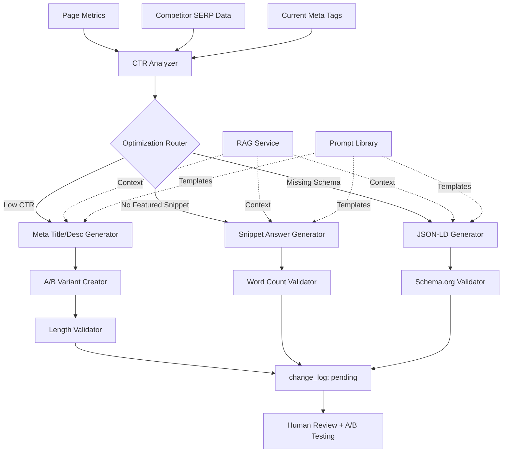

# Step 09: CTR, Featured Snippets & Schema Optimization

**Status:** Specification Complete
**Date:** 2025-11-03
**Est. Implementation:** 8-10 hours
**Priority:** High (Direct Impact on CTR & Rich Results)

---

## 🎯 Objective

Build an intelligent on-page SEO optimization system that:
1. **Proposes** A/B tested meta title/description variants
2. **Drafts** featured-snippet ready answers (40-60 words)
3. **Generates** valid JSON-LD schema markup (FAQ/HowTo/Article/Product)
4. **Validates** all outputs (length, format, schema.org compliance)
5. **Tracks** A/B test performance and recommendations

**Key Principle:** All suggestions staged in `change_log` (pending review) with validation notes.

---

## 🏗️ Architecture Overview



---

## 📊 Data Models

### 1. Meta Optimization Models

```python
# crm_api/app/models/ctr_optimization.py

from enum import Enum
from datetime import datetime
from typing import Optional, Dict, Any, List
from pydantic import BaseModel, Field, validator
import uuid

class MetaVariantType(str, Enum):
    """Type of meta tag variant."""
    TITLE = "title"
    DESCRIPTION = "description"
    BOTH = "both"

class ABTestStatus(str, Enum):
    """A/B test status."""
    DRAFT = "draft"
    RUNNING = "running"
    PAUSED = "paused"
    COMPLETED = "completed"
    WINNER_SELECTED = "winner_selected"

class SchemaType(str, Enum):
    """Supported JSON-LD schema types."""
    FAQ = "FAQPage"
    HOW_TO = "HowTo"
    ARTICLE = "Article"
    PRODUCT = "Product"
    LOCAL_BUSINESS = "LocalBusiness"
    BREADCRUMB = "BreadcrumbList"
    REVIEW = "Review"
    ORGANIZATION = "Organization"


class MetaVariant(BaseModel):
    """A/B test variant for meta tags."""
    variant_id: str = Field(default_factory=lambda: str(uuid.uuid4()))
    variant_label: str  # "A", "B", "C", etc.

    title: Optional[str] = None
    description: Optional[str] = None

    # Validation
    title_length: Optional[int] = None
    description_length: Optional[int] = None
    is_valid: bool = True
    validation_errors: List[str] = []

    # Performance tracking
    impressions: int = 0
    clicks: int = 0
    ctr: float = 0.0

    # Metadata
    created_at: datetime = Field(default_factory=datetime.utcnow)
    notes: Optional[str] = None

    @validator('title')
    def validate_title_length(cls, v):
        if v and len(v) > 60:
            raise ValueError(f"Title exceeds 60 characters: {len(v)}")
        return v

    @validator('description')
    def validate_description_length(cls, v):
        if v and len(v) > 160:
            raise ValueError(f"Description exceeds 160 characters: {len(v)}")
        return v

    def calculate_lengths(self):
        """Calculate character lengths."""
        if self.title:
            self.title_length = len(self.title)
        if self.description:
            self.description_length = len(self.description)


class FeaturedSnippet(BaseModel):
    """Featured snippet answer candidate."""
    snippet_id: str = Field(default_factory=lambda: str(uuid.uuid4()))
    page_id: int
    keyword_id: int

    # Content
    snippet_type: str  # "paragraph", "list", "table"
    answer_text: Optional[str] = None
    steps: Optional[List[str]] = None
    table_data: Optional[Dict[str, List[str]]] = None

    # Validation
    word_count: int = 0
    is_valid: bool = True
    validation_notes: str = ""

    # Target query
    target_query: str
    query_intent: Optional[str] = None  # "what", "how", "why", "best", etc.

    # Performance
    snippet_position: Optional[int] = None  # Position 0 if featured
    has_snippet: bool = False

    created_at: datetime = Field(default_factory=datetime.utcnow)

    def calculate_word_count(self):
        """Calculate word count for validation."""
        if self.answer_text:
            self.word_count = len(self.answer_text.split())
        elif self.steps:
            self.word_count = sum(len(step.split()) for step in self.steps)

    def validate_snippet(self):
        """Validate snippet meets featured snippet criteria."""
        self.calculate_word_count()

        errors = []

        # Paragraph snippets: 40-60 words
        if self.snippet_type == "paragraph":
            if self.word_count < 40:
                errors.append(f"Paragraph too short: {self.word_count} words (min 40)")
            elif self.word_count > 60:
                errors.append(f"Paragraph too long: {self.word_count} words (max 60)")

        # List snippets: 3-8 steps
        if self.snippet_type == "list":
            if self.steps:
                if len(self.steps) < 3:
                    errors.append(f"Too few steps: {len(self.steps)} (min 3)")
                elif len(self.steps) > 8:
                    errors.append(f"Too many steps: {len(self.steps)} (max 8)")

        self.is_valid = len(errors) == 0
        self.validation_notes = "; ".join(errors) if errors else "Valid"


class JSONLDSchema(BaseModel):
    """JSON-LD structured data."""
    schema_id: str = Field(default_factory=lambda: str(uuid.uuid4()))
    page_id: int

    # Schema details
    schema_type: SchemaType
    schema_data: Dict[str, Any]

    # Validation
    is_valid: bool = True
    validation_errors: List[str] = []
    schema_org_version: str = "https://schema.org"

    # Deployment
    is_deployed: bool = False
    deployed_at: Optional[datetime] = None

    created_at: datetime = Field(default_factory=datetime.utcnow)


class CTROptimizationSuggestion(BaseModel):
    """Complete CTR optimization suggestion."""
    suggestion_id: str = Field(default_factory=lambda: str(uuid.uuid4()))
    page_id: int
    keyword_id: Optional[int] = None

    # Current state
    current_title: str
    current_description: str
    current_ctr: float
    current_rank: int
    benchmark_ctr: Optional[float] = None  # Expected CTR for rank position

    # Proposed variants
    meta_variants: List[MetaVariant] = []

    # Featured snippet
    featured_snippet: Optional[FeaturedSnippet] = None

    # Schema markup
    json_ld_schema: Optional[JSONLDSchema] = None

    # A/B testing plan
    ab_test_config: Optional[Dict[str, Any]] = None

    # Rationale
    optimization_rationale: str
    expected_ctr_improvement: Optional[float] = None  # Percentage points

    # Context
    competitor_snippets: List[Dict[str, Any]] = []
    serp_features: List[str] = []

    created_at: datetime = Field(default_factory=datetime.utcnow)


class ABTest(BaseModel):
    """A/B test configuration and tracking."""
    test_id: str = Field(default_factory=lambda: str(uuid.uuid4()))
    page_id: int
    keyword_id: Optional[int] = None

    # Test config
    test_name: str
    test_type: MetaVariantType
    variants: List[MetaVariant]

    # Traffic split
    traffic_split: Dict[str, float]  # {"A": 0.5, "B": 0.5}

    # Status
    status: ABTestStatus
    started_at: Optional[datetime] = None
    ended_at: Optional[datetime] = None

    # Results
    winner_variant_id: Optional[str] = None
    confidence_level: Optional[float] = None  # Statistical significance
    lift_percentage: Optional[float] = None

    # Tracking
    total_impressions: int = 0
    total_clicks: int = 0

    created_at: datetime = Field(default_factory=datetime.utcnow)
```

---

## 📝 Prompt Templates

### 1. Meta Title/Description Optimizer

```python
META_OPTIMIZER_TEMPLATE = {
    "template_name": "meta_title_description_optimizer",
    "version": "1.0.0",
    "system_message": """You are an on-page SEO strategist specializing in click-through rate optimization.

Your goal is to create compelling meta titles and descriptions that:
- Maximize CTR while preserving relevance
- Include target keywords naturally
- Follow SERP best practices
- Stay within character limits (title ≤60, description ≤160)
- Stand out from competitor snippets""",

    "user_prompt_template": """
Optimize meta tags for improved CTR.

**Current Performance:**
- Rank: {rank}
- Current CTR: {ctr_current}%
- Expected CTR for position: {position_benchmark}%
- CTR Gap: {ctr_gap}%

**Current Meta Tags:**
- Title: "{current_title}" ({current_title_length} chars)
- Description: "{current_description}" ({current_description_length} chars)

**Target Keyword:** {target_keyword}

**Competitor Snippets (Top 3):**
{competitor_snippets}

**Page Context:**
{page_context}

**SERP Features Present:**
{serp_features}

**Tasks:**
1. Propose 2 meta title/description variants (labeled A and B)
2. Each variant must:
   - Title: 50-60 characters (include keyword)
   - Description: 140-160 characters (include keyword + CTA)
   - Be more compelling than current and competitors
   - Address user intent clearly
3. Explain why each variant should improve CTR

**Output Format (JSON):**
{{
  "meta_variants": [
    {{
      "variant_label": "A",
      "title": "...",
      "description": "...",
      "rationale": "Why this variant will improve CTR"
    }},
    {{
      "variant_label": "B",
      "title": "...",
      "description": "...",
      "rationale": "Why this variant will improve CTR"
    }}
  ],
  "expected_ctr_improvement": 2.5,
  "notes": "Additional optimization notes"
}}

Respond ONLY with valid JSON.
""",
    "output_type": "meta_variants",
    "max_retries": 3
}
```

### 2. Featured Snippet Answer Generator

```python
FEATURED_SNIPPET_TEMPLATE = {
    "template_name": "featured_snippet_generator",
    "version": "1.0.0",
    "system_message": """You are a featured snippet optimization specialist.

Your goal is to create snippet-ready answers that:
- Directly answer the target query
- Meet Google's featured snippet criteria
- Are 40-60 words for paragraph snippets OR 3-8 steps for list snippets
- Use clear, concise language
- Provide immediate value""",

    "user_prompt_template": """
Generate a featured-snippet ready answer.

**Target Query:** {target_query}
**Query Intent:** {query_intent}

**Current Featured Snippet (if any):**
{current_snippet}

**Competitor Answers:**
{competitor_answers}

**Our Page Content:**
{page_content}

**PAA Questions:**
{paa_questions}

**Tasks:**
1. Determine if query is best answered as:
   - Paragraph (definition, what/why questions)
   - List (how-to, step-by-step, rankings)
   - Table (comparisons, specifications)

2. Draft snippet-ready answer:
   - Paragraph: 40-60 words, direct answer first
   - List: 3-8 clear, actionable steps
   - Table: 2-4 columns, 3-6 rows max

3. Ensure answer is:
   - Factually accurate
   - Directly responsive to query
   - More comprehensive than competitors
   - Well-formatted for snippet extraction

**Output Format (JSON):**
{{
  "snippet_type": "paragraph|list|table",
  "answer_text": "40-60 word direct answer" (if paragraph),
  "steps": ["Step 1", "Step 2", ...] (if list),
  "table_data": {{"headers": [...], "rows": [...]}} (if table),
  "word_count": 52,
  "rationale": "Why this answer should win the snippet",
  "html_suggestion": "<div>Recommended HTML markup</div>"
}}

Respond ONLY with valid JSON.
""",
    "output_type": "featured_snippet",
    "max_retries": 3
}
```

### 3. JSON-LD Schema Generator

```python
JSONLD_SCHEMA_TEMPLATE = {
    "template_name": "jsonld_schema_generator",
    "version": "1.0.0",
    "system_message": """You are a structured data specialist.

Your goal is to generate valid JSON-LD schema markup that:
- Follows schema.org specifications exactly
- Enhances rich results eligibility
- Includes all required properties
- Validates against Google's Rich Results Test
- Is appropriate for the page type and content""",

    "user_prompt_template": """
Generate JSON-LD schema markup.

**Page Type:** {page_type}
**Recommended Schema:** {recommended_schema_type}

**Page Details:**
- URL: {page_url}
- Title: {page_title}
- Main Topic: {main_topic}
- Business Info: {business_info}

**Content Extracted:**
{page_content}

**FAQ/PAA Questions (if applicable):**
{faq_questions}

**How-To Steps (if applicable):**
{howto_steps}

**Product Details (if applicable):**
{product_details}

**Tasks:**
1. Generate appropriate JSON-LD markup:
   - FAQPage: If page has Q&A content
   - HowTo: If page has step-by-step instructions
   - Article: For blog posts, guides
   - Product: For product/service pages
   - LocalBusiness: For location-based services

2. Include all required properties per schema.org
3. Add recommended properties for enhanced rich results
4. Ensure proper nesting and formatting

**Output Format (JSON):**
{{
  "schema_type": "FAQPage|HowTo|Article|Product|LocalBusiness",
  "schema_data": {{
    "@context": "https://schema.org",
    "@type": "...",
    ...
  }},
  "validation_notes": "Schema validation notes",
  "rich_results_eligible": ["FAQ", "HowTo"],
  "implementation_notes": "Where to place this schema on the page"
}}

Respond ONLY with valid JSON.
""",
    "output_type": "jsonld_schema",
    "max_retries": 3
}
```

---

## 🔍 Schema.org Specifications

### 1. FAQPage Schema

```json
{
  "@context": "https://schema.org",
  "@type": "FAQPage",
  "mainEntity": [
    {
      "@type": "Question",
      "name": "What is residential cleaning?",
      "acceptedAnswer": {
        "@type": "Answer",
        "text": "Residential cleaning is a professional service that maintains and cleans homes, including tasks like dusting, vacuuming, mopping, and sanitizing surfaces."
      }
    },
    {
      "@type": "Question",
      "name": "How often should I get my house cleaned?",
      "acceptedAnswer": {
        "@type": "Answer",
        "text": "Most homeowners benefit from professional cleaning every 1-2 weeks. High-traffic homes may need weekly service, while less active homes can opt for bi-weekly or monthly cleaning."
      }
    }
  ]
}
```

**Required Properties:**
- `@context`, `@type`, `mainEntity`
- Each Question: `name`, `acceptedAnswer`
- Each Answer: `text`

**Recommended:**
- 3-10 questions per page
- Answers: 1-3 paragraphs
- Natural language questions

### 2. HowTo Schema

```json
{
  "@context": "https://schema.org",
  "@type": "HowTo",
  "name": "How to Prepare Your Home for Professional Cleaning",
  "description": "A step-by-step guide to preparing your home for a professional cleaning service.",
  "totalTime": "PT15M",
  "step": [
    {
      "@type": "HowToStep",
      "position": 1,
      "name": "Clear clutter",
      "text": "Remove personal items, toys, and clutter from surfaces to allow cleaners access to all areas.",
      "url": "https://rivercityclean.com/prepare-for-cleaning#step1"
    },
    {
      "@type": "HowToStep",
      "position": 2,
      "name": "Secure valuables",
      "text": "Put away jewelry, cash, and important documents in a secure location.",
      "url": "https://rivercityclean.com/prepare-for-cleaning#step2"
    },
    {
      "@type": "HowToStep",
      "position": 3,
      "name": "Communicate preferences",
      "text": "Leave a note for cleaners about any specific areas of concern or items to avoid.",
      "url": "https://rivercityclean.com/prepare-for-cleaning#step3"
    }
  ]
}
```

**Required Properties:**
- `@context`, `@type`, `name`, `step`
- Each step: `text` or `itemListElement`

**Recommended:**
- `description`, `totalTime`, `estimatedCost`
- `image`, `video` (for each step if available)
- 3-20 steps

### 3. Article Schema

```json
{
  "@context": "https://schema.org",
  "@type": "Article",
  "headline": "Complete Guide to Residential Cleaning Services",
  "description": "Everything you need to know about professional home cleaning services, from pricing to preparation.",
  "image": "https://rivercityclean.com/images/residential-cleaning-hero.jpg",
  "author": {
    "@type": "Person",
    "name": "Sarah Johnson",
    "url": "https://rivercityclean.com/about/sarah-johnson"
  },
  "publisher": {
    "@type": "Organization",
    "name": "River City Clean",
    "logo": {
      "@type": "ImageObject",
      "url": "https://rivercityclean.com/logo.png"
    }
  },
  "datePublished": "2025-01-15",
  "dateModified": "2025-11-03"
}
```

**Required Properties:**
- `@context`, `@type`, `headline`
- `image` (ImageObject or URL)
- `datePublished`, `dateModified`
- `author` (Person or Organization)
- `publisher` (Organization with logo)

### 4. Product/Service Schema

```json
{
  "@context": "https://schema.org",
  "@type": "Service",
  "serviceType": "Residential Cleaning",
  "provider": {
    "@type": "LocalBusiness",
    "name": "River City Clean",
    "image": "https://rivercityclean.com/images/logo.png",
    "telephone": "+1-555-0123",
    "address": {
      "@type": "PostalAddress",
      "streetAddress": "123 Main St",
      "addressLocality": "River City",
      "addressRegion": "CA",
      "postalCode": "12345"
    }
  },
  "areaServed": {
    "@type": "City",
    "name": "River City"
  },
  "hasOfferCatalog": {
    "@type": "OfferCatalog",
    "name": "Cleaning Services",
    "itemListElement": [
      {
        "@type": "Offer",
        "itemOffered": {
          "@type": "Service",
          "name": "Deep Cleaning",
          "description": "Comprehensive deep cleaning service for entire home"
        },
        "price": "199.00",
        "priceCurrency": "USD"
      }
    ]
  },
  "aggregateRating": {
    "@type": "AggregateRating",
    "ratingValue": "4.8",
    "reviewCount": "127"
  }
}
```

**Required Properties:**
- `@context`, `@type`, `name`
- Service: `serviceType`, `provider`
- Product: `name`, `description`, `offers`

**Recommended:**
- `aggregateRating`, `review`
- `image`, `brand`
- `areaServed` (for local services)

### 5. LocalBusiness Schema

```json
{
  "@context": "https://schema.org",
  "@type": "LocalBusiness",
  "name": "River City Clean",
  "image": "https://rivercityclean.com/images/storefront.jpg",
  "@id": "https://rivercityclean.com",
  "url": "https://rivercityclean.com",
  "telephone": "+1-555-0123",
  "priceRange": "$$",
  "address": {
    "@type": "PostalAddress",
    "streetAddress": "123 Main St",
    "addressLocality": "River City",
    "addressRegion": "CA",
    "postalCode": "12345",
    "addressCountry": "US"
  },
  "geo": {
    "@type": "GeoCoordinates",
    "latitude": 40.7128,
    "longitude": -74.0060
  },
  "openingHoursSpecification": [
    {
      "@type": "OpeningHoursSpecification",
      "dayOfWeek": ["Monday", "Tuesday", "Wednesday", "Thursday", "Friday"],
      "opens": "08:00",
      "closes": "18:00"
    }
  ],
  "sameAs": [
    "https://facebook.com/rivercityclean",
    "https://twitter.com/rivercityclean"
  ]
}
```

---

## ✅ Validation Rules

### Meta Tag Validation

```python
def validate_meta_tags(variant: MetaVariant) -> tuple[bool, List[str]]:
    """
    Validate meta title and description.

    Returns:
        (is_valid, error_messages)
    """
    errors = []

    # Title validation
    if variant.title:
        title_len = len(variant.title)

        if title_len < 30:
            errors.append(f"Title too short: {title_len} chars (min 30)")
        elif title_len > 60:
            errors.append(f"Title too long: {title_len} chars (max 60)")

        # Check for keyword stuffing
        words = variant.title.lower().split()
        word_counts = {}
        for word in words:
            if len(word) > 3:  # Ignore short words
                word_counts[word] = word_counts.get(word, 0) + 1

        repeated = [w for w, count in word_counts.items() if count > 2]
        if repeated:
            errors.append(f"Possible keyword stuffing: {', '.join(repeated)}")

    # Description validation
    if variant.description:
        desc_len = len(variant.description)

        if desc_len < 120:
            errors.append(f"Description too short: {desc_len} chars (min 120)")
        elif desc_len > 160:
            errors.append(f"Description too long: {desc_len} chars (max 160)")

        # Check for CTA
        ctas = ["contact", "call", "get", "learn", "book", "schedule", "request", "free"]
        has_cta = any(cta in variant.description.lower() for cta in ctas)
        if not has_cta:
            errors.append("Description missing call-to-action")

    return len(errors) == 0, errors
```

### Featured Snippet Validation

```python
def validate_featured_snippet(snippet: FeaturedSnippet) -> tuple[bool, List[str]]:
    """
    Validate featured snippet meets Google criteria.

    Returns:
        (is_valid, error_messages)
    """
    errors = []

    snippet.calculate_word_count()

    if snippet.snippet_type == "paragraph":
        if snippet.word_count < 40:
            errors.append(f"Paragraph too short: {snippet.word_count} words (min 40)")
        elif snippet.word_count > 60:
            errors.append(f"Paragraph too long: {snippet.word_count} words (max 60)")

        # Check for direct answer format
        if not snippet.answer_text:
            errors.append("Missing answer text")
        elif not snippet.answer_text[0].isupper():
            errors.append("Answer should start with capital letter")

    elif snippet.snippet_type == "list":
        if not snippet.steps:
            errors.append("Missing steps for list snippet")
        elif len(snippet.steps) < 3:
            errors.append(f"Too few steps: {len(snippet.steps)} (min 3)")
        elif len(snippet.steps) > 8:
            errors.append(f"Too many steps: {len(snippet.steps)} (max 8)")

        # Check step formatting
        for i, step in enumerate(snippet.steps, 1):
            if len(step.split()) < 3:
                errors.append(f"Step {i} too short: {step}")

    elif snippet.snippet_type == "table":
        if not snippet.table_data:
            errors.append("Missing table data")
        else:
            headers = snippet.table_data.get("headers", [])
            rows = snippet.table_data.get("rows", [])

            if len(headers) < 2 or len(headers) > 4:
                errors.append(f"Table should have 2-4 columns, has {len(headers)}")

            if len(rows) < 3 or len(rows) > 6:
                errors.append(f"Table should have 3-6 rows, has {len(rows)}")

    return len(errors) == 0, errors
```

### JSON-LD Schema Validation

```python
import jsonschema
from jsonschema import validate, ValidationError

def validate_jsonld_schema(schema: JSONLDSchema) -> tuple[bool, List[str]]:
    """
    Validate JSON-LD schema against schema.org specifications.

    Returns:
        (is_valid, error_messages)
    """
    errors = []

    # Check JSON structure
    try:
        if not isinstance(schema.schema_data, dict):
            errors.append("Schema data must be a JSON object")
            return False, errors

        # Check required top-level properties
        if "@context" not in schema.schema_data:
            errors.append("Missing @context property")
        elif schema.schema_data["@context"] != "https://schema.org":
            errors.append(f"Invalid @context: {schema.schema_data['@context']}")

        if "@type" not in schema.schema_data:
            errors.append("Missing @type property")

        # Validate specific schema types
        schema_type = schema.schema_data.get("@type")

        if schema_type == "FAQPage":
            errors.extend(validate_faq_schema(schema.schema_data))
        elif schema_type == "HowTo":
            errors.extend(validate_howto_schema(schema.schema_data))
        elif schema_type == "Article":
            errors.extend(validate_article_schema(schema.schema_data))
        elif schema_type == "Product":
            errors.extend(validate_product_schema(schema.schema_data))
        elif schema_type == "LocalBusiness":
            errors.extend(validate_local_business_schema(schema.schema_data))

    except Exception as e:
        errors.append(f"JSON parsing error: {str(e)}")

    return len(errors) == 0, errors


def validate_faq_schema(data: Dict[str, Any]) -> List[str]:
    """Validate FAQPage schema."""
    errors = []

    if "mainEntity" not in data:
        errors.append("FAQPage missing mainEntity")
    else:
        questions = data["mainEntity"]
        if not isinstance(questions, list):
            errors.append("mainEntity must be an array")
        elif len(questions) < 2:
            errors.append("FAQPage should have at least 2 questions")

        for i, q in enumerate(questions, 1):
            if q.get("@type") != "Question":
                errors.append(f"Question {i} missing @type: Question")
            if "name" not in q:
                errors.append(f"Question {i} missing 'name' property")
            if "acceptedAnswer" not in q:
                errors.append(f"Question {i} missing 'acceptedAnswer'")
            else:
                answer = q["acceptedAnswer"]
                if answer.get("@type") != "Answer":
                    errors.append(f"Question {i} answer missing @type: Answer")
                if "text" not in answer:
                    errors.append(f"Question {i} answer missing 'text'")

    return errors


def validate_howto_schema(data: Dict[str, Any]) -> List[str]:
    """Validate HowTo schema."""
    errors = []

    if "name" not in data:
        errors.append("HowTo missing 'name' property")

    if "step" not in data:
        errors.append("HowTo missing 'step' property")
    else:
        steps = data["step"]
        if not isinstance(steps, list):
            errors.append("'step' must be an array")
        elif len(steps) < 2:
            errors.append("HowTo should have at least 2 steps")

        for i, step in enumerate(steps, 1):
            if step.get("@type") != "HowToStep":
                errors.append(f"Step {i} missing @type: HowToStep")
            if "text" not in step:
                errors.append(f"Step {i} missing 'text' property")

    return errors


def validate_article_schema(data: Dict[str, Any]) -> List[str]:
    """Validate Article schema."""
    errors = []

    required = ["headline", "image", "datePublished", "author", "publisher"]
    for prop in required:
        if prop not in data:
            errors.append(f"Article missing required property: {prop}")

    # Validate publisher has logo
    if "publisher" in data:
        publisher = data["publisher"]
        if "logo" not in publisher:
            errors.append("Publisher missing logo")

    return errors
```

---

## 🔌 API Endpoints

```python
# crm_api/app/api/routes/ctr_optimization.py

from fastapi import APIRouter, HTTPException, Depends
from typing import List, Optional
from datetime import datetime

router = APIRouter(prefix="/ctr-optimization", tags=["CTR & Schema"])

@router.post("/analyze-page", response_model=CTROptimizationSuggestion)
async def analyze_page_ctr(
    page_id: int,
    keyword_id: Optional[int] = None
):
    """
    Analyze page and generate CTR optimization suggestions.

    Returns meta variants, featured snippet, and schema markup.
    """
    pass


@router.post("/generate-meta-variants", response_model=List[MetaVariant])
async def generate_meta_variants(
    page_id: int,
    keyword_id: Optional[int] = None,
    num_variants: int = 2
):
    """
    Generate A/B test variants for meta tags.

    Returns 2-3 variants with validation.
    """
    pass


@router.post("/generate-snippet", response_model=FeaturedSnippet)
async def generate_featured_snippet(
    page_id: int,
    target_query: str,
    snippet_type: Optional[str] = None  # "paragraph", "list", "table"
):
    """
    Generate featured-snippet ready answer.

    Returns formatted answer with validation.
    """
    pass


@router.post("/generate-schema", response_model=JSONLDSchema)
async def generate_jsonld_schema(
    page_id: int,
    schema_type: Optional[SchemaType] = None
):
    """
    Generate JSON-LD schema markup.

    Auto-detects appropriate schema type if not specified.
    Returns validated schema.org markup.
    """
    pass


@router.post("/validate-meta")
async def validate_meta_variant(
    variant: MetaVariant
):
    """
    Validate meta tag variant.

    Returns validation results and suggestions.
    """
    is_valid, errors = validate_meta_tags(variant)
    return {
        "is_valid": is_valid,
        "errors": errors,
        "title_length": len(variant.title) if variant.title else 0,
        "description_length": len(variant.description) if variant.description else 0
    }


@router.post("/validate-snippet")
async def validate_snippet(
    snippet: FeaturedSnippet
):
    """
    Validate featured snippet.

    Returns validation results.
    """
    is_valid, errors = validate_featured_snippet(snippet)
    return {
        "is_valid": is_valid,
        "errors": errors,
        "word_count": snippet.word_count
    }


@router.post("/validate-schema")
async def validate_schema(
    schema: JSONLDSchema
):
    """
    Validate JSON-LD schema.

    Returns schema.org compliance check.
    """
    is_valid, errors = validate_jsonld_schema(schema)
    return {
        "is_valid": is_valid,
        "errors": errors,
        "schema_type": schema.schema_type,
        "rich_results_eligible": determine_rich_results_eligibility(schema)
    }


@router.post("/ab-tests/create", response_model=ABTest)
async def create_ab_test(
    page_id: int,
    variants: List[MetaVariant],
    traffic_split: Optional[Dict[str, float]] = None
):
    """
    Create A/B test for meta tag variants.

    Returns test configuration.
    """
    pass


@router.post("/ab-tests/{test_id}/start")
async def start_ab_test(test_id: str):
    """
    Start A/B test.

    Begins tracking impressions and clicks.
    """
    pass


@router.post("/ab-tests/{test_id}/stop")
async def stop_ab_test(test_id: str):
    """
    Stop A/B test and analyze results.

    Returns winner if statistical significance achieved.
    """
    pass


@router.get("/ab-tests/{test_id}/results")
async def get_ab_test_results(test_id: str):
    """
    Get A/B test results.

    Returns performance metrics for each variant.
    """
    pass


@router.get("/stats/summary")
async def get_ctr_optimization_stats():
    """
    Get CTR optimization statistics.

    Returns:
        - Pages optimized
        - Average CTR improvement
        - Active A/B tests
        - Schema markup deployed
    """
    pass
```

---

## 📊 A/B Testing Framework

### Traffic Split Implementation

```python
def select_variant_for_user(
    test: ABTest,
    user_hash: str
) -> MetaVariant:
    """
    Deterministically assign user to variant based on hash.

    Ensures consistent assignment across sessions.
    """
    # Hash user identifier (IP + User-Agent)
    hash_value = int(hashlib.md5(user_hash.encode()).hexdigest(), 16)

    # Convert to 0-1 range
    rand_value = (hash_value % 10000) / 10000.0

    # Assign to variant based on traffic split
    cumulative = 0.0
    for variant_label, split_pct in test.traffic_split.items():
        cumulative += split_pct
        if rand_value < cumulative:
            # Find variant with this label
            for variant in test.variants:
                if variant.variant_label == variant_label:
                    return variant

    # Fallback to first variant
    return test.variants[0]
```

### Statistical Significance Calculation

```python
from scipy import stats

def calculate_ab_test_significance(
    variant_a: MetaVariant,
    variant_b: MetaVariant
) -> tuple[float, float, str]:
    """
    Calculate statistical significance using two-proportion z-test.

    Returns:
        (p_value, confidence_level, winner)
    """
    # Successes and trials
    successes_a = variant_a.clicks
    trials_a = variant_a.impressions

    successes_b = variant_b.clicks
    trials_b = variant_b.impressions

    if trials_a == 0 or trials_b == 0:
        return 1.0, 0.0, "insufficient_data"

    # Proportions
    p_a = successes_a / trials_a
    p_b = successes_b / trials_b

    # Pooled proportion
    p_pool = (successes_a + successes_b) / (trials_a + trials_b)

    # Standard error
    se = np.sqrt(p_pool * (1 - p_pool) * (1/trials_a + 1/trials_b))

    if se == 0:
        return 1.0, 0.0, "tie"

    # Z-score
    z = (p_a - p_b) / se

    # P-value (two-tailed)
    p_value = 2 * (1 - stats.norm.cdf(abs(z)))

    # Confidence level
    confidence = (1 - p_value) * 100

    # Determine winner
    if p_value < 0.05:  # 95% confidence
        if p_a > p_b:
            winner = variant_a.variant_label
        else:
            winner = variant_b.variant_label
    else:
        winner = "no_winner"

    return p_value, confidence, winner
```

### A/B Test Monitoring

```python
def check_ab_test_readiness(test: ABTest) -> Dict[str, Any]:
    """
    Check if A/B test has enough data for decision.

    Minimum thresholds:
    - 100 impressions per variant
    - 7 days runtime
    - 95% confidence level
    """
    status = {
        "can_conclude": False,
        "reasons": [],
        "recommendation": ""
    }

    # Check minimum impressions
    min_impressions = min(v.impressions for v in test.variants)
    if min_impressions < 100:
        status["reasons"].append(f"Insufficient impressions: {min_impressions}/100")
        status["recommendation"] = "Continue test"
        return status

    # Check minimum runtime
    if test.started_at:
        runtime_days = (datetime.utcnow() - test.started_at).days
        if runtime_days < 7:
            status["reasons"].append(f"Insufficient runtime: {runtime_days}/7 days")
            status["recommendation"] = "Continue test"
            return status

    # Check statistical significance
    if len(test.variants) == 2:
        p_value, confidence, winner = calculate_ab_test_significance(
            test.variants[0],
            test.variants[1]
        )

        if confidence >= 95.0:
            status["can_conclude"] = True
            status["winner"] = winner
            status["confidence"] = confidence
            status["recommendation"] = f"Declare variant {winner} as winner"
        else:
            status["reasons"].append(f"Low confidence: {confidence:.1f}%/95%")
            status["recommendation"] = "Continue test or increase traffic"

    return status
```

---

## 📋 Example Payloads

### Meta Variants Response

```json
{
  "suggestion_id": "ctr-uuid-12345",
  "page_id": 42,
  "keyword_id": 156,

  "current_title": "Residential Cleaning Services | River City Clean",
  "current_description": "Professional residential cleaning services. Get a free quote today.",
  "current_ctr": 2.1,
  "current_rank": 5,
  "benchmark_ctr": 5.1,

  "meta_variants": [
    {
      "variant_id": "var-a-uuid",
      "variant_label": "A",
      "title": "Top Residential Cleaning Near You | Same-Day Service",
      "description": "River City's #1 residential cleaning service. Eco-friendly products, flexible scheduling, satisfaction guaranteed. Book your free consultation today!",
      "title_length": 55,
      "description_length": 156,
      "is_valid": true,
      "validation_errors": [],
      "notes": "Emphasizes local, speed, and eco-friendly aspects"
    },
    {
      "variant_id": "var-b-uuid",
      "variant_label": "B",
      "title": "Residential Cleaning Services - Free Quote in 60 Seconds",
      "description": "Professional home cleaning with 5-star reviews. Weekly, bi-weekly, or monthly plans. Get your instant quote and first clean discount. Call now!",
      "title_length": 60,
      "description_length": 159,
      "is_valid": true,
      "validation_errors": [],
      "notes": "Emphasizes speed of quote and social proof"
    }
  ],

  "optimization_rationale": "Current CTR (2.1%) is 59% below expected for position 5 (5.1%). Competitors emphasize same-day service and free quotes. Proposed variants add urgency, local relevance, and clear CTAs.",

  "expected_ctr_improvement": 2.5,

  "competitor_snippets": [
    {
      "rank": 1,
      "title": "Same-Day House Cleaning | Book Online in 60 Seconds",
      "description": "Professional cleaners ready today. Online booking, upfront pricing, 100% satisfaction guarantee. 4.9 stars on Google."
    }
  ],

  "created_at": "2025-11-03T10:00:00Z"
}
```

### Featured Snippet Response

```json
{
  "snippet_id": "snip-uuid-67890",
  "page_id": 42,
  "keyword_id": 156,

  "snippet_type": "paragraph",
  "answer_text": "Residential cleaning is a professional service that maintains and sanitizes homes through tasks like dusting, vacuuming, mopping, and bathroom cleaning. Most services offer flexible weekly, bi-weekly, or monthly schedules starting around $100-$200 per visit depending on home size and cleaning depth.",
  "word_count": 52,

  "target_query": "what is residential cleaning",
  "query_intent": "what",

  "is_valid": true,
  "validation_notes": "Valid: 52 words (40-60 range)",

  "html_suggestion": "<div class=\"featured-answer\"><p><strong>Residential cleaning</strong> is a professional service that maintains and sanitizes homes through tasks like dusting, vacuuming, mopping, and bathroom cleaning. Most services offer flexible weekly, bi-weekly, or monthly schedules starting around $100-$200 per visit depending on home size and cleaning depth.</p></div>",

  "created_at": "2025-11-03T10:05:00Z"
}
```

### JSON-LD Schema Response

```json
{
  "schema_id": "schema-uuid-abcdef",
  "page_id": 42,

  "schema_type": "FAQPage",
  "schema_data": {
    "@context": "https://schema.org",
    "@type": "FAQPage",
    "mainEntity": [
      {
        "@type": "Question",
        "name": "How much does residential cleaning cost?",
        "acceptedAnswer": {
          "@type": "Answer",
          "text": "Residential cleaning typically costs $100-$200 per visit for a standard home (1500-2000 sq ft). Pricing varies based on home size, cleaning depth (standard vs deep clean), and frequency. Weekly service often offers discounts compared to one-time cleans."
        }
      },
      {
        "@type": "Question",
        "name": "How often should I get my house professionally cleaned?",
        "acceptedAnswer": {
          "@type": "Answer",
          "text": "Most homeowners benefit from professional cleaning every 1-2 weeks. High-traffic homes with pets or children may need weekly service, while less active homes can opt for bi-weekly or monthly cleaning. Many services offer flexible scheduling."
        }
      },
      {
        "@type": "Question",
        "name": "What should I do to prepare for a cleaning service?",
        "acceptedAnswer": {
          "@type": "Answer",
          "text": "Prepare for professional cleaners by: (1) clearing clutter from surfaces, (2) securing valuables and personal items, (3) providing access to all rooms, (4) communicating any special requests or areas of concern, and (5) securing pets if needed."
        }
      }
    ]
  },

  "is_valid": true,
  "validation_errors": [],

  "rich_results_eligible": ["FAQ"],
  "implementation_notes": "Place this schema in the <head> section or before </body>. Ensure FAQ content is visible on the page.",

  "created_at": "2025-11-03T10:10:00Z"
}
```

---

## 🔗 Integration with Existing Systems

### With RAG Service

```python
# Retrieve competitor snippets and SERP data
context_pack = await rag_service.retrieve_context(
    target_keyword=keyword_text,
    target_page_id=page_id,
    include_serp=True,
    include_competitors=True,
    include_paa=True
)

# Use in meta optimization
competitor_snippets = [
    {
        "title": source.metadata.get("title"),
        "description": source.metadata.get("description"),
        "rank": source.metadata.get("rank")
    }
    for source in context_pack.competitors
]
```

### With Prompt Library

```python
# Get meta optimizer template
template = await prompt_library.get_template_by_name("meta_title_description_optimizer")

# Execute with validation and retry
result = await prompt_library.execute_with_retry(
    template=template,
    context={
        "rank": 5,
        "ctr_current": 2.1,
        "position_benchmark": 5.1,
        "current_title": "...",
        "competitor_snippets": competitor_snippets
    },
    max_retries=3
)
```

### With Governance (change_log)

```python
# Create change_log entry for meta variant A/B test
for variant in variants:
    change_log_id = create_change_log_entry(
        module_name="seo_meta_ctr",
        action="update_meta_tags",
        target_type="page",
        target_id=page_id,
        old_value={
            "title": current_title,
            "description": current_description
        },
        new_value={
            "title": variant.title,
            "description": variant.description
        },
        status="pending",
        metadata={
            "variant_label": variant.variant_label,
            "ab_test_id": test.test_id,
            "expected_ctr_improvement": expected_improvement
        }
    )
```

---

## ✅ Acceptance Criteria

### Meta Tag Optimization
- [ ] Generate 2-3 variants per request
- [ ] Title length validation (30-60 chars)
- [ ] Description length validation (120-160 chars)
- [ ] Keyword inclusion check
- [ ] CTA presence check
- [ ] Competitor analysis integration

### Featured Snippet Generation
- [ ] Paragraph snippets: 40-60 words
- [ ] List snippets: 3-8 steps
- [ ] Table snippets: 2-4 columns, 3-6 rows
- [ ] Direct answer format
- [ ] Query intent detection

### JSON-LD Schema
- [ ] Support 5+ schema types (FAQ, HowTo, Article, Product, LocalBusiness)
- [ ] Schema.org validation
- [ ] Required properties check
- [ ] Google Rich Results Test compatibility
- [ ] Auto-detection of appropriate schema type

### A/B Testing
- [ ] Traffic split configuration (50/50, 60/40, etc.)
- [ ] Deterministic user assignment
- [ ] Statistical significance calculation
- [ ] Minimum 100 impressions per variant
- [ ] Minimum 7 days runtime
- [ ] 95% confidence threshold
- [ ] Winner selection automation

### API Endpoints
- [ ] 10+ endpoints for CTR optimization
- [ ] Validation endpoints for all types
- [ ] A/B test CRUD operations
- [ ] Performance statistics

---

## 📊 Metrics & Monitoring

### Optimization Metrics
- **Pages Optimized:** Total pages with CTR optimization
- **Average CTR Improvement:** Mean percentage point gain
- **Variants Generated:** Total A/B test variants created
- **Active A/B Tests:** Currently running tests

### Schema Deployment
- **Schemas Deployed:** Total JSON-LD markup deployed
- **Rich Results Achieved:** Pages with rich results in SERP
- **Schema Types:** Breakdown by FAQ/HowTo/Article/Product
- **Validation Success Rate:** % passing schema.org validation

### A/B Test Performance
- **Tests Completed:** Total A/B tests concluded
- **Statistical Significance Rate:** % reaching 95% confidence
- **Average Test Duration:** Days to conclusion
- **Winner Adoption Rate:** % of winners deployed

### Business Impact
- **CTR Lift:** Average CTR improvement from optimizations
- **Traffic Increase:** Additional clicks from CTR gains
- **Featured Snippet Wins:** Pages earning position 0
- **Revenue Impact:** $ value of increased traffic

---

## 🚀 Implementation Checklist

### Phase 1: Data Models & Validation (2 hours)
- [ ] Create `app/models/ctr_optimization.py`
- [ ] Implement all validation functions
- [ ] Write unit tests for validators

### Phase 2: Prompt Templates (2 hours)
- [ ] Create meta optimizer template
- [ ] Create featured snippet template
- [ ] Create JSON-LD generator template
- [ ] Add templates to prompt library

### Phase 3: Schema Generation (2 hours)
- [ ] Implement FAQ schema generator
- [ ] Implement HowTo schema generator
- [ ] Implement Article schema generator
- [ ] Implement Product/Service schema generator
- [ ] Implement LocalBusiness schema generator

### Phase 4: A/B Testing Framework (2 hours)
- [ ] Implement traffic split logic
- [ ] Implement variant selection
- [ ] Implement statistical significance calculation
- [ ] Create A/B test monitoring

### Phase 5: API Endpoints (2 hours)
- [ ] Create `app/api/routes/ctr_optimization.py`
- [ ] Implement all endpoints
- [ ] Register router in main.py
- [ ] Add request/response validation

---

## 🎯 Next Steps After Implementation

1. **WordPress Integration** - Deploy meta tags and schema via WordPress plugin
2. **Google Search Console Integration** - Import real CTR data for benchmarking
3. **Automated A/B Testing** - Auto-start tests for low-CTR pages
4. **Rich Results Monitoring** - Track featured snippet wins
5. **Machine Learning** - Train models to predict CTR improvement

---

## 📚 Dependencies

**Existing Systems:**
- ✅ RAG Service (context retrieval)
- ✅ Prompt Library (template management)
- ✅ Governance (change_log)
- ✅ SEO Data Models (pages, keywords, SERP)

**New Dependencies:**
```txt
jsonschema==4.20.0  # Already added in Step 05
scipy==1.11.0       # For statistical testing
```

---

## 💡 Key Design Decisions

### 1. A/B Testing Built-In
**Decision:** Include A/B testing framework from the start.
**Rationale:** Meta tag optimization requires empirical testing to validate improvements.
**Impact:** Data-driven decision making, higher confidence in changes.

### 2. Multi-Schema Support
**Decision:** Support 5+ schema.org types.
**Rationale:** Different page types benefit from different structured data.
**Impact:** Broader rich results coverage.

### 3. Strict Validation
**Decision:** Enforce length limits and schema.org compliance.
**Rationale:** Invalid meta tags or schemas waste effort and harm SEO.
**Impact:** Higher quality suggestions, better rich results eligibility.

### 4. Featured Snippet Focus
**Decision:** Dedicated snippet generation with format detection.
**Rationale:** Position 0 (featured snippet) drives significant traffic.
**Impact:** Targeted optimization for high-value SERP features.

### 5. Statistical Rigor
**Decision:** Require 95% confidence for A/B test conclusions.
**Rationale:** Avoid false positives and premature decisions.
**Impact:** More reliable optimization outcomes.

---

**Status:** ✅ Specification Complete
**Ready For:** Implementation (8-10 hours estimated)
**Blocks:** Step 15 (WordPress plugin will deploy these optimizations)
**Blocked By:** Nothing (can implement now)

---

*Specification created: 2025-11-03*
*Part of AI Suite Implementation (Step 09/16)*
