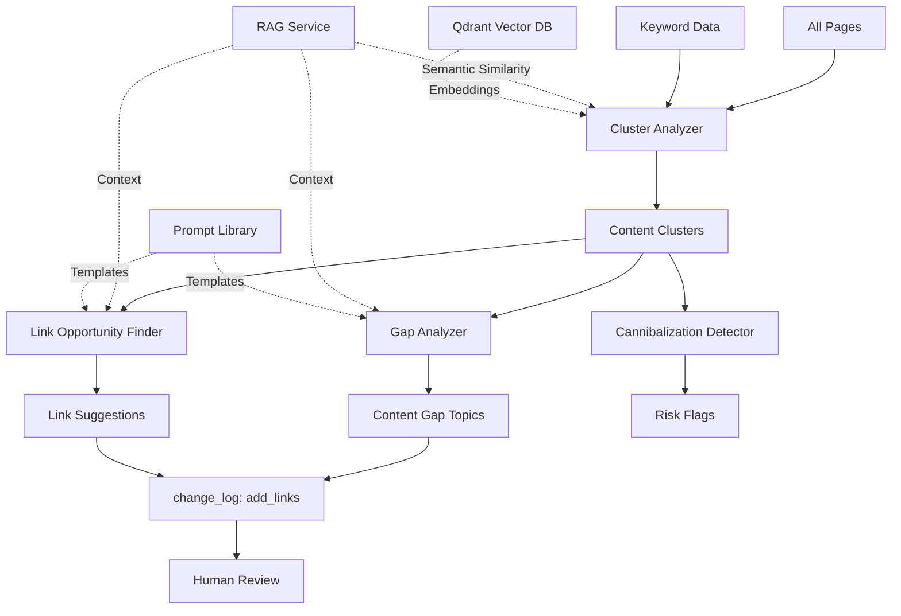

# Step 10: Content Clusters & Internal Linking

**Status:** Specification Complete
**Date:** 2025-11-03
**Est. Implementation:** 8-10 hours
**Priority:** High (Topical Authority & Internal Link Equity)

---

## 🎯 Objective

Build an intelligent content strategy and internal linking system that:
1. **Identifies** content clusters based on topical relevance
2. **Detects** content gaps within clusters (missing topics)
3. **Proposes** high-quality internal link opportunities
4. **Avoids** keyword cannibalization risks
5. **Generates** natural anchor text suggestions
6. **Optimizes** internal link equity distribution

**Key Principle:** Build topical authority through comprehensive cluster coverage and strategic internal linking.

---

## 🏗️ Architecture Overview



---

## 📊 Data Models

### 1. Content Cluster Models

```python
# crm_api/app/models/content_cluster.py

from enum import Enum
from datetime import datetime
from typing import Optional, Dict, Any, List
from pydantic import BaseModel, Field
import uuid

class ClusterType(str, Enum):
    """Type of content cluster."""
    TOPIC = "topic"  # Topical cluster (e.g., "residential cleaning")
    PRODUCT = "product"  # Product/service cluster
    LOCATION = "location"  # Location-based cluster
    FUNNEL_STAGE = "funnel_stage"  # TOFU/MOFU/BOFU
    CUSTOM = "custom"  # User-defined

class ClusterHealthStatus(str, Enum):
    """Cluster health status."""
    EXCELLENT = "excellent"  # >10 pages, well-linked
    GOOD = "good"  # 5-10 pages, decent linking
    NEEDS_WORK = "needs_work"  # <5 pages or poor linking
    ORPHANED = "orphaned"  # No internal links


class ContentCluster(BaseModel):
    """Content cluster (topic grouping)."""
    cluster_id: str = Field(default_factory=lambda: str(uuid.uuid4()))
    cluster_name: str
    cluster_type: ClusterType

    # Core topic/keyword
    pillar_keyword: str
    pillar_page_id: Optional[int] = None  # Main pillar page

    # Cluster members
    member_page_ids: List[int] = []
    member_keywords: List[str] = []

    # Covered topics
    covered_subtopics: List[str] = []

    # Cluster metrics
    total_pages: int = 0
    total_keywords: int = 0
    avg_rank: Optional[float] = None
    total_traffic: Optional[int] = None

    # Internal linking metrics
    internal_links_count: int = 0
    avg_links_per_page: float = 0.0
    orphaned_pages: List[int] = []

    # Health
    health_status: ClusterHealthStatus = ClusterHealthStatus.NEEDS_WORK
    health_score: float = 0.0  # 0-100

    # Gap analysis
    identified_gaps: List[str] = []  # Missing topics
    gap_priority_scores: List[float] = []

    created_at: datetime = Field(default_factory=datetime.utcnow)
    updated_at: datetime = Field(default_factory=datetime.utcnow)


class ContentGap(BaseModel):
    """Identified content gap within a cluster."""
    gap_id: str = Field(default_factory=lambda: str(uuid.uuid4()))
    cluster_id: str

    # Gap details
    gap_topic: str
    gap_keyword: str
    suggested_title: str
    one_line_scope: str

    # Priority
    priority_score: float  # 0-1
    priority_reasoning: str

    # Evidence
    competitor_coverage: List[Dict[str, Any]] = []  # Competitors covering this
    paa_questions: List[str] = []
    search_volume: Optional[int] = None
    keyword_difficulty: Optional[int] = None

    # Status
    is_addressed: bool = False
    content_draft_id: Optional[str] = None

    created_at: datetime = Field(default_factory=datetime.utcnow)


class InternalLinkSuggestion(BaseModel):
    """Internal link opportunity."""
    suggestion_id: str = Field(default_factory=lambda: str(uuid.uuid4()))
    cluster_id: Optional[str] = None

    # Link details
    source_page_id: int
    source_url: str
    target_page_id: int
    target_url: str

    # Anchor text
    suggested_anchor: str
    anchor_context: str  # Surrounding sentence

    # Scoring
    relevance_score: float  # 0-1 (semantic similarity)
    opportunity_score: float  # 0-1 (combined score)
    priority: str  # "high", "medium", "low"

    # Reasoning
    link_rationale: str
    benefits: List[str] = []

    # Placement suggestion
    suggested_section: Optional[str] = None  # "Introduction", "Section 3", etc.
    placement_html_hint: Optional[str] = None

    # Validation
    is_valid: bool = True
    validation_notes: str = ""

    # Status
    is_implemented: bool = False
    implemented_at: Optional[datetime] = None

    created_at: datetime = Field(default_factory=datetime.utcnow)


class CannibalizationRisk(BaseModel):
    """Keyword cannibalization detection."""
    risk_id: str = Field(default_factory=lambda: str(uuid.uuid4()))

    # Affected pages
    page_ids: List[int]
    page_urls: List[str]

    # Keyword
    cannibalized_keyword: str

    # Evidence
    all_ranks: List[int]  # Ranks for each page
    rank_fluctuation: bool  # Pages swapping positions
    traffic_split: bool  # Traffic split between pages

    # Severity
    severity: str  # "critical", "high", "medium", "low"
    severity_score: float  # 0-1

    # Recommendation
    mitigation_strategy: str
    recommended_actions: List[str] = []

    # Examples:
    # - "Consolidate pages A and B"
    # - "Differentiate: make page A target 'keyword near me', page B target 'best keyword'"
    # - "Choose canonical page, de-optimize others"

    created_at: datetime = Field(default_factory=datetime.utcnow)


class ClusterAnalysisResult(BaseModel):
    """Complete cluster analysis result."""
    analysis_id: str = Field(default_factory=lambda: str(uuid.uuid4()))
    cluster: ContentCluster

    # Gap analysis
    content_gaps: List[ContentGap] = []

    # Internal linking
    link_suggestions: List[InternalLinkSuggestion] = []

    # Cannibalization
    cannibalization_risks: List[CannibalizationRisk] = []

    # Summary
    total_gaps_identified: int = 0
    total_links_suggested: int = 0
    total_risks_flagged: int = 0

    created_at: datetime = Field(default_factory=datetime.utcnow)
```

---

## 🔍 Cluster Identification Algorithm

### 1. Keyword-Based Clustering

```python
from sklearn.feature_extraction.text import TfidfVectorizer
from sklearn.cluster import KMeans
import numpy as np

async def identify_clusters_by_keywords(
    pages: List[Dict[str, Any]],
    num_clusters: int = 5
) -> List[ContentCluster]:
    """
    Cluster pages based on keyword similarity.

    Uses TF-IDF vectorization and K-means clustering.
    """
    # Extract page content and keywords
    page_texts = []
    for page in pages:
        # Combine title, meta description, and primary keywords
        text = f"{page['title']} {page['meta_description']} "
        text += " ".join(page.get('primary_keywords', []))
        page_texts.append(text)

    # TF-IDF vectorization
    vectorizer = TfidfVectorizer(
        max_features=100,
        stop_words='english',
        ngram_range=(1, 2)
    )
    X = vectorizer.fit_transform(page_texts)

    # K-means clustering
    kmeans = KMeans(n_clusters=num_clusters, random_state=42)
    cluster_labels = kmeans.fit_predict(X)

    # Build clusters
    clusters = []
    for cluster_idx in range(num_clusters):
        # Get pages in this cluster
        cluster_page_indices = np.where(cluster_labels == cluster_idx)[0]
        cluster_pages = [pages[i] for i in cluster_page_indices]

        # Determine pillar keyword (most common)
        all_keywords = []
        for page in cluster_pages:
            all_keywords.extend(page.get('primary_keywords', []))

        keyword_counts = {}
        for kw in all_keywords:
            keyword_counts[kw] = keyword_counts.get(kw, 0) + 1

        pillar_keyword = max(keyword_counts, key=keyword_counts.get)

        # Create cluster
        cluster = ContentCluster(
            cluster_name=f"Cluster: {pillar_keyword}",
            cluster_type=ClusterType.TOPIC,
            pillar_keyword=pillar_keyword,
            member_page_ids=[p['page_id'] for p in cluster_pages],
            member_keywords=list(set(all_keywords)),
            total_pages=len(cluster_pages)
        )

        clusters.append(cluster)

    return clusters
```

### 2. Semantic Clustering (Qdrant-Based)

```python
async def identify_clusters_by_embeddings(
    pages: List[Dict[str, Any]],
    rag_service: RAGService,
    similarity_threshold: float = 0.7
) -> List[ContentCluster]:
    """
    Cluster pages based on semantic similarity using Qdrant.

    More accurate than keyword-based, captures conceptual relationships.
    """
    # Get embeddings for all pages
    page_embeddings = []
    for page in pages:
        # Combine title + description for embedding
        text = f"{page['title']}. {page['meta_description']}"
        embedding = await rag_service.embed_text(text)
        page_embeddings.append({
            'page_id': page['page_id'],
            'embedding': embedding,
            'text': text
        })

    # Find semantic clusters using hierarchical clustering
    clusters = []
    assigned_pages = set()

    for i, page_emb in enumerate(page_embeddings):
        if page_emb['page_id'] in assigned_pages:
            continue

        # Start new cluster with this page
        cluster_pages = [page_emb['page_id']]
        assigned_pages.add(page_emb['page_id'])

        # Find similar pages
        for j, other_emb in enumerate(page_embeddings):
            if i == j or other_emb['page_id'] in assigned_pages:
                continue

            # Calculate cosine similarity
            similarity = cosine_similarity(
                page_emb['embedding'],
                other_emb['embedding']
            )

            if similarity >= similarity_threshold:
                cluster_pages.append(other_emb['page_id'])
                assigned_pages.add(other_emb['page_id'])

        # Create cluster if has multiple pages
        if len(cluster_pages) >= 2:
            # Determine pillar keyword from pages
            cluster_page_objs = [p for p in pages if p['page_id'] in cluster_pages]
            pillar_keyword = extract_common_keyword(cluster_page_objs)

            cluster = ContentCluster(
                cluster_name=f"Cluster: {pillar_keyword}",
                cluster_type=ClusterType.TOPIC,
                pillar_keyword=pillar_keyword,
                member_page_ids=cluster_pages,
                total_pages=len(cluster_pages)
            )

            clusters.append(cluster)

    return clusters


def cosine_similarity(vec1: List[float], vec2: List[float]) -> float:
    """Calculate cosine similarity between two vectors."""
    dot_product = sum(a * b for a, b in zip(vec1, vec2))
    magnitude1 = sum(a * a for a in vec1) ** 0.5
    magnitude2 = sum(b * b for b in vec2) ** 0.5

    if magnitude1 == 0 or magnitude2 == 0:
        return 0.0

    return dot_product / (magnitude1 * magnitude2)
```

---

## 🔍 Gap Analysis Algorithm

### Content Gap Detection

```python
async def identify_content_gaps(
    cluster: ContentCluster,
    rag_service: RAGService
) -> List[ContentGap]:
    """
    Identify missing topics within a content cluster.

    Process:
    1. Analyze competitor content in this topic
    2. Extract subtopics competitors cover
    3. Compare with our coverage
    4. Identify gaps
    5. Prioritize by search volume and competition
    """

    gaps = []

    # Get competitor pages for pillar keyword
    competitor_pages = await get_competitor_content(cluster.pillar_keyword)

    # Extract subtopics from competitors
    competitor_subtopics = set()
    for comp in competitor_pages:
        # Use LLM to extract main subtopics from content
        subtopics = await extract_subtopics(comp['content'], rag_service)
        competitor_subtopics.update(subtopics)

    # Compare with our covered subtopics
    our_subtopics = set(cluster.covered_subtopics)
    missing_subtopics = competitor_subtopics - our_subtopics

    # Analyze each gap
    for subtopic in missing_subtopics:
        # Get PAA questions related to this subtopic
        paa_questions = await get_paa_questions(
            f"{cluster.pillar_keyword} {subtopic}"
        )

        # Get search volume data
        keyword_data = await get_keyword_data(subtopic)

        # Calculate priority score
        priority_score = calculate_gap_priority(
            num_competitors_covering=len([c for c in competitor_pages if subtopic in c['content']]),
            search_volume=keyword_data.get('volume', 0),
            keyword_difficulty=keyword_data.get('difficulty', 50),
            relevance_to_pillar=0.8  # Could calculate semantic similarity
        )

        # Generate content idea
        content_idea = await generate_content_gap_idea(
            cluster=cluster,
            gap_topic=subtopic,
            paa_questions=paa_questions,
            rag_service=rag_service
        )

        gap = ContentGap(
            cluster_id=cluster.cluster_id,
            gap_topic=subtopic,
            gap_keyword=content_idea['keyword'],
            suggested_title=content_idea['title'],
            one_line_scope=content_idea['scope'],
            priority_score=priority_score,
            priority_reasoning=content_idea['reasoning'],
            competitor_coverage=[{
                'domain': c['domain'],
                'url': c['url'],
                'rank': c['rank']
            } for c in competitor_pages if subtopic in c['content']],
            paa_questions=paa_questions,
            search_volume=keyword_data.get('volume'),
            keyword_difficulty=keyword_data.get('difficulty')
        )

        gaps.append(gap)

    # Sort by priority
    gaps.sort(key=lambda g: g.priority_score, reverse=True)

    return gaps[:10]  # Top 10 gaps


def calculate_gap_priority(
    num_competitors_covering: int,
    search_volume: int,
    keyword_difficulty: int,
    relevance_to_pillar: float
) -> float:
    """
    Calculate priority score for content gap (0-1).

    Factors:
    - Competitor coverage (more = higher priority)
    - Search volume (higher = higher priority)
    - Keyword difficulty (lower = higher priority)
    - Relevance to pillar (higher = higher priority)
    """

    # Normalize factors to 0-1 scale
    comp_score = min(num_competitors_covering / 5.0, 1.0)  # 5+ competitors = max
    volume_score = min(search_volume / 1000.0, 1.0)  # 1000+ volume = max
    difficulty_score = (100 - keyword_difficulty) / 100.0  # Lower difficulty = higher score

    # Weighted combination
    priority = (
        comp_score * 0.3 +
        volume_score * 0.3 +
        difficulty_score * 0.2 +
        relevance_to_pillar * 0.2
    )

    return priority
```

### Content Idea Generation

```python
async def generate_content_gap_idea(
    cluster: ContentCluster,
    gap_topic: str,
    paa_questions: List[str],
    rag_service: RAGService
) -> Dict[str, str]:
    """
    Generate content idea for gap topic using LLM.

    Returns:
        {
            "keyword": "target keyword",
            "title": "Suggested Title",
            "scope": "One-line description",
            "reasoning": "Why this content is needed"
        }
    """

    prompt = f"""
You are a content strategist.

**Content Cluster:** {cluster.cluster_name}
**Pillar Keyword:** {cluster.pillar_keyword}
**Existing Pages:** {cluster.total_pages}

**Identified Gap Topic:** {gap_topic}

**People Also Ask:**
{chr(10).join(f"- {q}" for q in paa_questions)}

**Task:**
Propose a new content piece that:
1. Fills this gap within the cluster
2. Complements existing pages (no cannibalization)
3. Targets a specific keyword
4. Addresses user intent clearly

**Output (JSON):**
{{
  "keyword": "specific target keyword for this page",
  "title": "Compelling page title (50-60 chars)",
  "scope": "One-line description of what this page will cover",
  "reasoning": "Why this content strengthens the cluster and addresses the gap"
}}

Respond ONLY with valid JSON.
"""

    # Execute LLM (mock for now)
    response = await execute_llm(prompt, temperature=0.7)
    result = json.loads(response)

    return result
```

---

## 🔗 Internal Link Opportunity Detection

### Link Opportunity Algorithm

```python
async def find_link_opportunities(
    cluster: ContentCluster,
    priority_pages: List[int],
    rag_service: RAGService,
    min_relevance: float = 0.6
) -> List[InternalLinkSuggestion]:
    """
    Find high-quality internal link opportunities within cluster.

    Process:
    1. For each page in cluster, analyze content
    2. Find semantic matches with other pages
    3. Generate natural anchor text
    4. Score opportunity
    5. Filter by relevance threshold
    """

    suggestions = []

    # Get all pages in cluster
    cluster_pages = await get_pages_by_ids(cluster.member_page_ids)

    # For each source page
    for source_page in cluster_pages:
        # Extract content sections
        sections = extract_content_sections(source_page['content'])

        # For each potential target page
        for target_page in cluster_pages:
            if source_page['page_id'] == target_page['page_id']:
                continue

            # Check if link already exists
            if link_exists(source_page, target_page):
                continue

            # Calculate semantic relevance
            relevance_score = await calculate_semantic_relevance(
                source_page,
                target_page,
                rag_service
            )

            if relevance_score < min_relevance:
                continue

            # Find best anchor context
            anchor_context = await find_best_anchor_context(
                source_page=source_page,
                target_page=target_page,
                rag_service=rag_service
            )

            if not anchor_context:
                continue

            # Calculate opportunity score
            opportunity_score = calculate_link_opportunity_score(
                relevance=relevance_score,
                source_authority=source_page.get('page_authority', 50),
                target_priority=target_page['page_id'] in priority_pages,
                existing_links_count=count_existing_links(source_page)
            )

            # Determine priority
            if opportunity_score >= 0.8:
                priority = "high"
            elif opportunity_score >= 0.6:
                priority = "medium"
            else:
                priority = "low"

            # Create suggestion
            suggestion = InternalLinkSuggestion(
                cluster_id=cluster.cluster_id,
                source_page_id=source_page['page_id'],
                source_url=source_page['url'],
                target_page_id=target_page['page_id'],
                target_url=target_page['url'],
                suggested_anchor=anchor_context['anchor'],
                anchor_context=anchor_context['context'],
                relevance_score=relevance_score,
                opportunity_score=opportunity_score,
                priority=priority,
                link_rationale=anchor_context['rationale'],
                benefits=[
                    "Reinforces topical cluster",
                    "Distributes page authority",
                    "Improves user navigation"
                ],
                suggested_section=anchor_context['section']
            )

            suggestions.append(suggestion)

    # Sort by opportunity score
    suggestions.sort(key=lambda s: s.opportunity_score, reverse=True)

    return suggestions


async def calculate_semantic_relevance(
    source_page: Dict[str, Any],
    target_page: Dict[str, Any],
    rag_service: RAGService
) -> float:
    """
    Calculate semantic relevance between two pages using embeddings.

    Returns:
        Relevance score (0-1)
    """

    # Embed source page
    source_text = f"{source_page['title']}. {source_page['meta_description']}"
    source_embedding = await rag_service.embed_text(source_text)

    # Embed target page
    target_text = f"{target_page['title']}. {target_page['meta_description']}"
    target_embedding = await rag_service.embed_text(target_text)

    # Calculate cosine similarity
    similarity = cosine_similarity(source_embedding, target_embedding)

    return similarity


async def find_best_anchor_context(
    source_page: Dict[str, Any],
    target_page: Dict[str, Any],
    rag_service: RAGService
) -> Optional[Dict[str, str]]:
    """
    Find best place to insert link with natural anchor text.

    Uses LLM to:
    1. Identify relevant section in source page
    2. Generate natural anchor text
    3. Provide contextual sentence

    Returns:
        {
            "anchor": "anchor text",
            "context": "Full sentence with [anchor] placeholder",
            "section": "Section name",
            "rationale": "Why this link makes sense"
        }
    """

    prompt = f"""
You are an internal linking specialist.

**Source Page:**
- Title: {source_page['title']}
- URL: {source_page['url']}
- Content: {source_page['content'][:1000]}...

**Target Page to Link To:**
- Title: {target_page['title']}
- URL: {target_page['url']}
- Description: {target_page['meta_description']}

**Task:**
Find the best place in the source page to add an internal link to the target page.

**Requirements:**
1. Anchor text should be natural (not forced)
2. Should fit contextually in existing content
3. Should add value to the reader
4. Avoid over-optimization (use natural phrasing)

**Output (JSON):**
{{
  "anchor": "natural anchor text (2-5 words)",
  "context": "Full sentence where link would go, with [LINK] as placeholder",
  "section": "Which section of the page (Introduction, Benefits, How It Works, etc.)",
  "rationale": "Why this link placement makes sense"
}}

If no good placement exists, return {{"anchor": null}}

Respond ONLY with valid JSON.
"""

    # Execute LLM
    response = await execute_llm(prompt, temperature=0.5)
    result = json.loads(response)

    if not result.get('anchor'):
        return None

    return result


def calculate_link_opportunity_score(
    relevance: float,
    source_authority: float,
    target_priority: bool,
    existing_links_count: int
) -> float:
    """
    Calculate overall opportunity score for internal link.

    Factors:
    - Semantic relevance (higher = better)
    - Source page authority (higher = better)
    - Target is priority page (bonus)
    - Existing links count (too many = lower score)
    """

    # Normalize source authority (0-100 -> 0-1)
    authority_score = source_authority / 100.0

    # Priority bonus
    priority_bonus = 0.2 if target_priority else 0.0

    # Existing links penalty (diminishing returns after 5 links)
    if existing_links_count < 5:
        links_penalty = 0.0
    else:
        links_penalty = min((existing_links_count - 5) * 0.05, 0.3)

    # Combined score
    score = (
        relevance * 0.5 +
        authority_score * 0.3 +
        priority_bonus
    ) - links_penalty

    return max(0.0, min(1.0, score))
```

---

## 🚨 Cannibalization Detection

### Detection Algorithm

```python
async def detect_cannibalization(
    cluster: ContentCluster
) -> List[CannibalizationRisk]:
    """
    Detect keyword cannibalization within cluster.

    Cannibalization occurs when multiple pages target the same keyword,
    causing them to compete against each other.

    Detection criteria:
    1. Multiple pages ranking for same keyword
    2. Rank fluctuation (pages swapping positions)
    3. Traffic split between pages
    4. Similar content/intent
    """

    risks = []

    # Get all keywords in cluster
    all_keywords = cluster.member_keywords

    # For each keyword, check how many pages rank for it
    for keyword in all_keywords:
        # Get pages ranking for this keyword
        ranking_pages = await get_pages_ranking_for_keyword(
            keyword_text=keyword,
            page_ids=cluster.member_page_ids
        )

        if len(ranking_pages) < 2:
            continue  # No cannibalization if only 1 page ranks

        # Analyze ranks over time
        ranks_history = []
        for page in ranking_pages:
            history = await get_rank_history(page['page_id'], keyword, days=30)
            ranks_history.append(history)

        # Check for rank fluctuation
        has_fluctuation = detect_rank_swapping(ranks_history)

        # Check traffic split
        traffic_data = []
        for page in ranking_pages:
            traffic = await get_keyword_traffic(page['page_id'], keyword)
            traffic_data.append(traffic)

        total_traffic = sum(traffic_data)
        has_traffic_split = all(t > 0 for t in traffic_data) and total_traffic > 0

        # Calculate severity
        severity_score = calculate_cannibalization_severity(
            num_pages=len(ranking_pages),
            has_fluctuation=has_fluctuation,
            has_traffic_split=has_traffic_split,
            keyword_value=await get_keyword_value(keyword)
        )

        if severity_score < 0.3:
            continue  # Not significant

        # Determine severity level
        if severity_score >= 0.8:
            severity = "critical"
        elif severity_score >= 0.6:
            severity = "high"
        elif severity_score >= 0.4:
            severity = "medium"
        else:
            severity = "low"

        # Generate mitigation strategy
        mitigation = await generate_mitigation_strategy(
            keyword=keyword,
            pages=ranking_pages,
            cluster=cluster
        )

        risk = CannibalizationRisk(
            page_ids=[p['page_id'] for p in ranking_pages],
            page_urls=[p['url'] for p in ranking_pages],
            cannibalized_keyword=keyword,
            all_ranks=[p['current_rank'] for p in ranking_pages],
            rank_fluctuation=has_fluctuation,
            traffic_split=has_traffic_split,
            severity=severity,
            severity_score=severity_score,
            mitigation_strategy=mitigation['strategy'],
            recommended_actions=mitigation['actions']
        )

        risks.append(risk)

    # Sort by severity
    risks.sort(key=lambda r: r.severity_score, reverse=True)

    return risks


def detect_rank_swapping(ranks_history: List[List[int]]) -> bool:
    """
    Detect if pages are swapping positions (indicator of cannibalization).

    Returns True if pages swap ranks frequently.
    """
    if len(ranks_history) < 2:
        return False

    # Check if leading page changes
    leading_page = []
    for day_idx in range(len(ranks_history[0])):
        day_ranks = [history[day_idx] for history in ranks_history]
        best_page_idx = day_ranks.index(min(day_ranks))
        leading_page.append(best_page_idx)

    # Count changes in leader
    changes = sum(1 for i in range(1, len(leading_page)) if leading_page[i] != leading_page[i-1])

    # If leader changes more than 30% of days, consider it swapping
    swap_rate = changes / len(leading_page)

    return swap_rate > 0.3


async def generate_mitigation_strategy(
    keyword: str,
    pages: List[Dict[str, Any]],
    cluster: ContentCluster
) -> Dict[str, Any]:
    """
    Generate strategy to resolve cannibalization using LLM.

    Returns:
        {
            "strategy": "Brief description of approach",
            "actions": ["Action 1", "Action 2", ...]
        }
    """

    prompt = f"""
You are an SEO specialist resolving keyword cannibalization.

**Cluster:** {cluster.cluster_name}
**Cannibalized Keyword:** {keyword}

**Competing Pages:**
{chr(10).join(f"- {p['url']} (Rank: {p['current_rank']}, Title: {p['title']})" for p in pages)}

**Problem:** Multiple pages are competing for the same keyword, diluting SEO effectiveness.

**Task:**
Recommend a mitigation strategy.

**Common Strategies:**
1. **Consolidate:** Merge pages into single comprehensive page, redirect others
2. **Differentiate:** Make each page target a different keyword variation
3. **Choose Canonical:** Select one page as primary, de-optimize others for this keyword
4. **Internal Linking:** Support one page as authority via internal links

**Output (JSON):**
{{
  "strategy": "Brief description of recommended approach",
  "actions": [
    "Specific action 1",
    "Specific action 2",
    "Specific action 3"
  ]
}}

Respond ONLY with valid JSON.
"""

    response = await execute_llm(prompt, temperature=0.3)
    result = json.loads(response)

    return result
```

---

## 📋 Prompt Templates

### Content Gap Identification Template

```python
CONTENT_GAP_TEMPLATE = {
    "template_name": "content_gap_identifier",
    "version": "1.0.0",
    "system_message": """You are a content strategist specializing in topical authority.

Your goal is to identify content gaps that strengthen topical clusters and improve SEO coverage.""",

    "user_prompt_template": """
Analyze this content cluster and identify gaps.

**Cluster:** {cluster_name}
**Pillar Keyword:** {pillar_keyword}
**Existing Pages:** {total_pages}

**Current Coverage:**
{covered_subtopics}

**Competitor Analysis:**
Top competitors cover these subtopics:
{competitor_subtopics}

**People Also Ask:**
{paa_questions}

**Task:**
Identify 2-3 high-priority content gaps that would strengthen this cluster.

For each gap, provide:
1. Gap topic/keyword
2. Suggested title
3. One-line scope
4. Why it's important

**Output (JSON):**
{{
  "content_gaps": [
    {{
      "gap_topic": "subtopic name",
      "gap_keyword": "target keyword",
      "suggested_title": "Compelling title (50-60 chars)",
      "one_line_scope": "Brief description of what this page would cover",
      "reasoning": "Why this gap is important to fill"
    }}
  ]
}}

Respond ONLY with valid JSON.
""",
    "output_type": "content_gaps",
    "max_retries": 2
}
```

### Internal Link Suggestion Template

```python
INTERNAL_LINK_TEMPLATE = {
    "template_name": "internal_link_suggester",
    "version": "1.0.0",
    "system_message": """You are an internal linking specialist.

Your goal is to propose high-quality internal links that:
- Use natural anchor text
- Add value to readers
- Reinforce topical authority
- Avoid over-optimization""",

    "user_prompt_template": """
Propose internal links for this content cluster.

**Cluster:** {cluster_name}
**Pages in Cluster:**
{cluster_pages}

**Priority Pages to Boost:**
{priority_pages}

**Task:**
Suggest 5-10 high-quality internal link opportunities.

For each link:
1. Identify source and target pages
2. Generate natural anchor text (2-5 words)
3. Provide context (full sentence where link would go)
4. Explain why this link makes sense

**Requirements:**
- Anchor text must be natural (not keyword-stuffed)
- Must fit contextually
- Should add value to user

**Output (JSON):**
{{
  "link_suggestions": [
    {{
      "source_url": "...",
      "target_url": "...",
      "suggested_anchor": "natural anchor text",
      "anchor_context": "Full sentence with [LINK] as placeholder",
      "section": "Where to place link",
      "rationale": "Why this link works"
    }}
  ]
}}

Respond ONLY with valid JSON.
""",
    "output_type": "internal_links",
    "max_retries": 2
}
```

---

## 🔌 API Endpoints

```python
# crm_api/app/api/routes/content_clusters.py

from fastapi import APIRouter, HTTPException, Depends
from typing import List, Optional

router = APIRouter(prefix="/content-clusters", tags=["Content Clusters"])

@router.post("/identify", response_model=List[ContentCluster])
async def identify_content_clusters(
    method: str = "semantic",  # "semantic" or "keyword"
    num_clusters: Optional[int] = None,
    similarity_threshold: float = 0.7
):
    """
    Identify content clusters from existing pages.

    Methods:
    - semantic: Use Qdrant embeddings for semantic clustering
    - keyword: Use TF-IDF + K-means clustering
    """
    pass


@router.get("/list", response_model=List[ContentCluster])
async def list_clusters(
    cluster_type: Optional[ClusterType] = None,
    min_health_score: Optional[float] = None
):
    """
    List all content clusters with filtering.
    """
    pass


@router.get("/{cluster_id}", response_model=ContentCluster)
async def get_cluster(cluster_id: str):
    """
    Get cluster details by ID.
    """
    pass


@router.post("/{cluster_id}/analyze", response_model=ClusterAnalysisResult)
async def analyze_cluster(
    cluster_id: str,
    include_gaps: bool = True,
    include_links: bool = True,
    include_cannibalization: bool = True
):
    """
    Run complete cluster analysis.

    Returns:
    - Content gaps
    - Internal link suggestions
    - Cannibalization risks
    """
    pass


@router.post("/{cluster_id}/gaps", response_model=List[ContentGap])
async def identify_cluster_gaps(
    cluster_id: str,
    max_gaps: int = 10
):
    """
    Identify content gaps within cluster.
    """
    pass


@router.post("/{cluster_id}/link-suggestions", response_model=List[InternalLinkSuggestion])
async def suggest_internal_links(
    cluster_id: str,
    priority_pages: Optional[List[int]] = None,
    min_relevance: float = 0.6,
    max_suggestions: int = 20
):
    """
    Generate internal link suggestions for cluster.
    """
    pass


@router.post("/{cluster_id}/cannibalization", response_model=List[CannibalizationRisk])
async def detect_cluster_cannibalization(
    cluster_id: str,
    min_severity: float = 0.3
):
    """
    Detect keyword cannibalization within cluster.
    """
    pass


@router.post("/cannibalization/detect-all", response_model=List[CannibalizationRisk])
async def detect_all_cannibalization(
    min_severity: float = 0.5
):
    """
    Scan all pages for cannibalization (not just within clusters).
    """
    pass


@router.get("/{cluster_id}/health", response_model=Dict[str, Any])
async def get_cluster_health(cluster_id: str):
    """
    Get cluster health metrics.

    Returns:
    - Health score (0-100)
    - Internal linking metrics
    - Content coverage
    - Recommendations
    """
    pass


@router.post("/create-manual", response_model=ContentCluster)
async def create_manual_cluster(
    cluster_name: str,
    pillar_keyword: str,
    page_ids: List[int]
):
    """
    Manually create content cluster.
    """
    pass
```

---

## ✅ Validation Rules

### Link Suggestion Validation

```python
def validate_link_suggestion(suggestion: InternalLinkSuggestion) -> tuple[bool, List[str]]:
    """
    Validate internal link suggestion.

    Returns:
        (is_valid, error_messages)
    """
    errors = []

    # Check anchor text length
    anchor_words = suggestion.suggested_anchor.split()
    if len(anchor_words) < 2:
        errors.append("Anchor text too short (min 2 words)")
    elif len(anchor_words) > 6:
        errors.append("Anchor text too long (max 6 words)")

    # Check for over-optimization
    if suggestion.suggested_anchor.lower() == suggestion.suggested_anchor:
        pass  # Natural case is good
    elif suggestion.suggested_anchor.isupper():
        errors.append("Anchor text should not be ALL CAPS")

    # Check for exact match anchor (over-optimization risk)
    # Get target page primary keyword
    target_keyword = get_page_primary_keyword(suggestion.target_page_id)
    if target_keyword and suggestion.suggested_anchor.lower() == target_keyword.lower():
        errors.append("Anchor is exact match keyword (diversify anchor text)")

    # Check relevance score
    if suggestion.relevance_score < 0.5:
        errors.append(f"Low relevance score: {suggestion.relevance_score:.2f} (min 0.5)")

    # Check for self-link
    if suggestion.source_page_id == suggestion.target_page_id:
        errors.append("Cannot link page to itself")

    return len(errors) == 0, errors
```

---

## 📊 Example Payloads

### Cluster Analysis Response

```json
{
  "analysis_id": "analysis-uuid-12345",
  "cluster": {
    "cluster_id": "cluster-uuid-67890",
    "cluster_name": "Residential Cleaning Services",
    "cluster_type": "topic",
    "pillar_keyword": "residential cleaning",
    "pillar_page_id": 42,
    "member_page_ids": [42, 58, 72, 91],
    "total_pages": 4,
    "health_status": "good",
    "health_score": 72.5
  },

  "content_gaps": [
    {
      "gap_topic": "eco-friendly cleaning products",
      "gap_keyword": "eco friendly cleaning products residential",
      "suggested_title": "Best Eco-Friendly Products for Home Cleaning in 2025",
      "one_line_scope": "Guide to environmentally safe cleaning products for residential use, including brand recommendations and DIY alternatives",
      "priority_score": 0.85,
      "priority_reasoning": "High search volume (1200/mo), covered by 4/5 top competitors, addresses growing eco-conscious trend",
      "search_volume": 1200,
      "keyword_difficulty": 35,
      "paa_questions": [
        "What are the best eco-friendly cleaning products?",
        "Are eco-friendly cleaners effective?",
        "How to make eco-friendly cleaning products at home?"
      ]
    },
    {
      "gap_topic": "cleaning frequency guide",
      "gap_keyword": "how often should you deep clean your house",
      "suggested_title": "How Often Should You Deep Clean Your Home? Expert Guide",
      "one_line_scope": "Room-by-room deep cleaning schedule with frequency recommendations based on household size and usage",
      "priority_score": 0.78,
      "search_volume": 890,
      "keyword_difficulty": 28
    }
  ],

  "link_suggestions": [
    {
      "source_page_id": 42,
      "source_url": "https://rivercityclean.com/residential-cleaning",
      "target_page_id": 58,
      "target_url": "https://rivercityclean.com/deep-cleaning-checklist",
      "suggested_anchor": "comprehensive deep cleaning checklist",
      "anchor_context": "For homeowners preparing for a professional service, our [LINK] ensures nothing is overlooked.",
      "relevance_score": 0.87,
      "opportunity_score": 0.92,
      "priority": "high",
      "link_rationale": "Pillar page should link to supporting checklist page to guide users through preparation process",
      "suggested_section": "Preparing for Your Cleaning Service"
    }
  ],

  "cannibalization_risks": [
    {
      "page_urls": [
        "https://rivercityclean.com/residential-cleaning",
        "https://rivercityclean.com/house-cleaning-services"
      ],
      "cannibalized_keyword": "house cleaning services",
      "all_ranks": [5, 7],
      "rank_fluctuation": true,
      "severity": "high",
      "severity_score": 0.75,
      "mitigation_strategy": "Differentiate pages by geographic focus",
      "recommended_actions": [
        "Make 'residential-cleaning' the general service page",
        "Pivot 'house-cleaning-services' to 'house cleaning services [city name]'",
        "Update internal links to point to 'residential-cleaning' as canonical"
      ]
    }
  ],

  "total_gaps_identified": 2,
  "total_links_suggested": 8,
  "total_risks_flagged": 1
}
```

---

## 🔗 Integration with Existing Systems

### With RAG Service

```python
# Semantic clustering using Qdrant
clusters = await identify_clusters_by_embeddings(
    pages=all_pages,
    rag_service=rag_service,
    similarity_threshold=0.7
)

# Gap analysis with competitor context
context_pack = await rag_service.retrieve_context(
    target_keyword=cluster.pillar_keyword,
    include_competitors=True,
    include_paa=True
)
```

### With Prompt Library

```python
# Content gap identification
template = await prompt_library.get_template_by_name("content_gap_identifier")

gaps = await prompt_library.execute_with_retry(
    template=template,
    context={
        "cluster_name": cluster.cluster_name,
        "pillar_keyword": cluster.pillar_keyword,
        "competitor_subtopics": competitor_analysis
    },
    max_retries=2
)
```

### With Governance (change_log)

```python
# Create change_log entries for link suggestions
for link in link_suggestions:
    change_log_id = create_change_log_entry(
        module_name="internal_linking",
        action="add_internal_link",
        target_type="page",
        target_id=link.source_page_id,
        old_value=None,
        new_value={
            "target_url": link.target_url,
            "anchor": link.suggested_anchor,
            "context": link.anchor_context
        },
        status="pending",
        metadata={
            "cluster_id": cluster.cluster_id,
            "relevance_score": link.relevance_score,
            "opportunity_score": link.opportunity_score
        }
    )

# Create content_drafts for gap topics
for gap in content_gaps:
    content_draft_id = create_content_draft(
        title=gap.suggested_title,
        target_keyword=gap.gap_keyword,
        scope=gap.one_line_scope,
        cluster_id=gap.cluster_id,
        priority=gap.priority_score
    )
```

---

## ✅ Acceptance Criteria

### Cluster Identification
- [ ] Support semantic (Qdrant) and keyword (TF-IDF) clustering
- [ ] Configurable similarity threshold
- [ ] Automatic pillar keyword detection
- [ ] Health score calculation (0-100)
- [ ] Orphaned page detection

### Gap Analysis
- [ ] Identify 2-10 content gaps per cluster
- [ ] Competitor coverage analysis
- [ ] PAA question integration
- [ ] Priority scoring (search volume, difficulty, relevance)
- [ ] Title and scope generation

### Internal Linking
- [ ] Semantic relevance calculation (Qdrant)
- [ ] Natural anchor text generation
- [ ] Context sentence generation
- [ ] Section placement suggestion
- [ ] Opportunity scoring
- [ ] Filter existing links

### Cannibalization Detection
- [ ] Detect multiple pages ranking for same keyword
- [ ] Rank fluctuation detection
- [ ] Traffic split analysis
- [ ] Severity classification
- [ ] Mitigation strategy generation

### API Endpoints
- [ ] 10+ endpoints for cluster management
- [ ] CRUD operations for clusters
- [ ] Analysis endpoints
- [ ] Filtering and pagination

---

## 📊 Metrics & Monitoring

### Cluster Metrics
- **Total Clusters:** Number of identified clusters
- **Average Cluster Size:** Mean pages per cluster
- **Cluster Health Distribution:** % excellent/good/needs work
- **Orphaned Pages:** Pages not in any cluster

### Gap Metrics
- **Gaps Identified:** Total content gaps found
- **Gaps Addressed:** % converted to content
- **Average Priority Score:** Mean gap priority
- **Gap Conversion Rate:** % gaps that become published content

### Link Metrics
- **Links Suggested:** Total internal link opportunities
- **Links Implemented:** % suggestions deployed
- **Average Relevance:** Mean semantic relevance score
- **Link Density:** Average internal links per page

### Cannibalization Metrics
- **Risks Detected:** Total cannibalization issues
- **Critical Risks:** Severity = critical
- **Risks Resolved:** % mitigated
- **Average Resolution Time:** Days to resolve

---

## 🚀 Implementation Checklist

### Phase 1: Data Models (2 hours)
- [ ] Create `app/models/content_cluster.py`
- [ ] Implement all cluster, gap, link, and cannibalization models
- [ ] Write unit tests

### Phase 2: Clustering Algorithms (2 hours)
- [ ] Implement keyword-based clustering (TF-IDF + K-means)
- [ ] Implement semantic clustering (Qdrant embeddings)
- [ ] Test with sample data

### Phase 3: Gap Analysis (2 hours)
- [ ] Implement gap detection algorithm
- [ ] Integrate competitor analysis
- [ ] Build priority scoring
- [ ] Create content idea generator

### Phase 4: Internal Linking (2 hours)
- [ ] Implement link opportunity detection
- [ ] Build semantic relevance calculator
- [ ] Create anchor text generator (LLM)
- [ ] Implement opportunity scoring

### Phase 5: Cannibalization Detection (1 hour)
- [ ] Implement detection algorithm
- [ ] Build rank fluctuation analyzer
- [ ] Create mitigation strategy generator

### Phase 6: API & Integration (1 hour)
- [ ] Create `app/api/routes/content_clusters.py`
- [ ] Implement all endpoints
- [ ] Register router
- [ ] Integration testing

---

## 📚 Dependencies

**Existing Systems:**
- ✅ RAG Service (semantic similarity)
- ✅ Prompt Library (templates)
- ✅ Governance (change_log)
- ✅ Qdrant Vector DB (embeddings)

**New Dependencies:**
```txt
scikit-learn==1.3.0  # For TF-IDF and K-means clustering
networkx==3.1  # For link graph analysis (optional)
```

---

## 💡 Key Design Decisions

### 1. Dual Clustering Methods
**Decision:** Support both semantic (Qdrant) and keyword-based (TF-IDF) clustering.
**Rationale:** Semantic is more accurate but requires embeddings. Keyword-based is faster and works without ML.
**Impact:** Flexibility for different use cases.

### 2. LLM-Generated Anchor Text
**Decision:** Use LLM to generate natural anchor text instead of templates.
**Rationale:** Natural language generation produces more diverse, contextual anchors.
**Impact:** Better user experience, avoids over-optimization.

### 3. Cannibalization as Separate Concern
**Decision:** Treat cannibalization detection as distinct from clustering.
**Rationale:** Cannibalization can occur within or across clusters.
**Impact:** More comprehensive detection coverage.

### 4. Priority-Based Gap Scoring
**Decision:** Score gaps by search volume, difficulty, and competitor coverage.
**Rationale:** Focus content efforts on highest-ROI opportunities.
**Impact:** More strategic content planning.

### 5. Semantic Relevance for Links
**Decision:** Use Qdrant embeddings to calculate link relevance.
**Rationale:** More accurate than keyword matching alone.
**Impact:** Higher quality link suggestions.

---

**Status:** ✅ Specification Complete
**Ready For:** Implementation (8-10 hours estimated)
**Blocks:** Step 11 (Citations & Backlinks can use cluster data)
**Blocked By:** Nothing (can implement now)

---

*Specification created: 2025-11-03*
*Part of AI Suite Implementation (Step 10/16)*
