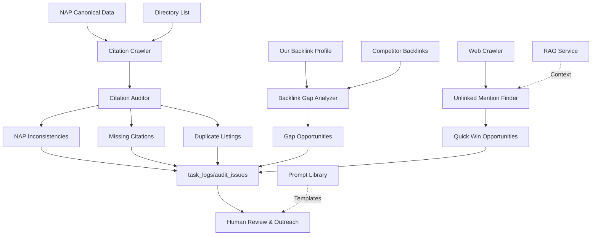

# Step 11: Citations & Backlink Strategy

**Status:** Specification Complete
**Date:** 2025-11-03
**Est. Implementation:** 8-10 hours
**Priority:** High (Local SEO & Domain Authority)

---

## 🎯 Objective

Build an intelligent local SEO and off-page optimization system that:
1. **Monitors** NAP (Name, Address, Phone) consistency across citations
2. **Identifies** citation gaps and errors (missing listings, duplicates, inconsistencies)
3. **Analyzes** backlink profiles vs. competitors
4. **Discovers** high-value backlink opportunities
5. **Surfaces** quick wins (broken links, unlinked mentions)
6. **Generates** ethical outreach strategies

**Key Principle:** No automated execution - all opportunities logged as tasks for manual review and ethical outreach.

---

## 🏗️ Architecture Overview



---

## 📊 Data Models

### 1. Citation & NAP Models

```python
# crm_api/app/models/citations.py

from enum import Enum
from datetime import datetime
from typing import Optional, Dict, Any, List
from pydantic import BaseModel, Field
import uuid

class CitationTier(str, Enum):
    """Citation directory tier/priority."""
    TIER_A = "tier_a"  # Critical (Google, Yelp, Facebook, Apple Maps)
    TIER_B = "tier_b"  # Important (industry-specific, high DA)
    TIER_C = "tier_c"  # Nice-to-have (local directories)

class CitationStatus(str, Enum):
    """Status of citation listing."""
    CLAIMED = "claimed"  # Verified and claimed
    UNCLAIMED = "unclaimed"  # Exists but not claimed
    MISSING = "missing"  # Not found on directory
    INCONSISTENT = "inconsistent"  # Found but NAP mismatch
    DUPLICATE = "duplicate"  # Multiple listings for same business
    PENDING = "pending"  # Submission pending

class NAPField(str, Enum):
    """NAP fields that can have inconsistencies."""
    NAME = "name"
    ADDRESS = "address"
    PHONE = "phone"
    WEBSITE = "website"
    HOURS = "hours"
    CATEGORY = "category"


class NAP(BaseModel):
    """Name, Address, Phone canonical data."""
    business_id: int

    # Canonical data
    business_name: str
    address_line1: str
    address_line2: Optional[str] = None
    city: str
    state: str
    zip_code: str
    country: str = "US"

    phone: str  # Format: +1-555-123-4567
    phone_formatted: str  # Display: (555) 123-4567

    website: str
    email: Optional[str] = None

    # Business hours (structured)
    hours: Optional[Dict[str, str]] = None  # {"monday": "8:00-17:00", ...}

    # Categories
    primary_category: str
    secondary_categories: List[str] = []

    # Social profiles
    facebook_url: Optional[str] = None
    twitter_url: Optional[str] = None
    linkedin_url: Optional[str] = None
    instagram_url: Optional[str] = None

    updated_at: datetime = Field(default_factory=datetime.utcnow)


class CitationDirectory(BaseModel):
    """Citation directory/platform."""
    directory_id: str = Field(default_factory=lambda: str(uuid.uuid4()))

    # Directory details
    directory_name: str  # "Google Business Profile", "Yelp", etc.
    directory_url: str
    tier: CitationTier

    # Metrics
    domain_authority: Optional[int] = None
    monthly_visitors: Optional[int] = None

    # Industry relevance
    is_industry_specific: bool = False
    industries: List[str] = []

    # Geographic relevance
    is_local: bool = False
    coverage_areas: List[str] = []  # ["US", "California", "River City"]

    # API availability
    has_api: bool = False
    api_endpoint: Optional[str] = None

    created_at: datetime = Field(default_factory=datetime.utcnow)


class Citation(BaseModel):
    """Citation listing on a directory."""
    citation_id: str = Field(default_factory=lambda: str(uuid.uuid4()))

    business_id: int
    directory_id: str

    # Status
    status: CitationStatus

    # Listing data (as it appears on directory)
    listed_name: Optional[str] = None
    listed_address: Optional[str] = None
    listed_phone: Optional[str] = None
    listed_website: Optional[str] = None
    listed_hours: Optional[str] = None
    listed_category: Optional[str] = None

    # Listing URL
    listing_url: Optional[str] = None

    # Inconsistencies detected
    inconsistent_fields: List[NAPField] = []
    inconsistency_details: Dict[str, str] = {}

    # Duplicate detection
    is_duplicate: bool = False
    duplicate_urls: List[str] = []

    # Metrics
    reviews_count: Optional[int] = None
    average_rating: Optional[float] = None

    # Last check
    last_checked_at: Optional[datetime] = None

    created_at: datetime = Field(default_factory=datetime.utcnow)
    updated_at: datetime = Field(default_factory=datetime.utcnow)


class CitationIssue(BaseModel):
    """Detected citation issue."""
    issue_id: str = Field(default_factory=lambda: str(uuid.uuid4()))

    citation_id: str
    directory_id: str

    # Issue type
    issue_type: str  # "missing", "inconsistent_name", "inconsistent_phone", "duplicate"
    severity: str  # "critical", "high", "medium", "low"

    # Details
    field_affected: Optional[NAPField] = None
    canonical_value: Optional[str] = None
    found_value: Optional[str] = None

    # Resolution
    recommended_action: str
    fix_instructions: str

    # Status
    is_resolved: bool = False
    resolved_at: Optional[datetime] = None

    created_at: datetime = Field(default_factory=datetime.utcnow)


class CitationAuditResult(BaseModel):
    """Complete citation audit result."""
    audit_id: str = Field(default_factory=lambda: str(uuid.uuid4()))
    business_id: int

    # Summary
    total_directories_checked: int = 0
    claimed_count: int = 0
    unclaimed_count: int = 0
    missing_count: int = 0
    inconsistent_count: int = 0
    duplicate_count: int = 0

    # Issues by tier
    tier_a_issues: int = 0
    tier_b_issues: int = 0
    tier_c_issues: int = 0

    # Consistency score (0-100)
    consistency_score: float = 0.0

    # Issues found
    issues: List[CitationIssue] = []

    # Recommendations
    priority_fixes: List[str] = []

    created_at: datetime = Field(default_factory=datetime.utcnow)


### 2. Backlink Models

class BacklinkType(str, Enum):
    """Type of backlink."""
    EDITORIAL = "editorial"  # Natural editorial link
    GUEST_POST = "guest_post"  # Guest blog post
    DIRECTORY = "directory"  # Business directory
    RESOURCE_PAGE = "resource_page"  # Listed on resource/links page
    PRESS_RELEASE = "press_release"  # Press release
    FORUM = "forum"  # Forum/community link
    SOCIAL = "social"  # Social media link
    COMMENT = "comment"  # Blog comment
    UGC = "ugc"  # User-generated content
    SPONSORED = "sponsored"  # Paid/sponsored
    PARTNER = "partner"  # Partner/affiliate link
    UNLINKED_MENTION = "unlinked_mention"  # Mentioned but not linked


class Backlink(BaseModel):
    """Backlink to our site."""
    backlink_id: str = Field(default_factory=lambda: str(uuid.uuid4()))

    # Link details
    source_domain: str
    source_url: str
    target_url: str  # Our page being linked to

    # Link attributes
    anchor_text: str
    link_type: BacklinkType
    is_dofollow: bool = True
    is_active: bool = True

    # Source page metrics
    source_page_authority: Optional[int] = None
    source_domain_authority: Optional[int] = None
    source_domain_rating: Optional[int] = None

    # Discovery
    discovered_at: datetime = Field(default_factory=datetime.utcnow)
    first_seen: datetime = Field(default_factory=datetime.utcnow)
    last_seen: datetime = Field(default_factory=datetime.utcnow)

    # Status
    is_lost: bool = False
    lost_at: Optional[datetime] = None


class BacklinkOpportunity(BaseModel):
    """Identified backlink opportunity."""
    opportunity_id: str = Field(default_factory=lambda: str(uuid.uuid4()))

    # Target domain/page
    target_domain: str
    target_url: str
    target_page_title: str

    # Opportunity type
    opportunity_type: str  # "competitor_gap", "broken_link", "unlinked_mention", "resource_page"
    priority: str  # "critical", "high", "medium", "low"
    priority_score: float  # 0-1

    # Metrics
    domain_authority: Optional[int] = None
    estimated_traffic: Optional[int] = None
    relevance_score: float = 0.0

    # Outreach
    contact_email: Optional[str] = None
    contact_name: Optional[str] = None
    suggested_outreach_template: Optional[str] = None
    outreach_reasoning: str = ""

    # Context
    why_relevant: str
    how_competitors_got_link: Optional[str] = None

    # Status
    outreach_sent: bool = False
    outreach_sent_at: Optional[datetime] = None
    link_acquired: bool = False
    link_acquired_at: Optional[datetime] = None

    created_at: datetime = Field(default_factory=datetime.utcnow)


class UnlinkedMention(BaseModel):
    """Mention of brand without link (quick win opportunity)."""
    mention_id: str = Field(default_factory=lambda: str(uuid.uuid4()))

    # Mention details
    source_domain: str
    source_url: str
    source_page_title: str

    # Mention context
    mention_text: str  # Sentence containing mention
    mentioned_term: str  # "River City Clean", "RiverCityClean.com", etc.

    # Opportunity
    should_link_to: str  # Our URL this should link to
    suggested_anchor: str

    # Contact
    contact_email: Optional[str] = None
    author_name: Optional[str] = None

    # Metrics
    domain_authority: Optional[int] = None
    page_traffic: Optional[int] = None

    # Status
    outreach_sent: bool = False
    link_added: bool = False

    created_at: datetime = Field(default_factory=datetime.utcnow)


class BrokenLinkOpportunity(BaseModel):
    """Broken link replacement opportunity."""
    opportunity_id: str = Field(default_factory=lambda: str(uuid.uuid4()))

    # Broken link details
    source_domain: str
    source_url: str
    broken_url: str  # The dead link

    # Our replacement
    our_replacement_url: str
    replacement_reasoning: str

    # Metrics
    source_domain_authority: Optional[int] = None
    num_linking_pages: int = 1  # How many pages have this broken link

    # Contact
    contact_email: Optional[str] = None

    # Outreach
    pitch_template: str = ""

    created_at: datetime = Field(default_factory=datetime.utcnow)


class BacklinkGapAnalysis(BaseModel):
    """Backlink gap analysis vs competitors."""
    analysis_id: str = Field(default_factory=lambda: str(uuid.uuid4()))

    # Our profile
    our_domain: str
    our_total_backlinks: int
    our_referring_domains: int
    our_domain_authority: Optional[int] = None

    # Competitor data
    competitors_analyzed: List[str] = []

    # Gap opportunities
    opportunities: List[BacklinkOpportunity] = []

    # Quick wins
    unlinked_mentions: List[UnlinkedMention] = []
    broken_links: List[BrokenLinkOpportunity] = []

    # Summary
    total_opportunities: int = 0
    high_priority_count: int = 0
    quick_wins_count: int = 0

    created_at: datetime = Field(default_factory=datetime.utcnow)
```

---

## 🔍 Citation Audit Algorithm

### NAP Consistency Check

```python
async def audit_citations(
    nap: NAP,
    directories: List[CitationDirectory]
) -> CitationAuditResult:
    """
    Audit all citations for NAP consistency.

    Process:
    1. Check each directory for listing
    2. Compare found data with canonical NAP
    3. Detect inconsistencies
    4. Flag duplicates
    5. Generate priority fix list
    """

    issues = []
    citations = []

    claimed_count = 0
    unclaimed_count = 0
    missing_count = 0
    inconsistent_count = 0
    duplicate_count = 0

    # Check each directory
    for directory in directories:
        # Search for listing
        listing_results = await search_directory_for_business(
            directory=directory,
            business_name=nap.business_name,
            phone=nap.phone,
            address=f"{nap.address_line1}, {nap.city}, {nap.state}"
        )

        if not listing_results:
            # Missing citation
            missing_count += 1

            issue = CitationIssue(
                citation_id="missing",
                directory_id=directory.directory_id,
                issue_type="missing",
                severity="critical" if directory.tier == CitationTier.TIER_A else "medium",
                recommended_action=f"Create listing on {directory.directory_name}",
                fix_instructions=get_directory_signup_instructions(directory)
            )
            issues.append(issue)

            # Create citation record
            citation = Citation(
                business_id=nap.business_id,
                directory_id=directory.directory_id,
                status=CitationStatus.MISSING
            )
            citations.append(citation)

        elif len(listing_results) > 1:
            # Duplicate listings
            duplicate_count += 1

            issue = CitationIssue(
                citation_id=listing_results[0]['citation_id'],
                directory_id=directory.directory_id,
                issue_type="duplicate",
                severity="high",
                recommended_action=f"Merge {len(listing_results)} duplicate listings",
                fix_instructions=f"Contact {directory.directory_name} support to merge duplicates: {[r['url'] for r in listing_results]}"
            )
            issues.append(issue)

        else:
            # Single listing found - check consistency
            listing = listing_results[0]

            inconsistent_fields = []
            inconsistency_details = {}

            # Check name
            if not names_match(nap.business_name, listing.get('name', '')):
                inconsistent_fields.append(NAPField.NAME)
                inconsistency_details['name'] = f"Canonical: '{nap.business_name}' | Found: '{listing.get('name')}'"

            # Check phone
            if not phones_match(nap.phone, listing.get('phone', '')):
                inconsistent_fields.append(NAPField.PHONE)
                inconsistency_details['phone'] = f"Canonical: '{nap.phone}' | Found: '{listing.get('phone')}'"

            # Check address
            if not addresses_match(
                f"{nap.address_line1}, {nap.city}, {nap.state} {nap.zip_code}",
                listing.get('address', '')
            ):
                inconsistent_fields.append(NAPField.ADDRESS)
                inconsistency_details['address'] = f"Canonical: '{nap.address_line1}' | Found: '{listing.get('address')}'"

            # Check website
            if listing.get('website') and not urls_match(nap.website, listing['website']):
                inconsistent_fields.append(NAPField.WEBSITE)
                inconsistency_details['website'] = f"Canonical: '{nap.website}' | Found: '{listing.get('website')}'"

            # Determine status
            if listing.get('claimed'):
                status = CitationStatus.CLAIMED
                claimed_count += 1
            else:
                status = CitationStatus.UNCLAIMED
                unclaimed_count += 1

            if inconsistent_fields:
                status = CitationStatus.INCONSISTENT
                inconsistent_count += 1

            # Create citation record
            citation = Citation(
                business_id=nap.business_id,
                directory_id=directory.directory_id,
                status=status,
                listed_name=listing.get('name'),
                listed_address=listing.get('address'),
                listed_phone=listing.get('phone'),
                listed_website=listing.get('website'),
                listing_url=listing.get('url'),
                inconsistent_fields=inconsistent_fields,
                inconsistency_details=inconsistency_details,
                reviews_count=listing.get('reviews_count'),
                average_rating=listing.get('rating'),
                last_checked_at=datetime.utcnow()
            )
            citations.append(citation)

            # Create issues for inconsistencies
            for field in inconsistent_fields:
                severity = determine_inconsistency_severity(field, directory.tier)

                issue = CitationIssue(
                    citation_id=citation.citation_id,
                    directory_id=directory.directory_id,
                    issue_type=f"inconsistent_{field.value}",
                    severity=severity,
                    field_affected=field,
                    canonical_value=inconsistency_details[field.value].split('|')[0].replace('Canonical: ', '').strip(),
                    found_value=inconsistency_details[field.value].split('|')[1].replace('Found: ', '').strip(),
                    recommended_action=f"Update {field.value} on {directory.directory_name}",
                    fix_instructions=f"Log into {directory.directory_name} and correct {field.value}"
                )
                issues.append(issue)

    # Calculate consistency score
    total_checked = len(directories)
    perfect_count = claimed_count - inconsistent_count
    consistency_score = (perfect_count / total_checked * 100) if total_checked > 0 else 0

    # Count issues by tier
    tier_a_issues = len([i for i in issues if get_directory_tier(i.directory_id) == CitationTier.TIER_A])
    tier_b_issues = len([i for i in issues if get_directory_tier(i.directory_id) == CitationTier.TIER_B])
    tier_c_issues = len([i for i in issues if get_directory_tier(i.directory_id) == CitationTier.TIER_C])

    # Generate priority fixes
    priority_fixes = generate_priority_fix_list(issues, directories)

    return CitationAuditResult(
        business_id=nap.business_id,
        total_directories_checked=total_checked,
        claimed_count=claimed_count,
        unclaimed_count=unclaimed_count,
        missing_count=missing_count,
        inconsistent_count=inconsistent_count,
        duplicate_count=duplicate_count,
        tier_a_issues=tier_a_issues,
        tier_b_issues=tier_b_issues,
        tier_c_issues=tier_c_issues,
        consistency_score=consistency_score,
        issues=issues,
        priority_fixes=priority_fixes
    )


def names_match(canonical: str, found: str) -> bool:
    """Check if business names match (with fuzzy tolerance)."""
    # Normalize
    canonical_norm = canonical.lower().strip()
    found_norm = found.lower().strip()

    # Exact match
    if canonical_norm == found_norm:
        return True

    # Common abbreviations
    abbreviations = {
        "incorporated": "inc",
        "corporation": "corp",
        "company": "co",
        "limited": "ltd",
        "and": "&"
    }

    for full, abbr in abbreviations.items():
        canonical_norm = canonical_norm.replace(full, abbr)
        found_norm = found_norm.replace(full, abbr)

    # Check after normalization
    if canonical_norm == found_norm:
        return True

    # Fuzzy match (allow small differences)
    similarity = calculate_string_similarity(canonical_norm, found_norm)
    return similarity > 0.9


def phones_match(canonical: str, found: str) -> bool:
    """Check if phone numbers match (normalize formatting)."""
    # Extract digits only
    canonical_digits = ''.join(c for c in canonical if c.isdigit())
    found_digits = ''.join(c for c in found if c.isdigit())

    # Compare last 10 digits (ignore country code variations)
    return canonical_digits[-10:] == found_digits[-10:]


def addresses_match(canonical: str, found: str) -> bool:
    """Check if addresses match (with normalization)."""
    # Normalize
    canonical_norm = canonical.lower().strip()
    found_norm = found.lower().strip()

    # Common abbreviations
    abbreviations = {
        "street": "st",
        "avenue": "ave",
        "road": "rd",
        "drive": "dr",
        "boulevard": "blvd",
        "suite": "ste",
        "apartment": "apt",
        "floor": "fl"
    }

    for full, abbr in abbreviations.items():
        canonical_norm = canonical_norm.replace(full, abbr)
        found_norm = found_norm.replace(full, abbr)

    # Fuzzy match
    similarity = calculate_string_similarity(canonical_norm, found_norm)
    return similarity > 0.85
```

---

## 🔗 Backlink Gap Analysis

### Competitor Backlink Comparison

```python
async def analyze_backlink_gaps(
    our_domain: str,
    competitor_domains: List[str],
    our_backlinks: List[Backlink]
) -> BacklinkGapAnalysis:
    """
    Identify backlink opportunities by comparing with competitors.

    Process:
    1. Get competitor backlink profiles
    2. Find domains linking to competitors but not to us
    3. Filter by quality (DA, relevance)
    4. Prioritize opportunities
    5. Generate outreach suggestions
    """

    opportunities = []

    # Get our referring domains
    our_referring_domains = set(bl.source_domain for bl in our_backlinks)

    # Analyze each competitor
    for competitor_domain in competitor_domains:
        # Get competitor backlinks
        competitor_backlinks = await fetch_competitor_backlinks(competitor_domain)

        # Find gaps
        for comp_bl in competitor_backlinks:
            # Skip if we already have this domain
            if comp_bl.source_domain in our_referring_domains:
                continue

            # Skip low-quality domains
            if comp_bl.source_domain_authority and comp_bl.source_domain_authority < 20:
                continue

            # Calculate relevance
            relevance_score = await calculate_domain_relevance(
                source_domain=comp_bl.source_domain,
                our_domain=our_domain
            )

            if relevance_score < 0.5:
                continue

            # Calculate priority score
            priority_score = calculate_backlink_opportunity_priority(
                domain_authority=comp_bl.source_domain_authority or 0,
                relevance_score=relevance_score,
                num_competitors_with_link=count_competitors_with_link(comp_bl.source_domain, competitor_domains)
            )

            # Determine priority level
            if priority_score >= 0.8:
                priority = "critical"
            elif priority_score >= 0.6:
                priority = "high"
            elif priority_score >= 0.4:
                priority = "medium"
            else:
                priority = "low"

            # Find contact info
            contact = await find_contact_info(comp_bl.source_domain)

            # Generate outreach suggestion
            outreach_template = await generate_outreach_template(
                opportunity_type="competitor_gap",
                source_domain=comp_bl.source_domain,
                competitor_context=f"You link to {competitor_domain}",
                our_value_prop=generate_value_proposition(our_domain, comp_bl.link_type)
            )

            opportunity = BacklinkOpportunity(
                target_domain=comp_bl.source_domain,
                target_url=comp_bl.source_url,
                target_page_title=await fetch_page_title(comp_bl.source_url),
                opportunity_type="competitor_gap",
                priority=priority,
                priority_score=priority_score,
                domain_authority=comp_bl.source_domain_authority,
                relevance_score=relevance_score,
                contact_email=contact.get('email'),
                contact_name=contact.get('name'),
                suggested_outreach_template=outreach_template,
                outreach_reasoning=f"Links to competitor {competitor_domain}; relevant to our industry",
                why_relevant=f"Domain authority: {comp_bl.source_domain_authority}, Relevance: {relevance_score:.0%}",
                how_competitors_got_link=comp_bl.link_type.value
            )

            opportunities.append(opportunity)

    # Sort by priority score
    opportunities.sort(key=lambda o: o.priority_score, reverse=True)

    # Find quick wins
    unlinked_mentions = await find_unlinked_mentions(our_domain)
    broken_links = await find_broken_link_opportunities(our_domain)

    return BacklinkGapAnalysis(
        our_domain=our_domain,
        our_total_backlinks=len(our_backlinks),
        our_referring_domains=len(our_referring_domains),
        competitors_analyzed=competitor_domains,
        opportunities=opportunities[:100],  # Top 100
        unlinked_mentions=unlinked_mentions,
        broken_links=broken_links,
        total_opportunities=len(opportunities),
        high_priority_count=len([o for o in opportunities if o.priority in ["critical", "high"]]),
        quick_wins_count=len(unlinked_mentions) + len(broken_links)
    )


def calculate_backlink_opportunity_priority(
    domain_authority: int,
    relevance_score: float,
    num_competitors_with_link: int
) -> float:
    """
    Calculate priority score for backlink opportunity (0-1).

    Factors:
    - Domain authority (higher = better)
    - Relevance (higher = better)
    - Number of competitors with link (more = better)
    """

    # Normalize DA to 0-1
    da_score = domain_authority / 100.0

    # Competitor score (max 3 competitors)
    competitor_score = min(num_competitors_with_link / 3.0, 1.0)

    # Weighted combination
    priority = (
        da_score * 0.4 +
        relevance_score * 0.4 +
        competitor_score * 0.2
    )

    return priority
```

### Unlinked Mention Detection

```python
async def find_unlinked_mentions(
    our_domain: str,
    brand_variations: List[str] = None
) -> List[UnlinkedMention]:
    """
    Find mentions of our brand without links (quick win opportunities).

    Process:
    1. Search for brand mentions across web
    2. Check if mention includes link
    3. If not, create opportunity
    4. Find contact info
    5. Generate outreach template
    """

    if not brand_variations:
        brand_variations = generate_brand_variations(our_domain)

    mentions = []

    for brand_term in brand_variations:
        # Search for mentions
        search_results = await search_web_for_mentions(
            query=f'"{brand_term}" -site:{our_domain}',
            num_results=50
        )

        for result in search_results:
            # Fetch page content
            page_content = await fetch_page_content(result['url'])

            # Check if mention includes link to our domain
            has_link = our_domain in page_content or any(
                our_domain in href for href in extract_links(page_content)
            )

            if has_link:
                continue  # Already linked

            # Extract mention context
            mention_context = extract_mention_context(page_content, brand_term)

            if not mention_context:
                continue

            # Determine which page should be linked
            target_page = determine_best_target_page(
                mention_context=mention_context,
                our_domain=our_domain
            )

            # Find contact
            contact = await find_contact_info(result['domain'])

            # Generate outreach
            outreach = f"""
Subject: Quick question about your article on {result['title']}

Hi {contact.get('name', 'there')},

I was reading your article "{result['title']}" and noticed you mentioned {brand_term}.

Thank you for the mention! Would you consider adding a link to our website ({target_page}) where you reference us? It would help readers learn more about our services.

Happy to reciprocate if there's anything we can do for you.

Best regards
"""

            mention = UnlinkedMention(
                source_domain=result['domain'],
                source_url=result['url'],
                source_page_title=result['title'],
                mention_text=mention_context,
                mentioned_term=brand_term,
                should_link_to=target_page,
                suggested_anchor=brand_term,
                contact_email=contact.get('email'),
                author_name=contact.get('name'),
                domain_authority=result.get('domain_authority')
            )

            mentions.append(mention)

    # Sort by domain authority
    mentions.sort(key=lambda m: m.domain_authority or 0, reverse=True)

    return mentions[:50]  # Top 50
```

### Broken Link Opportunities

```python
async def find_broken_link_opportunities(
    our_domain: str,
    our_content: List[Dict[str, Any]]
) -> List[BrokenLinkOpportunity]:
    """
    Find broken links that we could replace with our content.

    Process:
    1. Identify relevant domains in our industry
    2. Crawl for broken links (404s)
    3. Match broken content with our replacement content
    4. Generate outreach pitch
    """

    opportunities = []

    # Get industry-relevant domains
    relevant_domains = await find_industry_domains(our_domain)

    for domain in relevant_domains:
        # Crawl for broken outbound links
        broken_links = await crawl_for_broken_links(domain)

        for broken_link in broken_links:
            # Analyze what the broken page was about
            broken_content_topic = await analyze_dead_page_topic(broken_link['url'])

            if not broken_content_topic:
                continue

            # Find our content that could replace it
            replacement = find_best_replacement_content(
                broken_topic=broken_content_topic,
                our_content=our_content
            )

            if not replacement:
                continue

            # Calculate relevance
            relevance = calculate_topic_similarity(
                broken_content_topic,
                replacement['topic']
            )

            if relevance < 0.7:
                continue

            # Find contact
            contact = await find_contact_info(domain)

            # Generate pitch
            pitch = f"""
Subject: Broken link on {broken_link['source_page_title']}

Hi {contact.get('name', 'there')},

I was reading your article "{broken_link['source_page_title']}" and noticed you have a broken link: {broken_link['url']}

I have a similar resource that might be a good replacement: {replacement['url']}

It covers {replacement['topic']} and I think your readers would find it helpful.

Would you consider updating the link?

Best regards
"""

            opportunity = BrokenLinkOpportunity(
                source_domain=domain,
                source_url=broken_link['source_url'],
                broken_url=broken_link['url'],
                our_replacement_url=replacement['url'],
                replacement_reasoning=f"Our content on '{replacement['topic']}' is highly relevant (similarity: {relevance:.0%})",
                source_domain_authority=broken_link.get('domain_authority'),
                num_linking_pages=broken_link.get('num_pages_with_link', 1),
                contact_email=contact.get('email'),
                pitch_template=pitch
            )

            opportunities.append(opportunity)

    return opportunities
```

---

## 📋 Prompt Templates

### Citation Fix Template

```python
CITATION_FIX_TEMPLATE = {
    "template_name": "citation_fix_prioritizer",
    "version": "1.0.0",
    "system_message": """You are a local SEO specialist.

Your goal is to prioritize citation fixes for maximum local SEO impact.""",

    "user_prompt_template": """
Prioritize citation fixes.

**Canonical NAP:**
- Name: {business_name}
- Address: {address}
- Phone: {phone}

**Issues Found:**
{citation_issues}

**Task:**
Create a prioritized action plan for fixing citation issues.

**Prioritization Criteria:**
1. Tier A directories first (Google, Yelp, Facebook, Apple Maps)
2. Name/phone inconsistencies over address variations
3. Duplicates over missing listings
4. High DA directories over low DA

**Output (JSON):**
{{
  "priority_fixes": [
    {{
      "priority": "critical|high|medium|low",
      "directory": "directory name",
      "issue": "description",
      "action": "specific fix needed",
      "reasoning": "why this is prioritized here"
    }}
  ]
}}

Respond ONLY with valid JSON.
""",
    "output_type": "citation_priorities",
    "max_retries": 2
}
```

### Backlink Outreach Template

```python
BACKLINK_OUTREACH_TEMPLATE = {
    "template_name": "backlink_outreach_generator",
    "version": "1.0.0",
    "system_message": """You are an ethical link building specialist.

Your goal is to create personalized, value-driven outreach that builds genuine relationships.""",

    "user_prompt_template": """
Generate outreach email for backlink opportunity.

**Target Site:**
- Domain: {target_domain}
- Page: {target_page_title}
- Contact: {contact_name}

**Opportunity Type:** {opportunity_type}
**Context:** {opportunity_context}

**Our Value Proposition:**
{our_value_prop}

**Task:**
Write a personalized outreach email that:
1. Shows genuine familiarity with their content
2. Provides value (not just asking for link)
3. Makes specific, easy-to-act-on request
4. Is concise (150-200 words)
5. Feels authentic, not templated

**Output (JSON):**
{{
  "subject_line": "...",
  "email_body": "...",
  "follow_up_timing": "days to wait before follow-up",
  "notes": "personalization suggestions"
}}

Respond ONLY with valid JSON.
""",
    "output_type": "outreach_email",
    "max_retries": 2
}
```

---

## 🔌 API Endpoints

```python
# crm_api/app/api/routes/citations_backlinks.py

from fastapi import APIRouter, HTTPException, Depends
from typing import List, Optional

router = APIRouter(prefix="/citations-backlinks", tags=["Citations & Backlinks"])

# Citation endpoints

@router.post("/citations/audit", response_model=CitationAuditResult)
async def audit_citations_endpoint(
    business_id: int
):
    """
    Run complete citation audit.

    Checks all directories for NAP consistency.
    """
    pass


@router.get("/citations/directories", response_model=List[CitationDirectory])
async def list_citation_directories(
    tier: Optional[CitationTier] = None,
    is_local: Optional[bool] = None
):
    """
    List citation directories.
    """
    pass


@router.get("/citations/issues", response_model=List[CitationIssue])
async def list_citation_issues(
    business_id: int,
    severity: Optional[str] = None,
    is_resolved: bool = False
):
    """
    List citation issues.
    """
    pass


@router.post("/citations/issues/{issue_id}/resolve")
async def resolve_citation_issue(
    issue_id: str,
    resolution_notes: str
):
    """
    Mark citation issue as resolved.
    """
    pass


# Backlink endpoints

@router.post("/backlinks/gap-analysis", response_model=BacklinkGapAnalysis)
async def analyze_backlink_gaps_endpoint(
    our_domain: str,
    competitor_domains: List[str]
):
    """
    Analyze backlink gaps vs competitors.

    Returns prioritized opportunities.
    """
    pass


@router.get("/backlinks/opportunities", response_model=List[BacklinkOpportunity])
async def list_backlink_opportunities(
    priority: Optional[str] = None,
    opportunity_type: Optional[str] = None,
    limit: int = 50
):
    """
    List backlink opportunities.
    """
    pass


@router.get("/backlinks/unlinked-mentions", response_model=List[UnlinkedMention])
async def list_unlinked_mentions(
    our_domain: str,
    min_domain_authority: int = 20
):
    """
    Find unlinked brand mentions (quick wins).
    """
    pass


@router.get("/backlinks/broken-links", response_model=List[BrokenLinkOpportunity])
async def list_broken_link_opportunities(
    our_domain: str
):
    """
    Find broken link replacement opportunities.
    """
    pass


@router.post("/backlinks/opportunities/{opportunity_id}/outreach-sent")
async def mark_outreach_sent(
    opportunity_id: str,
    outreach_notes: str
):
    """
    Mark outreach as sent for opportunity.
    """
    pass


@router.post("/backlinks/opportunities/{opportunity_id}/link-acquired")
async def mark_link_acquired(
    opportunity_id: str,
    acquired_url: str
):
    """
    Mark backlink as successfully acquired.
    """
    pass


@router.get("/backlinks/stats", response_model=Dict[str, Any])
async def get_backlink_stats(
    our_domain: str
):
    """
    Get backlink profile statistics.

    Returns:
        - Total backlinks
        - Referring domains
        - Domain authority
        - Recent gains/losses
    """
    pass
```

---

## ✅ Acceptance Criteria

### Citation Management
- [ ] NAP consistency checking across 20+ directories
- [ ] Fuzzy matching for name/address variations
- [ ] Duplicate detection
- [ ] Tiered directory prioritization (A/B/C)
- [ ] Consistency score calculation (0-100)
- [ ] Priority fix list generation

### Backlink Gap Analysis
- [ ] Competitor backlink profile comparison
- [ ] Domain authority filtering (min 20 DA)
- [ ] Relevance scoring
- [ ] Priority calculation
- [ ] Contact discovery
- [ ] Outreach template generation

### Quick Win Detection
- [ ] Unlinked mention finder
- [ ] Broken link opportunity detector
- [ ] Brand variation matching
- [ ] Email pitch generation

### Governance Integration
- [ ] All opportunities logged as tasks
- [ ] No automated outreach
- [ ] Manual approval required
- [ ] Monthly review reminders

---

## 📊 Metrics & Monitoring

### Citation Metrics
- **Consistency Score:** 0-100 based on NAP accuracy
- **Claimed Listings:** % directories where listing is claimed
- **Missing Citations:** Count of Tier A/B/C missing
- **Inconsistencies:** Count by field (name/phone/address)

### Backlink Metrics
- **Total Backlinks:** Cumulative backlinks
- **Referring Domains:** Unique domains linking to us
- **Domain Authority:** Average DA of linking domains
- **Link Velocity:** New links per month
- **Lost Links:** Backlinks that disappeared

### Outreach Metrics
- **Opportunities Identified:** Total backlink opportunities
- **Outreach Sent:** Email outreach attempts
- **Response Rate:** % who replied
- **Acquisition Rate:** % converted to backlinks

---

## 🚀 Implementation Checklist

### Phase 1: Data Models (2 hours)
- [ ] Create `app/models/citations.py`
- [ ] Create backlink models
- [ ] Write unit tests

### Phase 2: Citation Audit (2 hours)
- [ ] Implement NAP consistency checker
- [ ] Build directory crawler integrations
- [ ] Create duplicate detector
- [ ] Implement priority scoring

### Phase 3: Backlink Gap Analysis (2 hours)
- [ ] Build competitor comparison
- [ ] Implement relevance scoring
- [ ] Create opportunity prioritization

### Phase 4: Quick Wins (2 hours)
- [ ] Unlinked mention finder
- [ ] Broken link detector
- [ ] Contact discovery

### Phase 5: Outreach Generation (1 hour)
- [ ] Template library
- [ ] Personalization engine
- [ ] LLM-based generation

### Phase 6: API & Integration (1 hour)
- [ ] Create endpoints
- [ ] Register router
- [ ] Integration testing

---

## 📚 Dependencies

**Existing Systems:**
- ✅ RAG Service (relevance scoring)
- ✅ Prompt Library (outreach templates)
- ✅ Governance (task logging)

**New Dependencies:**
```txt
# No new dependencies required
```

**External APIs (Optional):**
- Moz API (domain authority)
- Ahrefs API (backlink data)
- SEMrush API (competitor backlinks)

---

## 💡 Key Design Decisions

### 1. No Automated Outreach
**Decision:** All outreach must be manually approved and sent.
**Rationale:** Ethical link building requires personalization and genuine relationship building.
**Impact:** Higher quality backlinks, better sender reputation.

### 2. Tiered Directory Prioritization
**Decision:** Categorize directories into Tier A/B/C.
**Rationale:** Focus effort on high-impact directories first.
**Impact:** Efficient use of time, faster local SEO gains.

### 3. Fuzzy NAP Matching
**Decision:** Use fuzzy matching for name/address consistency.
**Rationale:** Directories often have slight variations that are acceptable.
**Impact:** Fewer false positives, more accurate audits.

### 4. Quick Win Focus
**Decision:** Prioritize unlinked mentions and broken links.
**Rationale:** These have highest conversion rate (already familiar with brand).
**Impact:** Faster link acquisition.

### 5. Monthly Review Cadence
**Decision:** Schedule monthly citation/backlink reviews.
**Rationale:** Off-page SEO is long-term, doesn't need daily monitoring.
**Impact:** Sustainable workload, prevents spam.

---

**Status:** ✅ Specification Complete
**Ready For:** Implementation (8-10 hours estimated)
**Blocks:** Step 12 (Communications Hub can use outreach templates)
**Blocked By:** Nothing (can implement now)

---

*Specification created: 2025-11-03*
*Part of AI Suite Implementation (Step 11/16)*
