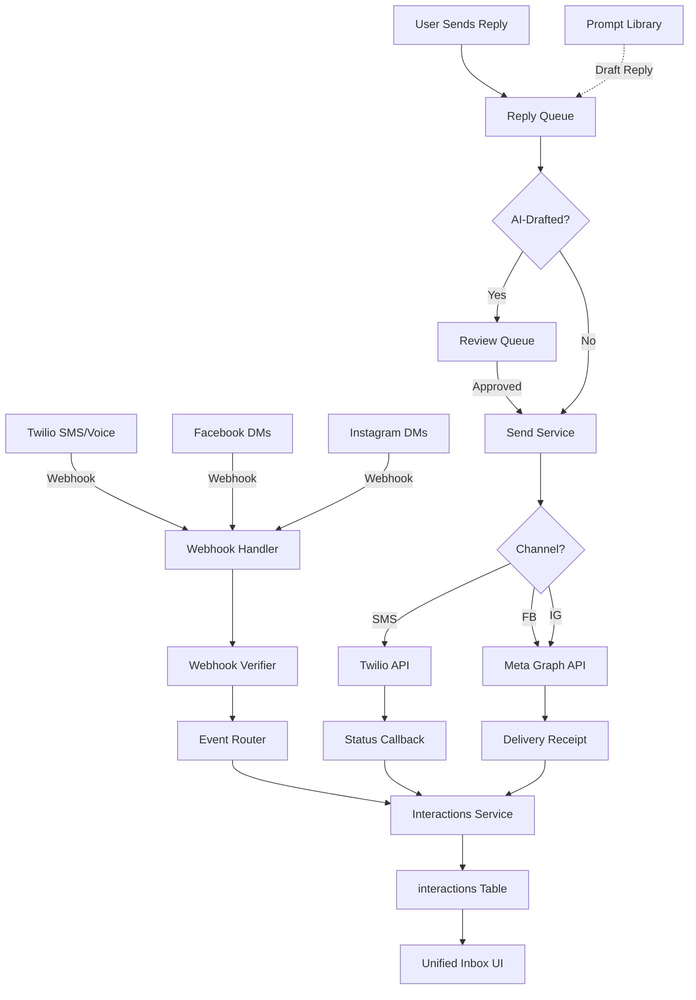

# Step 12: Communications Hub (Twilio + Meta Integration)

**Status:** Specification Complete
**Date:** 2025-11-03
**Est. Implementation:** 10-12 hours
**Priority:** High (Unified Customer Communications)

---

## 🎯 Objective

Build a unified communications hub that:
1. **Integrates** Twilio for two-way SMS/MMS and voice
2. **Integrates** Meta (Facebook/Instagram) for DMs
3. **Centralizes** all communications in unified inbox
4. **Threads** conversations correctly across channels
5. **Tracks** delivery statuses and opt-outs
6. **Enables** AI-drafted replies with review mode
7. **Implements** webhook-first architecture with security

**Key Principle:** All communications flow through `interactions` table with consistent schema and real-time updates.

---

## 🏗️ Architecture Overview



---

## 📊 Data Models

### 1. Communications Configuration

```python
# crm_api/app/models/communications.py

from enum import Enum
from datetime import datetime
from typing import Optional, Dict, Any, List
from pydantic import BaseModel, Field
import uuid

class Channel(str, Enum):
    """Communication channel."""
    SMS = "sms"
    MMS = "mms"
    VOICE = "voice"
    EMAIL = "email"
    FACEBOOK = "facebook"
    INSTAGRAM = "instagram"
    WHATSAPP = "whatsapp"

class InteractionDirection(str, Enum):
    """Direction of interaction."""
    INBOUND = "inbound"
    OUTBOUND = "outbound"

class InteractionStatus(str, Enum):
    """Interaction delivery status."""
    QUEUED = "queued"
    SENDING = "sending"
    SENT = "sent"
    DELIVERED = "delivered"
    READ = "read"
    FAILED = "failed"
    UNDELIVERED = "undelivered"

class DraftStatus(str, Enum):
    """AI draft review status."""
    DRAFT = "draft"
    PENDING_REVIEW = "pending_review"
    APPROVED = "approved"
    REJECTED = "rejected"
    SENT = "sent"


class TwilioConfig(BaseModel):
    """Twilio configuration."""
    account_sid: str
    auth_token: str
    phone_numbers: List[Dict[str, str]]  # [{"number": "+15551234567", "type": "sms", "friendly_name": "Main"}]
    webhook_url: str
    status_callback_url: str

    # Voice settings
    voice_url: Optional[str] = None
    voice_fallback_url: Optional[str] = None
    recording_status_callback_url: Optional[str] = None


class MetaConfig(BaseModel):
    """Meta (Facebook/Instagram) configuration."""
    app_id: str
    app_secret: str

    # Page tokens
    facebook_page_id: str
    facebook_page_access_token: str
    facebook_verify_token: str

    instagram_account_id: str
    instagram_access_token: str

    # Token refresh
    token_expires_at: datetime
    refresh_token: Optional[str] = None

    # Webhook
    webhook_verify_token: str
    webhook_url: str


class Interaction(BaseModel):
    """Unified interaction record (extends existing model)."""
    interaction_id: int  # Auto-increment primary key

    # Existing CRM fields
    lead_id: Optional[int] = None
    customer_id: Optional[int] = None
    assigned_to: Optional[int] = None

    # Communication details
    channel: Channel
    direction: InteractionDirection

    # Content
    message_body: Optional[str] = None
    media_urls: List[str] = []

    # External IDs
    channel_message_id: str  # Twilio SID or Meta message ID
    thread_id: Optional[str] = None  # For grouping related messages

    # Contact info
    from_number: Optional[str] = None  # For SMS/voice
    to_number: Optional[str] = None
    from_social_id: Optional[str] = None  # For FB/IG
    to_social_id: Optional[str] = None

    # Status tracking
    status: InteractionStatus = InteractionStatus.QUEUED
    error_code: Optional[str] = None
    error_message: Optional[str] = None

    # Delivery tracking
    sent_at: Optional[datetime] = None
    delivered_at: Optional[datetime] = None
    read_at: Optional[datetime] = None

    # Voice-specific
    call_duration_seconds: Optional[int] = None
    recording_url: Optional[str] = None

    # AI draft tracking
    is_ai_drafted: bool = False
    draft_status: Optional[DraftStatus] = None
    reviewed_by: Optional[int] = None
    reviewed_at: Optional[datetime] = None

    # Metadata
    metadata: Dict[str, Any] = {}

    created_at: datetime = Field(default_factory=datetime.utcnow)
    updated_at: datetime = Field(default_factory=datetime.utcnow)


class ConversationThread(BaseModel):
    """Conversation thread grouping."""
    thread_id: str = Field(default_factory=lambda: str(uuid.uuid4()))

    lead_id: Optional[int] = None
    customer_id: Optional[int] = None

    channel: Channel

    # Participants
    customer_identifier: str  # Phone number or social ID
    business_identifier: str  # Our phone number or page ID

    # Thread metrics
    message_count: int = 0
    last_message_at: Optional[datetime] = None
    last_customer_message_at: Optional[datetime] = None
    last_agent_response_at: Optional[datetime] = None

    # Status
    is_active: bool = True
    is_opted_out: bool = False
    opted_out_at: Optional[datetime] = None

    created_at: datetime = Field(default_factory=datetime.utcnow)
    updated_at: datetime = Field(default_factory=datetime.utcnow)


class OptOut(BaseModel):
    """Opt-out tracking."""
    opt_out_id: str = Field(default_factory=lambda: str(uuid.uuid4()))

    channel: Channel
    identifier: str  # Phone number or social ID

    opt_out_reason: Optional[str] = None
    opt_out_keywords: List[str] = ["STOP", "UNSUBSCRIBE", "END", "QUIT", "CANCEL"]

    opted_out_at: datetime = Field(default_factory=datetime.utcnow)
    opted_back_in_at: Optional[datetime] = None


class DraftedReply(BaseModel):
    """AI-drafted reply pending review."""
    draft_id: str = Field(default_factory=lambda: str(uuid.uuid4()))

    # Source interaction
    in_reply_to_interaction_id: int
    thread_id: str

    # Draft content
    channel: Channel
    message_body: str
    media_urls: List[str] = []

    # AI generation
    generated_by_template_id: Optional[str] = None
    generation_reasoning: str = ""
    confidence_score: Optional[float] = None

    # Review
    draft_status: DraftStatus = DraftStatus.PENDING_REVIEW
    reviewed_by: Optional[int] = None
    review_notes: Optional[str] = None
    reviewed_at: Optional[datetime] = None

    # Sending
    sent_interaction_id: Optional[int] = None

    created_at: datetime = Field(default_factory=datetime.utcnow)
```

---

## 📞 Twilio Integration

### 1. Inbound SMS/MMS Webhook

```python
# crm_api/app/api/routes/webhooks/twilio.py

from fastapi import APIRouter, Request, HTTPException, Header
from twilio.request_validator import RequestValidator

router = APIRouter(prefix="/webhooks/twilio", tags=["Twilio Webhooks"])

@router.post("/sms/inbound")
async def handle_inbound_sms(
    request: Request,
    x_twilio_signature: str = Header(None)
):
    """
    Handle inbound SMS/MMS from Twilio.

    Twilio sends:
    - MessageSid: Unique message ID
    - From: Customer phone number
    - To: Our Twilio number
    - Body: Message text
    - NumMedia: Number of media attachments (MMS)
    - MediaUrl0, MediaUrl1, ...: Media URLs
    """

    # Verify webhook authenticity
    form_data = await request.form()
    url = str(request.url)

    validator = RequestValidator(twilio_config.auth_token)
    if not validator.validate(url, dict(form_data), x_twilio_signature):
        raise HTTPException(status_code=403, detail="Invalid Twilio signature")

    # Extract data
    message_sid = form_data.get("MessageSid")
    from_number = form_data.get("From")
    to_number = form_data.get("To")
    body = form_data.get("Body", "")
    num_media = int(form_data.get("NumMedia", 0))

    # Extract media URLs
    media_urls = []
    for i in range(num_media):
        media_url = form_data.get(f"MediaUrl{i}")
        if media_url:
            media_urls.append(media_url)

    # Determine channel
    channel = Channel.MMS if num_media > 0 else Channel.SMS

    # Check opt-out keywords
    if is_opt_out_message(body):
        await handle_opt_out(
            channel=channel,
            identifier=from_number,
            reason="Customer requested via keyword"
        )
        # Send confirmation
        await send_sms(
            to=from_number,
            from_=to_number,
            body="You have been unsubscribed. Reply START to opt back in."
        )
        return {"status": "opt_out_processed"}

    # Check if opted out
    if is_opted_out(channel, from_number):
        # Don't process message, but log
        log_blocked_message(from_number, "Opted out")
        return {"status": "blocked_opted_out"}

    # Find or create thread
    thread = await get_or_create_thread(
        channel=channel,
        customer_identifier=from_number,
        business_identifier=to_number
    )

    # Find associated lead/customer
    lead_id, customer_id = await find_contact_by_phone(from_number)

    # Create interaction record
    interaction = Interaction(
        lead_id=lead_id,
        customer_id=customer_id,
        channel=channel,
        direction=InteractionDirection.INBOUND,
        message_body=body,
        media_urls=media_urls,
        channel_message_id=message_sid,
        thread_id=thread.thread_id,
        from_number=from_number,
        to_number=to_number,
        status=InteractionStatus.DELIVERED,
        delivered_at=datetime.utcnow()
    )

    # Save to database
    interaction_id = await save_interaction(interaction)

    # Update thread
    await update_thread_last_message(thread.thread_id, datetime.utcnow())

    # Trigger AI response (if enabled)
    if should_auto_respond(lead_id, customer_id):
        await generate_ai_draft_reply(interaction_id)

    # Notify agents via WebSocket
    await broadcast_new_interaction(interaction_id)

    return {"status": "processed", "interaction_id": interaction_id}


@router.post("/sms/status")
async def handle_sms_status(
    request: Request,
    x_twilio_signature: str = Header(None)
):
    """
    Handle SMS delivery status callbacks.

    Twilio status updates:
    - queued
    - sending
    - sent
    - delivered
    - undelivered
    - failed
    """

    # Verify signature
    form_data = await request.form()
    url = str(request.url)

    validator = RequestValidator(twilio_config.auth_token)
    if not validator.validate(url, dict(form_data), x_twilio_signature):
        raise HTTPException(status_code=403, detail="Invalid signature")

    message_sid = form_data.get("MessageSid")
    message_status = form_data.get("MessageStatus")
    error_code = form_data.get("ErrorCode")

    # Map Twilio status to our status
    status_map = {
        "queued": InteractionStatus.QUEUED,
        "sending": InteractionStatus.SENDING,
        "sent": InteractionStatus.SENT,
        "delivered": InteractionStatus.DELIVERED,
        "undelivered": InteractionStatus.UNDELIVERED,
        "failed": InteractionStatus.FAILED
    }

    new_status = status_map.get(message_status, InteractionStatus.FAILED)

    # Update interaction
    await update_interaction_status(
        channel_message_id=message_sid,
        status=new_status,
        error_code=error_code,
        timestamp=datetime.utcnow()
    )

    # Notify if failed
    if new_status == InteractionStatus.FAILED:
        await notify_failure(message_sid, error_code)

    return {"status": "updated"}
```

### 2. Inbound Voice Webhook

```python
@router.post("/voice/inbound")
async def handle_inbound_call(
    request: Request,
    x_twilio_signature: str = Header(None)
):
    """
    Handle inbound voice calls.

    Returns TwiML to control call flow.
    """

    # Verify signature
    form_data = await request.form()
    url = str(request.url)

    validator = RequestValidator(twilio_config.auth_token)
    if not validator.validate(url, dict(form_data), x_twilio_signature):
        raise HTTPException(status_code=403, detail="Invalid signature")

    call_sid = form_data.get("CallSid")
    from_number = form_data.get("From")
    to_number = form_data.get("To")
    call_status = form_data.get("CallStatus")

    # Check opt-out
    if is_opted_out(Channel.VOICE, from_number):
        # Play message and hang up
        twiml = """
        <?xml version="1.0" encoding="UTF-8"?>
        <Response>
            <Say>You have opted out of communications. Goodbye.</Say>
            <Hangup/>
        </Response>
        """
        return Response(content=twiml, media_type="application/xml")

    # Find contact
    lead_id, customer_id = await find_contact_by_phone(from_number)

    # Create interaction
    interaction = Interaction(
        lead_id=lead_id,
        customer_id=customer_id,
        channel=Channel.VOICE,
        direction=InteractionDirection.INBOUND,
        channel_message_id=call_sid,
        from_number=from_number,
        to_number=to_number,
        status=InteractionStatus.DELIVERED,
        metadata={"call_status": call_status}
    )

    interaction_id = await save_interaction(interaction)

    # Return TwiML for call handling
    twiml = f"""
    <?xml version="1.0" encoding="UTF-8"?>
    <Response>
        <Say>Thank you for calling River City Clean. Please hold while we connect you to an agent.</Say>
        <Dial record="record-from-answer" recordingStatusCallback="/webhooks/twilio/voice/recording">
            <Queue>support_queue</Queue>
        </Dial>
    </Response>
    """

    return Response(content=twiml, media_type="application/xml")


@router.post("/voice/recording")
async def handle_voice_recording(
    request: Request,
    x_twilio_signature: str = Header(None)
):
    """
    Handle voice recording callbacks.

    Saves recording URL to interaction.
    """

    form_data = await request.form()

    call_sid = form_data.get("CallSid")
    recording_url = form_data.get("RecordingUrl")
    recording_duration = int(form_data.get("RecordingDuration", 0))

    # Update interaction with recording
    await update_interaction_recording(
        channel_message_id=call_sid,
        recording_url=recording_url,
        call_duration_seconds=recording_duration
    )

    return {"status": "recorded"}
```

### 3. Outbound SMS Sending

```python
# crm_api/app/services/communications.py

from twilio.rest import Client

class CommunicationsService:
    def __init__(self, twilio_config: TwilioConfig):
        self.twilio_client = Client(
            twilio_config.account_sid,
            twilio_config.auth_token
        )
        self.config = twilio_config

    async def send_sms(
        self,
        to: str,
        body: str,
        from_: Optional[str] = None,
        media_urls: List[str] = None,
        lead_id: Optional[int] = None,
        customer_id: Optional[int] = None,
        is_ai_drafted: bool = False
    ) -> int:
        """
        Send outbound SMS/MMS.

        Returns interaction_id
        """

        # Check opt-out
        if is_opted_out(Channel.SMS, to):
            raise ValueError(f"{to} has opted out")

        # Select from number if not provided
        if not from_:
            from_ = self.get_default_sms_number()

        # Determine channel
        channel = Channel.MMS if media_urls else Channel.SMS

        # Find or create thread
        thread = await get_or_create_thread(
            channel=channel,
            customer_identifier=to,
            business_identifier=from_
        )

        # Create interaction (pending)
        interaction = Interaction(
            lead_id=lead_id,
            customer_id=customer_id,
            channel=channel,
            direction=InteractionDirection.OUTBOUND,
            message_body=body,
            media_urls=media_urls or [],
            thread_id=thread.thread_id,
            from_number=from_,
            to_number=to,
            status=InteractionStatus.QUEUED,
            is_ai_drafted=is_ai_drafted
        )

        interaction_id = await save_interaction(interaction)

        try:
            # Send via Twilio
            message = self.twilio_client.messages.create(
                body=body,
                from_=from_,
                to=to,
                media_url=media_urls,
                status_callback=self.config.status_callback_url
            )

            # Update with Twilio message SID
            await update_interaction(
                interaction_id=interaction_id,
                channel_message_id=message.sid,
                status=InteractionStatus.SENDING,
                sent_at=datetime.utcnow()
            )

            return interaction_id

        except Exception as e:
            # Update as failed
            await update_interaction(
                interaction_id=interaction_id,
                status=InteractionStatus.FAILED,
                error_message=str(e)
            )
            raise
```

---

## 📱 Meta (Facebook/Instagram) Integration

### 1. Webhook Verification

```python
# crm_api/app/api/routes/webhooks/meta.py

from fastapi import APIRouter, Request, Query, HTTPException
import hmac
import hashlib

router = APIRouter(prefix="/webhooks/meta", tags=["Meta Webhooks"])

@router.get("/facebook")
async def verify_facebook_webhook(
    hub_mode: str = Query(None, alias="hub.mode"),
    hub_challenge: str = Query(None, alias="hub.challenge"),
    hub_verify_token: str = Query(None, alias="hub.verify_token")
):
    """
    Verify Facebook webhook.

    Facebook sends GET request to verify endpoint.
    """

    if hub_mode == "subscribe" and hub_verify_token == meta_config.webhook_verify_token:
        return int(hub_challenge)
    else:
        raise HTTPException(status_code=403, detail="Verification failed")


@router.get("/instagram")
async def verify_instagram_webhook(
    hub_mode: str = Query(None, alias="hub.mode"),
    hub_challenge: str = Query(None, alias="hub.challenge"),
    hub_verify_token: str = Query(None, alias="hub.verify_token")
):
    """
    Verify Instagram webhook.
    """

    if hub_mode == "subscribe" and hub_verify_token == meta_config.webhook_verify_token:
        return int(hub_challenge)
    else:
        raise HTTPException(status_code=403, detail="Verification failed")
```

### 2. Inbound Message Webhooks

```python
@router.post("/facebook")
async def handle_facebook_webhook(
    request: Request,
    x_hub_signature: str = Header(None, alias="X-Hub-Signature-256")
):
    """
    Handle Facebook Messenger webhook events.

    Events:
    - messages (inbound messages)
    - messaging_postbacks (button clicks)
    - message_deliveries (delivery receipts)
    - message_reads (read receipts)
    """

    # Verify signature
    body = await request.body()

    expected_signature = "sha256=" + hmac.new(
        meta_config.app_secret.encode(),
        body,
        hashlib.sha256
    ).hexdigest()

    if not hmac.compare_digest(x_hub_signature, expected_signature):
        raise HTTPException(status_code=403, detail="Invalid signature")

    # Parse payload
    data = await request.json()

    # Process each entry
    for entry in data.get("entry", []):
        for messaging_event in entry.get("messaging", []):
            await process_facebook_messaging_event(messaging_event)

    return {"status": "processed"}


async def process_facebook_messaging_event(event: Dict[str, Any]):
    """Process single Facebook messaging event."""

    sender_id = event["sender"]["id"]
    recipient_id = event["recipient"]["id"]
    timestamp = event.get("timestamp")

    # Handle message
    if "message" in event:
        message = event["message"]
        message_id = message.get("mid")
        text = message.get("text", "")
        attachments = message.get("attachments", [])

        # Extract media URLs
        media_urls = []
        for attachment in attachments:
            if attachment["type"] in ["image", "video", "audio", "file"]:
                media_urls.append(attachment["payload"]["url"])

        # Check opt-out
        if is_opt_out_message(text):
            await handle_opt_out(
                channel=Channel.FACEBOOK,
                identifier=sender_id,
                reason="Customer requested"
            )
            # Send confirmation
            await send_facebook_message(
                recipient_id=sender_id,
                text="You have been unsubscribed from messages."
            )
            return

        # Find or create thread
        thread = await get_or_create_thread(
            channel=Channel.FACEBOOK,
            customer_identifier=sender_id,
            business_identifier=recipient_id
        )

        # Find contact by Facebook ID
        lead_id, customer_id = await find_contact_by_social_id(sender_id, "facebook")

        # Create interaction
        interaction = Interaction(
            lead_id=lead_id,
            customer_id=customer_id,
            channel=Channel.FACEBOOK,
            direction=InteractionDirection.INBOUND,
            message_body=text,
            media_urls=media_urls,
            channel_message_id=message_id,
            thread_id=thread.thread_id,
            from_social_id=sender_id,
            to_social_id=recipient_id,
            status=InteractionStatus.DELIVERED,
            delivered_at=datetime.fromtimestamp(timestamp / 1000),
            metadata={"attachments": attachments}
        )

        interaction_id = await save_interaction(interaction)

        # Auto-respond if enabled
        if should_auto_respond(lead_id, customer_id):
            await generate_ai_draft_reply(interaction_id)

        # Broadcast to agents
        await broadcast_new_interaction(interaction_id)

    # Handle delivery receipt
    elif "delivery" in event:
        delivery = event["delivery"]
        message_ids = delivery.get("mids", [])
        delivered_at = datetime.fromtimestamp(delivery.get("watermark", 0) / 1000)

        for message_id in message_ids:
            await update_interaction_status(
                channel_message_id=message_id,
                status=InteractionStatus.DELIVERED,
                timestamp=delivered_at
            )

    # Handle read receipt
    elif "read" in event:
        read = event["read"]
        read_at = datetime.fromtimestamp(read.get("watermark", 0) / 1000)

        # Update all messages in thread as read
        await mark_thread_messages_read(
            channel=Channel.FACEBOOK,
            sender_id=sender_id,
            read_at=read_at
        )


@router.post("/instagram")
async def handle_instagram_webhook(
    request: Request,
    x_hub_signature: str = Header(None, alias="X-Hub-Signature-256")
):
    """
    Handle Instagram messaging webhook events.

    Similar to Facebook, but uses Instagram-specific fields.
    """

    # Verify signature
    body = await request.body()

    expected_signature = "sha256=" + hmac.new(
        meta_config.app_secret.encode(),
        body,
        hashlib.sha256
    ).hexdigest()

    if not hmac.compare_digest(x_hub_signature, expected_signature):
        raise HTTPException(status_code=403, detail="Invalid signature")

    # Parse payload
    data = await request.json()

    # Process entries
    for entry in data.get("entry", []):
        for messaging_event in entry.get("messaging", []):
            await process_instagram_messaging_event(messaging_event)

    return {"status": "processed"}


async def process_instagram_messaging_event(event: Dict[str, Any]):
    """Process Instagram messaging event (similar to Facebook)."""
    # Implementation similar to Facebook handler
    # Uses Instagram Graph API endpoints
    pass
```

### 3. Outbound Meta Messages

```python
class MetaMessaging:
    def __init__(self, meta_config: MetaConfig):
        self.config = meta_config
        self.graph_api_version = "v18.0"

    async def send_facebook_message(
        self,
        recipient_id: str,
        text: str,
        attachments: List[Dict] = None,
        lead_id: Optional[int] = None,
        customer_id: Optional[int] = None
    ) -> int:
        """
        Send Facebook Messenger message.

        Uses Graph API: POST /{page-id}/messages
        """

        # Check opt-out
        if is_opted_out(Channel.FACEBOOK, recipient_id):
            raise ValueError(f"{recipient_id} has opted out")

        # Build message payload
        payload = {
            "recipient": {"id": recipient_id},
            "message": {}
        }

        if text:
            payload["message"]["text"] = text

        if attachments:
            payload["message"]["attachment"] = attachments[0]

        # Find thread
        thread = await get_or_create_thread(
            channel=Channel.FACEBOOK,
            customer_identifier=recipient_id,
            business_identifier=self.config.facebook_page_id
        )

        # Create interaction
        interaction = Interaction(
            lead_id=lead_id,
            customer_id=customer_id,
            channel=Channel.FACEBOOK,
            direction=InteractionDirection.OUTBOUND,
            message_body=text,
            thread_id=thread.thread_id,
            from_social_id=self.config.facebook_page_id,
            to_social_id=recipient_id,
            status=InteractionStatus.QUEUED
        )

        interaction_id = await save_interaction(interaction)

        # Send via Graph API
        url = f"https://graph.facebook.com/{self.graph_api_version}/{self.config.facebook_page_id}/messages"

        headers = {
            "Authorization": f"Bearer {self.config.facebook_page_access_token}",
            "Content-Type": "application/json"
        }

        async with httpx.AsyncClient() as client:
            response = await client.post(url, json=payload, headers=headers)

            if response.status_code == 200:
                result = response.json()
                message_id = result.get("message_id")

                await update_interaction(
                    interaction_id=interaction_id,
                    channel_message_id=message_id,
                    status=InteractionStatus.SENT,
                    sent_at=datetime.utcnow()
                )

                return interaction_id
            else:
                error = response.json()
                await update_interaction(
                    interaction_id=interaction_id,
                    status=InteractionStatus.FAILED,
                    error_message=error.get("error", {}).get("message")
                )
                raise Exception(f"Failed to send: {error}")
```

---

## 🤖 AI-Drafted Replies with Review Mode

### Reply Generation

```python
async def generate_ai_draft_reply(
    in_reply_to_interaction_id: int
) -> str:
    """
    Generate AI-drafted reply for customer message.

    Process:
    1. Get conversation context
    2. Determine intent
    3. Generate reply using prompt template
    4. Validate
    5. Queue for review
    """

    # Get original interaction
    interaction = await get_interaction(in_reply_to_interaction_id)

    # Get conversation history
    thread_history = await get_thread_history(
        thread_id=interaction.thread_id,
        limit=10
    )

    # Build context
    context = {
        "customer_message": interaction.message_body,
        "conversation_history": [
            f"{'Customer' if msg.direction == InteractionDirection.INBOUND else 'Agent'}: {msg.message_body}"
            for msg in thread_history
        ],
        "channel": interaction.channel.value,
        "customer_name": await get_customer_name(interaction.lead_id, interaction.customer_id)
    }

    # Get appropriate template
    template = await prompt_library.get_template_by_name("customer_reply_generator")

    # Generate reply
    result = await prompt_library.execute_with_retry(
        template=template,
        context=context,
        max_retries=2
    )

    # Parse response
    draft_reply = result["reply_text"]
    confidence = result.get("confidence", 0.5)
    reasoning = result.get("reasoning", "")

    # Create draft
    draft = DraftedReply(
        in_reply_to_interaction_id=in_reply_to_interaction_id,
        thread_id=interaction.thread_id,
        channel=interaction.channel,
        message_body=draft_reply,
        generated_by_template_id=template.template_id,
        generation_reasoning=reasoning,
        confidence_score=confidence,
        draft_status=DraftStatus.PENDING_REVIEW
    )

    draft_id = await save_drafted_reply(draft)

    # Notify agents for review
    await notify_agents_for_review(draft_id)

    return draft_id
```

### Review & Send API

```python
@router.get("/drafts/pending", response_model=List[DraftedReply])
async def list_pending_drafts(
    limit: int = 50
):
    """
    List AI-drafted replies pending review.
    """
    pass


@router.post("/drafts/{draft_id}/approve")
async def approve_draft(
    draft_id: str,
    user_id: int,
    edits: Optional[str] = None
):
    """
    Approve AI-drafted reply and send.

    If edits provided, uses edited version instead.
    """

    draft = await get_draft(draft_id)

    # Apply edits if provided
    final_message = edits if edits else draft.message_body

    # Update draft status
    await update_draft(
        draft_id=draft_id,
        draft_status=DraftStatus.APPROVED,
        reviewed_by=user_id,
        reviewed_at=datetime.utcnow()
    )

    # Send message
    interaction_id = await send_reply(
        thread_id=draft.thread_id,
        channel=draft.channel,
        message_body=final_message,
        is_ai_drafted=True
    )

    # Link draft to sent interaction
    await update_draft(
        draft_id=draft_id,
        sent_interaction_id=interaction_id,
        draft_status=DraftStatus.SENT
    )

    return {"status": "sent", "interaction_id": interaction_id}


@router.post("/drafts/{draft_id}/reject")
async def reject_draft(
    draft_id: str,
    user_id: int,
    reason: str
):
    """
    Reject AI-drafted reply.

    Provides feedback to improve future drafts.
    """

    await update_draft(
        draft_id=draft_id,
        draft_status=DraftStatus.REJECTED,
        reviewed_by=user_id,
        review_notes=reason,
        reviewed_at=datetime.utcnow()
    )

    # Store feedback for learning
    await store_draft_feedback(
        draft_id=draft_id,
        feedback_type="rejection",
        feedback_text=reason
    )

    return {"status": "rejected"}
```

---

## 📋 Sequence Diagrams

### Inbound SMS Flow

```
Customer Phone → Twilio → Webhook Handler → Verify Signature → Check Opt-Out
                                                ↓
                                          Find/Create Thread
                                                ↓
                                        Create Interaction Record
                                                ↓
                                          Broadcast to Agents
                                                ↓
                                    (Optional) Generate AI Draft
                                                ↓
                                        Queue for Review
```

### Outbound Message Flow with AI Draft

```
Agent Requests AI Draft → Generate Draft → Save as PENDING_REVIEW
                               ↓
                       Notify Agent for Review
                               ↓
          Agent Reviews → APPROVED or REJECTED
                               ↓
                        (if approved)
                               ↓
                Send via Twilio/Meta API → Update Status to SENT
                               ↓
                    Await Delivery Receipt
                               ↓
                  Update Status to DELIVERED
```

---

## 🔒 Security Measures

### 1. Webhook Verification

```python
def verify_twilio_signature(
    url: str,
    params: Dict[str, Any],
    signature: str,
    auth_token: str
) -> bool:
    """Verify Twilio webhook signature."""
    from twilio.request_validator import RequestValidator
    validator = RequestValidator(auth_token)
    return validator.validate(url, params, signature)


def verify_meta_signature(
    payload: bytes,
    signature: str,
    app_secret: str
) -> bool:
    """Verify Meta webhook signature."""
    expected = "sha256=" + hmac.new(
        app_secret.encode(),
        payload,
        hashlib.sha256
    ).hexdigest()
    return hmac.compare_digest(signature, expected)
```

### 2. Token Refresh (Meta)

```python
async def refresh_meta_tokens():
    """
    Refresh Meta access tokens before expiration.

    Run daily via Celery job.
    """

    # Check if token expires within 7 days
    days_until_expiry = (meta_config.token_expires_at - datetime.utcnow()).days

    if days_until_expiry <= 7:
        # Exchange for long-lived token
        url = f"https://graph.facebook.com/{graph_api_version}/oauth/access_token"

        params = {
            "grant_type": "fb_exchange_token",
            "client_id": meta_config.app_id,
            "client_secret": meta_config.app_secret,
            "fb_exchange_token": meta_config.facebook_page_access_token
        }

        async with httpx.AsyncClient() as client:
            response = await client.get(url, params=params)

            if response.status_code == 200:
                data = response.json()
                new_token = data["access_token"]
                expires_in = data["expires_in"]  # seconds

                # Update config
                meta_config.facebook_page_access_token = new_token
                meta_config.token_expires_at = datetime.utcnow() + timedelta(seconds=expires_in)

                await save_meta_config(meta_config)

                log.info(f"Refreshed Meta token, expires in {expires_in / 86400:.0f} days")
```

---

## ✅ Acceptance Criteria

### Twilio Integration
- [ ] Inbound SMS webhook verified and processing
- [ ] Inbound MMS handling with media URLs
- [ ] Voice call webhook with recording
- [ ] Outbound SMS sending
- [ ] Status callbacks (sent/delivered/failed)
- [ ] Signature verification on all webhooks

### Meta Integration
- [ ] Facebook webhook verification (GET)
- [ ] Facebook message webhook (POST)
- [ ] Instagram message webhook
- [ ] Outbound Facebook messages
- [ ] Delivery and read receipts
- [ ] Token refresh automation

### Unified Inbox
- [ ] All channels in interactions table
- [ ] Thread grouping (conversation view)
- [ ] Real-time WebSocket updates
- [ ] Media display (images, videos, recordings)
- [ ] Status indicators

### AI Drafts
- [ ] Draft generation from context
- [ ] Review queue UI
- [ ] Approve with edits
- [ ] Reject with feedback
- [ ] Learning from rejections

### Opt-Out Management
- [ ] Keyword detection (STOP, UNSUBSCRIBE)
- [ ] Opt-out confirmation message
- [ ] Opt-in handling (START)
- [ ] Per-channel opt-out tracking
- [ ] Block messages to opted-out contacts

---

## 📊 Metrics & Monitoring

### Communication Metrics
- **Total Interactions:** All inbound + outbound
- **Response Time:** Time to first reply
- **Channel Distribution:** % by SMS/Facebook/Instagram
- **Delivery Rate:** % successfully delivered

### AI Draft Metrics
- **Drafts Generated:** Total AI drafts
- **Approval Rate:** % approved vs rejected
- **Edit Rate:** % approved with edits
- **Confidence Distribution:** Draft confidence scores

### Opt-Out Metrics
- **Opt-Out Rate:** % contacts opted out
- **Opt-Out by Channel:** SMS vs social
- **Opt-In Rate:** % who opt back in

---

## 🚀 Implementation Checklist

### Phase 1: Data Models (1 hour)
- [ ] Create communications models
- [ ] Extend interactions table schema
- [ ] Create thread, opt-out, draft tables

### Phase 2: Twilio Integration (3 hours)
- [ ] Inbound SMS webhook
- [ ] Inbound voice webhook
- [ ] Status callback handler
- [ ] Outbound SMS service
- [ ] Signature verification

### Phase 3: Meta Integration (3 hours)
- [ ] Webhook verification endpoints
- [ ] Facebook message webhook
- [ ] Instagram message webhook
- [ ] Outbound messaging
- [ ] Token refresh automation

### Phase 4: AI Drafts (2 hours)
- [ ] Draft generation service
- [ ] Review queue API
- [ ] Approve/reject endpoints
- [ ] Feedback collection

### Phase 5: Opt-Out & Security (1 hour)
- [ ] Opt-out keyword detection
- [ ] Opt-out confirmation flow
- [ ] Webhook signature verification
- [ ] Rate limiting

### Phase 6: Testing & Integration (2 hours)
- [ ] End-to-end test (SMS in → draft → approve → send)
- [ ] Facebook/Instagram test
- [ ] WebSocket notifications
- [ ] Error handling

---

## 📚 Dependencies

**Existing Systems:**
- ✅ Interactions table (CRM)
- ✅ Prompt Library (AI drafts)
- ✅ Governance (review mode)

**New Dependencies:**
```txt
twilio==8.10.0
httpx==0.25.0  # For Meta Graph API
python-multipart==0.0.6  # For webhook form data
```

---

## 💡 Key Design Decisions

### 1. Webhook-First Architecture
**Decision:** All inbound communications via webhooks.
**Rationale:** Real-time, scalable, event-driven.
**Impact:** Instant delivery to unified inbox.

### 2. Thread-Based Conversations
**Decision:** Group messages by thread_id.
**Rationale:** Provides conversation context for AI and agents.
**Impact:** Better customer experience, contextual AI responses.

### 3. Review Mode for AI Drafts
**Decision:** All AI-generated replies require approval.
**Rationale:** Safety, brand consistency, legal compliance.
**Impact:** Zero risk of inappropriate AI responses.

### 4. Per-Channel Opt-Out
**Decision:** Track opt-outs separately by channel.
**Rationale:** Customer may opt out of SMS but want Facebook messages.
**Impact:** Respects preferences, maintains compliance.

### 5. Signature Verification Required
**Decision:** Verify all webhook signatures.
**Rationale:** Prevent spoofed webhooks, ensure authenticity.
**Impact:** Secure, trusted data only.

---

**Status:** ✅ Specification Complete
**Ready For:** Implementation (10-12 hours estimated)
**Blocks:** Nothing
**Blocked By:** Nothing (can implement now)

---

*Specification created: 2025-11-03*
*Part of AI Suite Implementation (Step 12/16)*
