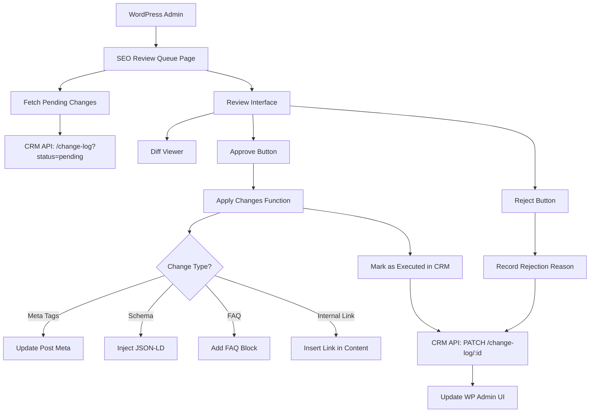

# Step 15: WordPress MU Plugin - Review & Deploy UX

**Status:** Specification Complete
**Date:** 2025-11-03
**Est. Implementation:** 12-14 hours
**Priority:** High (Production Integration)

---

## 🎯 Objective

Build WordPress Must-Use (MU) Plugin for SEO change review and deployment:
1. **Review Queue** - WordPress admin screen showing pending AI suggestions
2. **Diff Viewer** - Visual comparison of current vs. proposed changes
3. **Approve & Apply** - One-click deployment of approved changes
4. **Reject with Reason** - Feedback loop for AI improvement
5. **Audit Trail** - Complete logging synchronized with CRM
6. **Bi-directional Sync** - WordPress ↔ CRM API integration

**User Experience:** SEO editors never leave WordPress to review/approve AI suggestions.

---

## 🏗️ Architecture Overview



---

## 📁 Plugin Structure

```
wp-content/mu-plugins/
└── rivercity-seo-manager/
    ├── rivercity-seo-manager.php          # Main plugin file
    ├── includes/
    │   ├── class-crm-api.php              # CRM API client
    │   ├── class-change-executor.php      # Apply changes to WP
    │   ├── class-diff-renderer.php        # Render diffs
    │   └── class-audit-logger.php         # Local audit logging
    ├── admin/
    │   ├── class-review-queue-page.php    # Admin page controller
    │   ├── views/
    │   │   ├── review-queue.php           # Main queue view
    │   │   ├── change-detail.php          # Single change detail
    │   │   └── partials/
    │   │       ├── meta-diff.php          # Meta tag diff
    │   │       ├── schema-diff.php        # JSON-LD diff
    │   │       ├── faq-diff.php           # FAQ diff
    │   │       └── link-diff.php          # Internal link diff
    │   └── css/
    │       └── review-queue.css
    ├── assets/
    │   └── js/
    │       ├── review-queue.js            # Admin JS
    │       └── diff-viewer.js             # Diff highlighting
    └── readme.md
```

---

## 🔌 CRM API Integration

### API Client Class

```php
<?php
// includes/class-crm-api.php

class RiverCity_CRM_API {
    private $api_base_url;
    private $api_key;

    public function __construct() {
        $this->api_base_url = defined('RIVERCITY_CRM_API_URL')
            ? RIVERCITY_CRM_API_URL
            : 'https://api.rivercityclean.com';

        $this->api_key = defined('RIVERCITY_CRM_API_KEY')
            ? RIVERCITY_CRM_API_KEY
            : get_option('rivercity_crm_api_key');
    }

    /**
     * Get pending changes from CRM.
     *
     * @return array|WP_Error
     */
    public function get_pending_changes($filters = []) {
        $args = [
            'status' => 'pending',
            'target_type' => 'wordpress_post',
            'limit' => 50
        ];

        $args = array_merge($args, $filters);

        $url = add_query_arg($args, $this->api_base_url . '/api/governance/change-log');

        $response = wp_remote_get($url, [
            'headers' => [
                'Authorization' => 'Bearer ' . $this->api_key,
                'Content-Type' => 'application/json'
            ],
            'timeout' => 30
        ]);

        if (is_wp_error($response)) {
            return $response;
        }

        $body = wp_remote_retrieve_body($response);
        $data = json_decode($body, true);

        if (json_last_error() !== JSON_ERROR_NONE) {
            return new WP_Error('json_error', 'Failed to parse API response');
        }

        return $data['changes'] ?? [];
    }

    /**
     * Get single change detail.
     *
     * @param string $change_id
     * @return array|WP_Error
     */
    public function get_change($change_id) {
        $url = $this->api_base_url . '/api/governance/change-log/' . $change_id;

        $response = wp_remote_get($url, [
            'headers' => [
                'Authorization' => 'Bearer ' . $this->api_key
            ]
        ]);

        if (is_wp_error($response)) {
            return $response;
        }

        $body = wp_remote_retrieve_body($response);
        return json_decode($body, true);
    }

    /**
     * Approve change.
     *
     * @param string $change_id
     * @param int $user_id
     * @return bool|WP_Error
     */
    public function approve_change($change_id, $user_id) {
        $url = $this->api_base_url . '/api/governance/change-log/' . $change_id . '/approve';

        $response = wp_remote_post($url, [
            'headers' => [
                'Authorization' => 'Bearer ' . $this->api_key,
                'Content-Type' => 'application/json'
            ],
            'body' => json_encode([
                'user_id' => $user_id,
                'approved_at' => current_time('mysql', true),
                'approved_from' => 'wordpress_plugin'
            ])
        ]);

        if (is_wp_error($response)) {
            return $response;
        }

        $code = wp_remote_retrieve_response_code($response);
        return $code === 200;
    }

    /**
     * Reject change with reason.
     *
     * @param string $change_id
     * @param int $user_id
     * @param string $reason
     * @return bool|WP_Error
     */
    public function reject_change($change_id, $user_id, $reason) {
        $url = $this->api_base_url . '/api/governance/change-log/' . $change_id . '/reject';

        $response = wp_remote_post($url, [
            'headers' => [
                'Authorization' => 'Bearer ' . $this->api_key,
                'Content-Type' => 'application/json'
            ],
            'body' => json_encode([
                'user_id' => $user_id,
                'decision_reason' => $reason,
                'rejected_at' => current_time('mysql', true)
            ])
        ]);

        if (is_wp_error($response)) {
            return $response;
        }

        return wp_remote_retrieve_response_code($response) === 200;
    }

    /**
     * Mark change as executed.
     *
     * @param string $change_id
     * @param array $execution_metadata
     * @return bool|WP_Error
     */
    public function mark_executed($change_id, $execution_metadata = []) {
        $url = $this->api_base_url . '/api/governance/change-log/' . $change_id . '/execute';

        $response = wp_remote_post($url, [
            'headers' => [
                'Authorization' => 'Bearer ' . $this->api_key,
                'Content-Type' => 'application/json'
            ],
            'body' => json_encode([
                'executed_at' => current_time('mysql', true),
                'executed_by' => 'wordpress_plugin',
                'execution_metadata' => $execution_metadata
            ])
        ]);

        if (is_wp_error($response)) {
            return $response;
        }

        return wp_remote_retrieve_response_code($response) === 200;
    }
}
```

---

## 🎨 Admin UI - Review Queue Page

### Main Admin Page

```php
<?php
// admin/class-review-queue-page.php

class RiverCity_Review_Queue_Page {
    private $crm_api;
    private $change_executor;

    public function __construct() {
        $this->crm_api = new RiverCity_CRM_API();
        $this->change_executor = new RiverCity_Change_Executor();

        add_action('admin_menu', [$this, 'add_admin_menu']);
        add_action('admin_enqueue_scripts', [$this, 'enqueue_scripts']);

        // AJAX handlers
        add_action('wp_ajax_rc_approve_change', [$this, 'ajax_approve_change']);
        add_action('wp_ajax_rc_reject_change', [$this, 'ajax_reject_change']);
        add_action('wp_ajax_rc_bulk_approve', [$this, 'ajax_bulk_approve']);
    }

    public function add_admin_menu() {
        add_menu_page(
            'SEO Review Queue',
            'SEO Reviews',
            'edit_posts',
            'rivercity-seo-reviews',
            [$this, 'render_page'],
            'dashicons-visibility',
            25
        );
    }

    public function enqueue_scripts($hook) {
        if ($hook !== 'toplevel_page_rivercity-seo-reviews') {
            return;
        }

        wp_enqueue_style(
            'rc-review-queue',
            plugins_url('../admin/css/review-queue.css', __FILE__),
            [],
            '1.0.0'
        );

        wp_enqueue_script(
            'rc-review-queue',
            plugins_url('../assets/js/review-queue.js', __FILE__),
            ['jquery'],
            '1.0.0',
            true
        );

        wp_localize_script('rc-review-queue', 'rcReviewQueue', [
            'ajaxurl' => admin_url('admin-ajax.php'),
            'nonce' => wp_create_nonce('rc_review_queue'),
            'strings' => [
                'approveConfirm' => __('Approve this change?', 'rivercity-seo'),
                'rejectConfirm' => __('Reject this change?', 'rivercity-seo'),
                'bulkApproveConfirm' => __('Approve selected changes?', 'rivercity-seo')
            ]
        ]);
    }

    public function render_page() {
        // Get filter parameters
        $module = isset($_GET['module']) ? sanitize_text_field($_GET['module']) : '';
        $action_type = isset($_GET['action_type']) ? sanitize_text_field($_GET['action_type']) : '';

        // Fetch pending changes
        $filters = [];
        if ($module) {
            $filters['module_name'] = $module;
        }
        if ($action_type) {
            $filters['action'] = $action_type;
        }

        $changes = $this->crm_api->get_pending_changes($filters);

        if (is_wp_error($changes)) {
            echo '<div class="error"><p>Error fetching changes: ' . esc_html($changes->get_error_message()) . '</p></div>';
            return;
        }

        // Render view
        include dirname(__FILE__) . '/views/review-queue.php';
    }

    /**
     * AJAX: Approve single change.
     */
    public function ajax_approve_change() {
        check_ajax_referer('rc_review_queue', 'nonce');

        if (!current_user_can('edit_posts')) {
            wp_send_json_error(['message' => 'Insufficient permissions']);
        }

        $change_id = isset($_POST['change_id']) ? sanitize_text_field($_POST['change_id']) : '';

        if (empty($change_id)) {
            wp_send_json_error(['message' => 'Invalid change ID']);
        }

        // Get change details
        $change = $this->crm_api->get_change($change_id);

        if (is_wp_error($change)) {
            wp_send_json_error(['message' => $change->get_error_message()]);
        }

        // Approve in CRM
        $approved = $this->crm_api->approve_change($change_id, get_current_user_id());

        if (is_wp_error($approved)) {
            wp_send_json_error(['message' => $approved->get_error_message()]);
        }

        // Execute change in WordPress
        $result = $this->change_executor->execute($change);

        if (is_wp_error($result)) {
            // Execution failed - log but don't fail approval
            error_log('SEO change execution failed: ' . $result->get_error_message());

            wp_send_json_success([
                'message' => 'Approved but execution failed: ' . $result->get_error_message(),
                'partial' => true
            ]);
        }

        // Mark as executed in CRM
        $this->crm_api->mark_executed($change_id, [
            'wordpress_post_id' => $result['post_id'] ?? null,
            'applied_at' => current_time('mysql', true),
            'applied_by' => wp_get_current_user()->user_login
        ]);

        wp_send_json_success([
            'message' => 'Change approved and applied successfully'
        ]);
    }

    /**
     * AJAX: Reject change.
     */
    public function ajax_reject_change() {
        check_ajax_referer('rc_review_queue', 'nonce');

        if (!current_user_can('edit_posts')) {
            wp_send_json_error(['message' => 'Insufficient permissions']);
        }

        $change_id = isset($_POST['change_id']) ? sanitize_text_field($_POST['change_id']) : '';
        $reason = isset($_POST['reason']) ? sanitize_textarea_field($_POST['reason']) : '';

        if (empty($change_id)) {
            wp_send_json_error(['message' => 'Invalid change ID']);
        }

        if (empty($reason)) {
            wp_send_json_error(['message' => 'Rejection reason required']);
        }

        // Reject in CRM
        $rejected = $this->crm_api->reject_change($change_id, get_current_user_id(), $reason);

        if (is_wp_error($rejected)) {
            wp_send_json_error(['message' => $rejected->get_error_message()]);
        }

        wp_send_json_success([
            'message' => 'Change rejected successfully'
        ]);
    }

    /**
     * AJAX: Bulk approve.
     */
    public function ajax_bulk_approve() {
        check_ajax_referer('rc_review_queue', 'nonce');

        if (!current_user_can('edit_posts')) {
            wp_send_json_error(['message' => 'Insufficient permissions']);
        }

        $change_ids = isset($_POST['change_ids']) ? $_POST['change_ids'] : [];

        if (empty($change_ids) || !is_array($change_ids)) {
            wp_send_json_error(['message' => 'No changes selected']);
        }

        $results = [
            'success' => [],
            'failed' => []
        ];

        foreach ($change_ids as $change_id) {
            $change_id = sanitize_text_field($change_id);

            // Get change
            $change = $this->crm_api->get_change($change_id);

            if (is_wp_error($change)) {
                $results['failed'][] = $change_id;
                continue;
            }

            // Approve
            $approved = $this->crm_api->approve_change($change_id, get_current_user_id());

            if (is_wp_error($approved)) {
                $results['failed'][] = $change_id;
                continue;
            }

            // Execute
            $executed = $this->change_executor->execute($change);

            if (is_wp_error($executed)) {
                $results['failed'][] = $change_id;
                continue;
            }

            // Mark executed
            $this->crm_api->mark_executed($change_id, [
                'wordpress_post_id' => $executed['post_id'] ?? null
            ]);

            $results['success'][] = $change_id;
        }

        wp_send_json_success([
            'message' => sprintf(
                'Approved %d changes, %d failed',
                count($results['success']),
                count($results['failed'])
            ),
            'results' => $results
        ]);
    }
}
```

---

## 📝 Review Queue View

```php
<?php
// admin/views/review-queue.php

if (!defined('ABSPATH')) exit;

$total_changes = count($changes);
?>

<div class="wrap rc-review-queue">
    <h1><?php _e('SEO Review Queue', 'rivercity-seo'); ?></h1>

    <!-- Filters -->
    <div class="rc-filters">
        <form method="get" action="">
            <input type="hidden" name="page" value="rivercity-seo-reviews">

            <select name="module">
                <option value=""><?php _e('All Modules', 'rivercity-seo'); ?></option>
                <option value="seo_meta" <?php selected($module, 'seo_meta'); ?>>Meta Tags</option>
                <option value="seo_schema" <?php selected($module, 'seo_schema'); ?>>Schema Markup</option>
                <option value="seo_faq" <?php selected($module, 'seo_faq'); ?>>FAQ</option>
                <option value="internal_linking" <?php selected($module, 'internal_linking'); ?>>Internal Links</option>
            </select>

            <select name="action_type">
                <option value=""><?php _e('All Actions', 'rivercity-seo'); ?></option>
                <option value="update_meta" <?php selected($action_type, 'update_meta'); ?>>Update Meta</option>
                <option value="add_schema" <?php selected($action_type, 'add_schema'); ?>>Add Schema</option>
                <option value="add_faq" <?php selected($action_type, 'add_faq'); ?>>Add FAQ</option>
                <option value="add_internal_link" <?php selected($action_type, 'add_internal_link'); ?>>Add Link</option>
            </select>

            <button type="submit" class="button"><?php _e('Filter', 'rivercity-seo'); ?></button>
        </form>

        <div class="rc-stats">
            <span class="rc-stat-item">
                <strong><?php echo esc_html($total_changes); ?></strong> <?php _e('Pending', 'rivercity-seo'); ?>
            </span>
        </div>
    </div>

    <!-- Bulk Actions -->
    <?php if ($total_changes > 0): ?>
    <div class="tablenav top">
        <div class="alignleft actions bulkactions">
            <button type="button" class="button rc-bulk-approve" disabled>
                <?php _e('Bulk Approve Selected', 'rivercity-seo'); ?>
            </button>
        </div>
    </div>

    <!-- Changes Table -->
    <table class="wp-list-table widefat fixed striped">
        <thead>
            <tr>
                <td class="check-column">
                    <input type="checkbox" id="rc-select-all">
                </td>
                <th><?php _e('Page', 'rivercity-seo'); ?></th>
                <th><?php _e('Module', 'rivercity-seo'); ?></th>
                <th><?php _e('Action', 'rivercity-seo'); ?></th>
                <th><?php _e('AI Confidence', 'rivercity-seo'); ?></th>
                <th><?php _e('Created', 'rivercity-seo'); ?></th>
                <th><?php _e('Actions', 'rivercity-seo'); ?></th>
            </tr>
        </thead>
        <tbody>
            <?php foreach ($changes as $change): ?>
            <tr data-change-id="<?php echo esc_attr($change['change_id']); ?>">
                <th class="check-column">
                    <input type="checkbox" class="rc-change-checkbox" value="<?php echo esc_attr($change['change_id']); ?>">
                </th>
                <td>
                    <strong><?php echo esc_html($change['target_title'] ?? 'Unknown Page'); ?></strong>
                    <div class="row-actions">
                        <span><a href="#" class="rc-view-details"><?php _e('View Details', 'rivercity-seo'); ?></a></span>
                    </div>
                </td>
                <td>
                    <span class="rc-badge rc-badge-<?php echo esc_attr($change['module_name']); ?>">
                        <?php echo esc_html(ucwords(str_replace('_', ' ', $change['module_name']))); ?>
                    </span>
                </td>
                <td><?php echo esc_html(ucwords(str_replace('_', ' ', $change['action']))); ?></td>
                <td>
                    <?php if (isset($change['metadata']['confidence_score'])): ?>
                    <div class="rc-confidence">
                        <span class="rc-confidence-bar" style="width: <?php echo esc_attr($change['metadata']['confidence_score'] * 100); ?>%"></span>
                        <span class="rc-confidence-text"><?php echo esc_html(round($change['metadata']['confidence_score'] * 100)); ?>%</span>
                    </div>
                    <?php else: ?>
                    <span class="rc-text-muted">N/A</span>
                    <?php endif; ?>
                </td>
                <td><?php echo esc_html(human_time_diff(strtotime($change['created_at']), current_time('timestamp'))) . ' ago'); ?></td>
                <td>
                    <button type="button"
                            class="button button-primary rc-approve-btn"
                            data-change-id="<?php echo esc_attr($change['change_id']); ?>">
                        <?php _e('Approve & Apply', 'rivercity-seo'); ?>
                    </button>
                    <button type="button"
                            class="button rc-reject-btn"
                            data-change-id="<?php echo esc_attr($change['change_id']); ?>">
                        <?php _e('Reject', 'rivercity-seo'); ?>
                    </button>
                </td>
            </tr>

            <!-- Expandable Detail Row -->
            <tr class="rc-detail-row" id="rc-detail-<?php echo esc_attr($change['change_id']); ?>" style="display: none;">
                <td colspan="7">
                    <div class="rc-change-detail">
                        <?php include dirname(__FILE__) . '/change-detail.php'; ?>
                    </div>
                </td>
            </tr>
            <?php endforeach; ?>
        </tbody>
    </table>

    <?php else: ?>
    <div class="rc-empty-state">
        <p><?php _e('No pending changes to review.', 'rivercity-seo'); ?></p>
    </div>
    <?php endif; ?>
</div>

<!-- Reject Modal -->
<div id="rc-reject-modal" class="rc-modal" style="display: none;">
    <div class="rc-modal-content">
        <h2><?php _e('Reject Change', 'rivercity-seo'); ?></h2>
        <p><?php _e('Please provide a reason for rejecting this change:', 'rivercity-seo'); ?></p>
        <textarea id="rc-reject-reason" rows="4" style="width: 100%;"></textarea>
        <div class="rc-modal-actions">
            <button type="button" class="button button-primary" id="rc-confirm-reject">
                <?php _e('Reject', 'rivercity-seo'); ?>
            </button>
            <button type="button" class="button" id="rc-cancel-reject">
                <?php _e('Cancel', 'rivercity-seo'); ?>
            </button>
        </div>
    </div>
</div>
```

---

## 🔍 Diff Viewer Components

### Meta Tag Diff

```php
<?php
// admin/views/partials/meta-diff.php

function render_meta_diff($old_value, $new_value) {
    ?>
    <div class="rc-diff-container">
        <h4><?php _e('Meta Tag Changes', 'rivercity-seo'); ?></h4>

        <div class="rc-diff-comparison">
            <!-- Current/Old -->
            <div class="rc-diff-column rc-diff-old">
                <h5><?php _e('Current', 'rivercity-seo'); ?></h5>
                <div class="rc-meta-preview">
                    <?php if (isset($old_value['title'])): ?>
                    <div class="rc-meta-field">
                        <label><?php _e('Title:', 'rivercity-seo'); ?></label>
                        <div class="rc-meta-value">
                            <?php echo esc_html($old_value['title']); ?>
                            <span class="rc-char-count"><?php echo strlen($old_value['title']); ?> chars</span>
                        </div>
                    </div>
                    <?php endif; ?>

                    <?php if (isset($old_value['description'])): ?>
                    <div class="rc-meta-field">
                        <label><?php _e('Description:', 'rivercity-seo'); ?></label>
                        <div class="rc-meta-value">
                            <?php echo esc_html($old_value['description']); ?>
                            <span class="rc-char-count"><?php echo strlen($old_value['description']); ?> chars</span>
                        </div>
                    </div>
                    <?php endif; ?>
                </div>
            </div>

            <!-- Arrow -->
            <div class="rc-diff-arrow">→</div>

            <!-- Proposed/New -->
            <div class="rc-diff-column rc-diff-new">
                <h5><?php _e('Proposed', 'rivercity-seo'); ?></h5>
                <div class="rc-meta-preview">
                    <?php if (isset($new_value['title'])): ?>
                    <div class="rc-meta-field">
                        <label><?php _e('Title:', 'rivercity-seo'); ?></label>
                        <div class="rc-meta-value rc-highlight-new">
                            <?php echo esc_html($new_value['title']); ?>
                            <span class="rc-char-count"><?php echo strlen($new_value['title']); ?> chars</span>
                            <?php if (strlen($new_value['title']) > 60): ?>
                            <span class="rc-warning">⚠ Too long (max 60 chars)</span>
                            <?php endif; ?>
                        </div>
                    </div>
                    <?php endif; ?>

                    <?php if (isset($new_value['description'])): ?>
                    <div class="rc-meta-field">
                        <label><?php _e('Description:', 'rivercity-seo'); ?></label>
                        <div class="rc-meta-value rc-highlight-new">
                            <?php echo esc_html($new_value['description']); ?>
                            <span class="rc-char-count"><?php echo strlen($new_value['description']); ?> chars</span>
                            <?php if (strlen($new_value['description']) > 160): ?>
                            <span class="rc-warning">⚠ Too long (max 160 chars)</span>
                            <?php endif; ?>
                        </div>
                    </div>
                    <?php endif; ?>
                </div>
            </div>
        </div>

        <!-- SERP Preview -->
        <div class="rc-serp-preview">
            <h5><?php _e('SERP Preview', 'rivercity-seo'); ?></h5>
            <div class="rc-serp-result">
                <div class="rc-serp-title"><?php echo esc_html($new_value['title'] ?? ''); ?></div>
                <div class="rc-serp-url"><?php echo esc_url(get_permalink()); ?></div>
                <div class="rc-serp-description"><?php echo esc_html($new_value['description'] ?? ''); ?></div>
            </div>
        </div>
    </div>
    <?php
}
?>
```

### Schema JSON-LD Diff

```php
<?php
// admin/views/partials/schema-diff.php

function render_schema_diff($old_value, $new_value) {
    ?>
    <div class="rc-diff-container">
        <h4><?php _e('JSON-LD Schema Changes', 'rivercity-seo'); ?></h4>

        <div class="rc-schema-comparison">
            <!-- Current Schema -->
            <div class="rc-schema-column">
                <h5><?php _e('Current Schema', 'rivercity-seo'); ?></h5>
                <?php if ($old_value): ?>
                <pre class="rc-json-viewer"><?php echo esc_html(json_encode($old_value, JSON_PRETTY_PRINT | JSON_UNESCAPED_SLASHES)); ?></pre>
                <?php else: ?>
                <p class="rc-text-muted"><?php _e('No schema currently exists', 'rivercity-seo'); ?></p>
                <?php endif; ?>
            </div>

            <!-- Proposed Schema -->
            <div class="rc-schema-column">
                <h5><?php _e('Proposed Schema', 'rivercity-seo'); ?></h5>
                <pre class="rc-json-viewer rc-highlight-new"><?php echo esc_html(json_encode($new_value, JSON_PRETTY_PRINT | JSON_UNESCAPED_SLASHES)); ?></pre>

                <!-- Validation Status -->
                <?php
                $validation = validate_json_ld_schema($new_value);
                ?>
                <div class="rc-validation-result">
                    <?php if ($validation['valid']): ?>
                    <span class="rc-validation-success">✓ <?php _e('Valid schema.org markup', 'rivercity-seo'); ?></span>
                    <?php else: ?>
                    <span class="rc-validation-error">✗ <?php _e('Schema validation errors:', 'rivercity-seo'); ?></span>
                    <ul>
                        <?php foreach ($validation['errors'] as $error): ?>
                        <li><?php echo esc_html($error); ?></li>
                        <?php endforeach; ?>
                    </ul>
                    <?php endif; ?>
                </div>

                <!-- Rich Results Test Link -->
                <div class="rc-external-tools">
                    <a href="https://search.google.com/test/rich-results" target="_blank" class="button">
                        <?php _e('Test in Google Rich Results', 'rivercity-seo'); ?>
                    </a>
                </div>
            </div>
        </div>
    </div>
    <?php
}

function validate_json_ld_schema($schema) {
    // Basic validation
    $errors = [];

    // Check required properties
    if (!isset($schema['@context'])) {
        $errors[] = 'Missing @context property';
    }

    if (!isset($schema['@type'])) {
        $errors[] = 'Missing @type property';
    }

    // Type-specific validation
    if (isset($schema['@type'])) {
        switch ($schema['@type']) {
            case 'FAQPage':
                if (!isset($schema['mainEntity']) || !is_array($schema['mainEntity'])) {
                    $errors[] = 'FAQPage must have mainEntity array';
                }
                break;

            case 'HowTo':
                if (!isset($schema['step'])) {
                    $errors[] = 'HowTo must have step property';
                }
                break;

            case 'Article':
                if (!isset($schema['headline'])) {
                    $errors[] = 'Article must have headline';
                }
                if (!isset($schema['author'])) {
                    $errors[] = 'Article must have author';
                }
                break;
        }
    }

    return [
        'valid' => empty($errors),
        'errors' => $errors
    ];
}
?>
```

---

## ⚙️ Change Executor

```php
<?php
// includes/class-change-executor.php

class RiverCity_Change_Executor {
    /**
     * Execute a change in WordPress.
     *
     * @param array $change Change log entry from CRM
     * @return array|WP_Error
     */
    public function execute($change) {
        $action = $change['action'];
        $target_id = $change['target_id'];
        $new_value = $change['new_value'];

        switch ($action) {
            case 'update_meta':
                return $this->update_meta_tags($target_id, $new_value);

            case 'add_schema':
                return $this->add_json_ld_schema($target_id, $new_value);

            case 'add_faq':
                return $this->add_faq_block($target_id, $new_value);

            case 'add_internal_link':
                return $this->add_internal_link($target_id, $new_value);

            default:
                return new WP_Error('unknown_action', 'Unknown action type: ' . $action);
        }
    }

    /**
     * Update meta tags (title/description).
     *
     * @param int $post_id
     * @param array $meta_data
     * @return array|WP_Error
     */
    private function update_meta_tags($post_id, $meta_data) {
        if (!get_post($post_id)) {
            return new WP_Error('post_not_found', 'Post not found: ' . $post_id);
        }

        // Update using Yoast SEO meta (if available)
        if (class_exists('WPSEO_Meta')) {
            if (isset($meta_data['title'])) {
                update_post_meta($post_id, '_yoast_wpseo_title', sanitize_text_field($meta_data['title']));
            }

            if (isset($meta_data['description'])) {
                update_post_meta($post_id, '_yoast_wpseo_metadesc', sanitize_textarea_field($meta_data['description']));
            }
        }
        // Fallback to generic meta
        else {
            if (isset($meta_data['title'])) {
                update_post_meta($post_id, '_seo_title', sanitize_text_field($meta_data['title']));
            }

            if (isset($meta_data['description'])) {
                update_post_meta($post_id, '_seo_description', sanitize_textarea_field($meta_data['description']));
            }
        }

        return [
            'post_id' => $post_id,
            'action' => 'update_meta',
            'updated' => true
        ];
    }

    /**
     * Add JSON-LD schema to post.
     *
     * @param int $post_id
     * @param array $schema_data
     * @return array|WP_Error
     */
    private function add_json_ld_schema($post_id, $schema_data) {
        if (!get_post($post_id)) {
            return new WP_Error('post_not_found', 'Post not found: ' . $post_id);
        }

        // Store schema as post meta
        $existing_schemas = get_post_meta($post_id, '_rc_json_ld_schemas', true) ?: [];

        // Add new schema
        $schema_id = uniqid('schema_');
        $existing_schemas[$schema_id] = [
            'schema' => $schema_data,
            'added_at' => current_time('mysql'),
            'added_by' => 'ai_suggestion'
        ];

        update_post_meta($post_id, '_rc_json_ld_schemas', $existing_schemas);

        // Hook to inject into <head>
        add_action('wp_head', function() use ($post_id) {
            if (is_singular() && get_the_ID() === $post_id) {
                $schemas = get_post_meta($post_id, '_rc_json_ld_schemas', true);
                foreach ($schemas as $schema_entry) {
                    echo '<script type="application/ld+json">';
                    echo json_encode($schema_entry['schema'], JSON_UNESCAPED_SLASHES | JSON_PRETTY_PRINT);
                    echo '</script>' . "\n";
                }
            }
        });

        return [
            'post_id' => $post_id,
            'action' => 'add_schema',
            'schema_id' => $schema_id
        ];
    }

    /**
     * Add FAQ block to post content.
     *
     * @param int $post_id
     * @param array $faq_data
     * @return array|WP_Error
     */
    private function add_faq_block($post_id, $faq_data) {
        $post = get_post($post_id);

        if (!$post) {
            return new WP_Error('post_not_found', 'Post not found: ' . $post_id);
        }

        // Generate FAQ HTML block
        $faq_html = $this->generate_faq_html($faq_data);

        // Append to post content
        $updated_content = $post->post_content . "\n\n" . $faq_html;

        wp_update_post([
            'ID' => $post_id,
            'post_content' => $updated_content
        ]);

        return [
            'post_id' => $post_id,
            'action' => 'add_faq',
            'faq_count' => count($faq_data['faqs'] ?? [])
        ];
    }

    /**
     * Generate FAQ HTML.
     *
     * @param array $faq_data
     * @return string
     */
    private function generate_faq_html($faq_data) {
        $html = '<div class="faq-section">' . "\n";
        $html .= '<h2>Frequently Asked Questions</h2>' . "\n";

        foreach ($faq_data['faqs'] as $faq) {
            $html .= '<div class="faq-item">' . "\n";
            $html .= '<h3>' . esc_html($faq['question']) . '</h3>' . "\n";
            $html .= '<p>' . esc_html($faq['answer']) . '</p>' . "\n";
            $html .= '</div>' . "\n";
        }

        $html .= '</div>' . "\n";

        return $html;
    }

    /**
     * Add internal link to post content.
     *
     * @param int $post_id
     * @param array $link_data
     * @return array|WP_Error
     */
    private function add_internal_link($post_id, $link_data) {
        $post = get_post($post_id);

        if (!$post) {
            return new WP_Error('post_not_found', 'Post not found: ' . $post_id);
        }

        $anchor = $link_data['anchor'];
        $target_url = $link_data['target_url'];
        $context = $link_data['context'] ?? '';

        // Find and replace anchor text with link
        $link_html = '<a href="' . esc_url($target_url) . '">' . esc_html($anchor) . '</a>';

        $updated_content = str_replace($anchor, $link_html, $post->post_content);

        wp_update_post([
            'ID' => $post_id,
            'post_content' => $updated_content
        ]);

        return [
            'post_id' => $post_id,
            'action' => 'add_internal_link',
            'link_added' => true
        ];
    }
}
?>
```

---

## ✅ Success Criteria

- [ ] WordPress admin page displays pending changes from CRM API
- [ ] Diff viewer shows side-by-side comparison for all change types
- [ ] Approve button applies changes and marks executed in CRM
- [ ] Reject button records reason and updates CRM
- [ ] Bulk approve functionality works for multiple changes
- [ ] Meta tag updates reflect in Yoast/SEO plugin
- [ ] JSON-LD schema validates and injects correctly
- [ ] FAQ blocks render properly in post content
- [ ] Internal links insert at correct locations
- [ ] All actions log to WordPress and CRM audit trail
- [ ] Error handling provides clear feedback
- [ ] UI is responsive and intuitive

---

**Status:** ✅ Specification Complete
**Estimated Time:** 12-14 hours for full implementation
**Priority:** High (Production Integration)

**Next Step:** Implement final Step 16 (Go-Live & Module Graduation)

---

*Specification created: 2025-11-03*
*Part of AI Suite Implementation (Step 15/16)*
